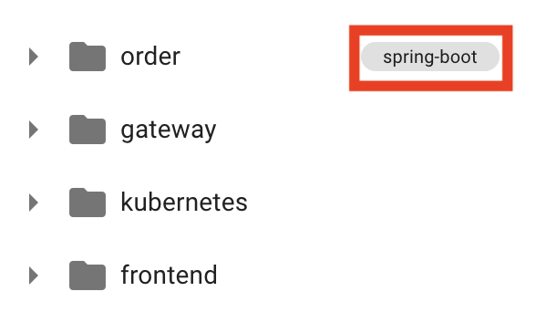
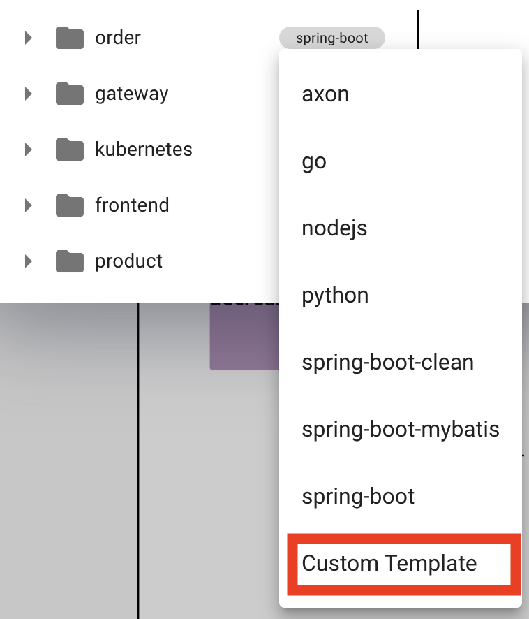
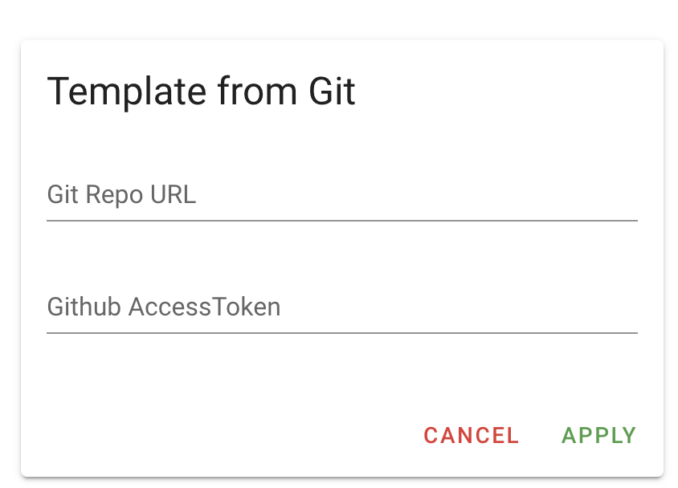
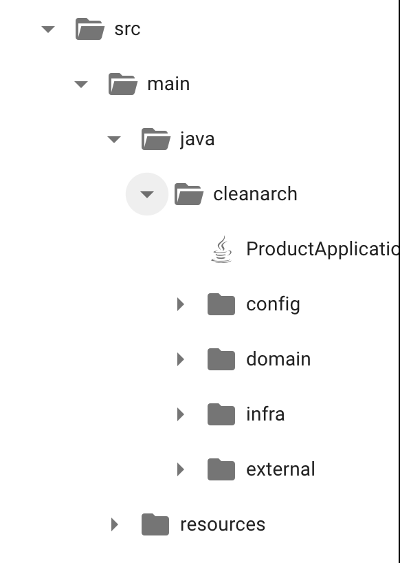
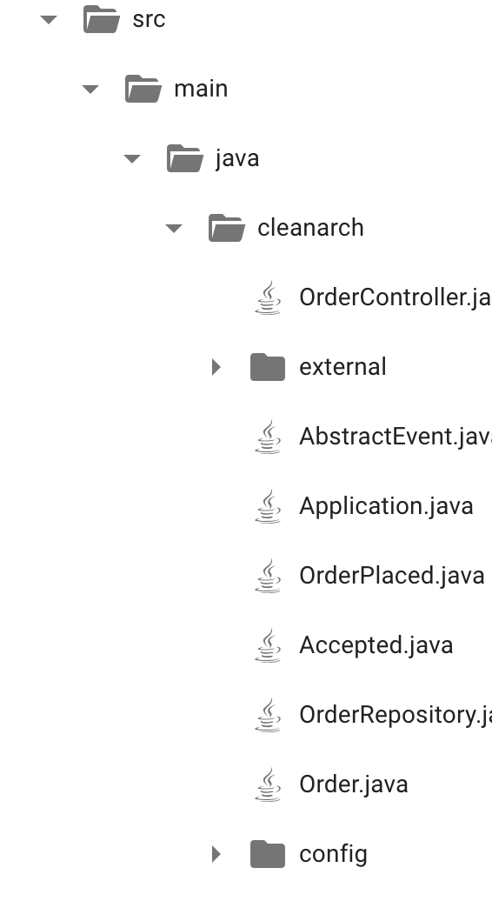

# Custom Template Tutorial

## Setting Custom Template 

- Click on 'spring-boot' aside the service folders from Code Preview

- Set Custom Template

- Fill in the Git Repository URL with Template on Git Repo URL
ex) https://github.com/msa-ez/template-spring-boot-default  
fork the repository and fill in your repository url 

- Issue Github Access Token and put access token in Github access token
(How to issue Github Access Token : https://kim-dragon.tistory.com/122)

 
- Original Template

- Custom Template