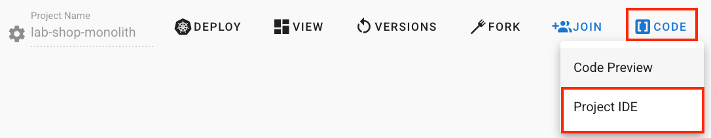
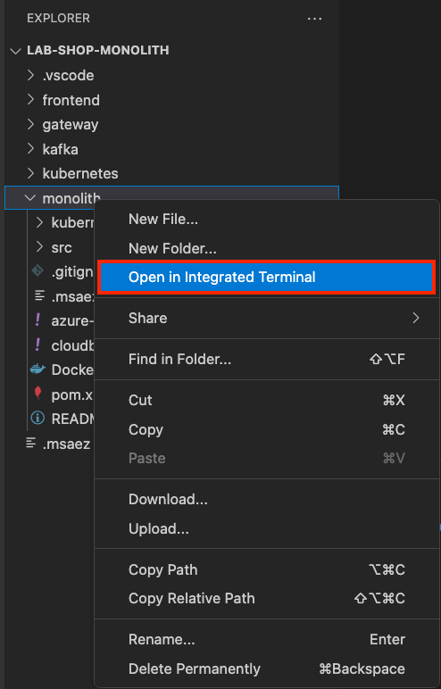
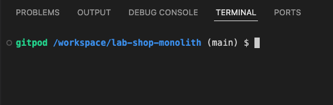

# Running Unit Microservices


We will practice compiling and running Spring Boot applications to execute individual microservices. 

The generated applications provide RESTful services, and we will use the httpie tool to make calls to these services. 

We'll explore the operational structure using a debugger and extend the service by adding attributes to aggregate objects.

## EventStorming Model Preparation

- Open the model in a new tab using the link :
**[Model Link](https://www.msaez.io/#/storming/7b59c53f12e372251cc3c83da8b2fd09)**
- If the model doesn't load, click on the avatar icon (person shape) in the upper right, log in with your **Github** account, and then reload.
- Verify that the model is displayed correctly. 


## Running Microservices
Compile and run the microservices created with Spring Boot.

1. Select CODE > ProjectIDE from the menu to launch the integrated browser IDE.
2. Click on "Continue with gitpod."
3. Click "Continue."


- In the browser IDE, right-click on the monolith folder in the left explorer and select "Open In Integrated Terminal."


- Confirm that the terminal opens within the subfolder.


### Starting the Created Services
Run the microservices in the terminal using mvn.
```
mvn spring-boot:run
```
<br>

- Install the httpie tool.
```
pip install httpie
```
<br>

### Service Testing
- 1. Register product information (stock of 10).

```
http POST localhost:8081/inventories id=1 stock=10
```
<br>

- Place an order for 3 items.
```
http POST localhost:8081/orders productId=1 productName="TV" qty=3
```
<br>

- Verify that the stock decreased by 3.
```
http :8081/inventories/1
```
<br>

- View the ordered product.
```java
http GET localhost:8081/orders
```
<br>

- Modify the ordered product.
```java
http PATCH localhost:8081/orders/1 qty=10
```
<br>

## Common Error Types
1. Web server failed to start. Port 8081 was already in use: Another process is using the same port number. Terminate the process holding the port (close the terminal or use Ctrl + C or the command fuser -k portNumber/tcp).
1. No plugin found for prefix 'spring-boot': Check if there is a pom.xml in the current folder. If yes, check for typos in the mvn spring-boot:run command.
1. ConnectionError: HTTPConnectionPool(host='localhost', port=8081): Max retries: The server itself is not running.

### Debugging in IDE
1. Find Application.java and locate the main function.
2. Set a breakpoint by clicking the circle on the left of the first line in the main function.
3. Click on the link "Debug" above the main function (takes about 10 seconds, please wait).
4. Once the debugger is active and stops at the breakpoint, click the "Continue" arrow button.
5. Next, set a breakpoint in Order.java at the following method:
6. Then, test the breakpoint by placing an order:
```java
@PostPersist
    public void onPostPersist() {
        /// Add this part
    }
```
```
http POST localhost:8081/inventories id=1 stock=10
http POST localhost:8081/orders productId=1 productName="TV" qty=3
```
- After confirming that the debugger is paused, check the contents of variables under local > this object.
<br>

### Extending Order Aggregate
- Add the following field to Order.java:
```
    String address;
```
<br>

### Restart the Service
- Restart the service with the added field.
```
http POST localhost:8081/orders productId=1 productName="TV" qty=3 address="my home"
```
<br>

### Checking and Killing Running Processes

```java
netstat -lntp | grep :808 
kill -9 <process id>
```
or
```
fuser -k 8081/tcp
```
<br>

#### Detailed Explanation
<iframe width="100%" height="100%" src="https://www.youtube.com/embed/J6yqEJrQUyk" frameborder="0" allow="accelerometer; autoplay; clipboard-write; encrypted-media; gyroscope; picture-in-picture" allowfullscreen></iframe>


