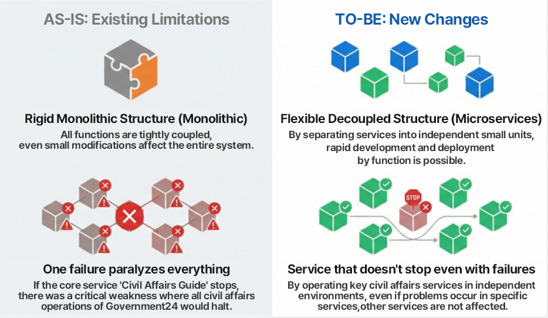
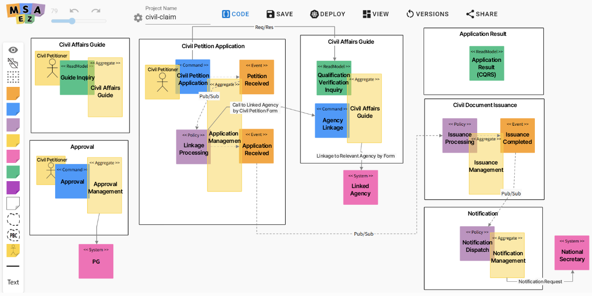

# Government24 Cloud-Native Transformation: Innovating Public Services with Microservice Architecture

In this post, we will examine the **design and analysis process** of the first phase of the Government24 Portal Cloud-Native Transformation project carried out by Uengine Solutions, and provide an in-depth explanation of the technical evolution brought about by the introduction of **Microservice Architecture (MSA)**.

Especially, we will compare the **AS-IS vs TO-BE structure** that overcame the limitations of the existing monolithic complaint system and introduce optimization strategies and practical application cases of key technical patterns (Saga, event-driven, CQRS, etc.) for complaint types.

Through this, we aim to convey the insights of MSA application in actual project development to developers and the context of how public complaint services are being innovated to general readers.

## Background of Public Cloud Transition and Challenges of Government24

The Ministry of Interior and Safety is accelerating digital government innovation under the 'Public Sector Information Resource Cloud Transition Plan' to transition all public systems to the cloud by 2030. With an aggressive goal to apply cloud-native to at least 70% of new systems by 2026, a large-scale first-phase transition project targeting nine representative systems from seven agencies was launched in 2025.

At the center of this effort is the **Government24 Complaint Portal**, a public portal that is closest to citizens' daily lives. Government24, which must maintain stability even when faced with heavy user traffic, set the goal of automating system capacity expansion up to **7.6 times** and reducing service downtime by **81.6%** and processing speed by **36.7%** through this transition. This technological leap will ultimately provide citizens with a solid foundation for faster and more comfortable digital government services.

[Key Features of Government24 Cloud-Native Transformation]

## Analysis of Government24 Cloud-Native Transformation

### Limitations of the Existing System (AS-IS Architecture)

The Government24 cloud-native transformation was officially initiated based on the Information Strategy Plan (ISP) formulated in 2024. Uengine Solutions, which began detailed design and analysis following this roadmap, first conducted a thorough analysis of the existing system and identified critical limitations in the monolithic architecture, including a single point of failure (SPOF).

#### 1. Rigidness due to Strong Coupling (Tight Coupling)

The analysis revealed that the existing Government24 system exhibited a typical monolithic integrated structure or a tightly coupled structure between large applications. 
The high dependency between internal modules made maintenance and feature expansion difficult, and the high coupling made deployment inflexible, significantly impeding scalability.

#### 2. Risk of SPOF in the 'Complaint Guidance' Service

The more significant weakness was the structural single point of failure (SPOF). Since all complaint application processes required passing through the 'Complaint Guidance' (search/guidance) module, a single service outage would paralyze all complaint operations of Government24. This was a structural vulnerability that would cause a complete halt to all national services due to a single failure, making it a top priority to resolve during the cloud transition.

In summary, the existing system suffered from rigidity and low flexibility due to its monolithic nature, and the risk of immediate propagation of failures was high. Additionally, it was not possible to respond flexibly under critical load conditions, leading to concerns about performance degradation. Based on this analysis, Uengine Solutions formulated an architecture strategy to reduce coupling and ensure stability through service separation and redesign.

### Architecture Transition Strategy by Complaint Type (TO-BE Architecture Design)

The Government24 portal can be broadly categorized into three types of complaint services:

By applying different architectural patterns tailored to the characteristics of each service, such as synchronous vs asynchronous, event-driven vs API-driven, and dedicated domain separation, we designed a flexible and efficient MSA architecture.

The following describes the improvement前后 architecture and service flow for the three types of complaint services: **① Simple Application/Immediate Issuance Complaint, ② Organic/Non-linked Complaint, ③ Major Complaint**.

#### ① Simple Application/Immediate Issuance Complaint – **Synchronous REST-based MSA**

Simple Application/Immediate Issuance Complaint is a type of service that can **issue a result immediately when applied**, such as **printouts of resident registration documents, one-stop service for happy birth,** etc.
These services prioritize minimizing response time for user requests, so the new architecture maintains a synchronous REST call method to simplify the processing flow.

In the past structure, there was an inefficient process where the issuance module directly updated the application status information by **updating the application database** or processing multiple steps within a single process. However, in the newly designed structure, the issuance service calls the application service directly via REST API to update the result.
This way, we clarified the interface between services and eliminated direct database connections to other boundary services to reduce coupling.

In other words, we handle internal coupling as much as possible with simple function calls or internal API calls, and avoid unnecessary message broker routing to reduce performance overhead.

#### ② Organic/Non-linked Complaint – **Asynchronous Pub/Sub Structure Based on Event Store**

**Organic/Non-linked Complaint** is a type of service that requires processing over a certain period of time after application, meaning **complaints that cannot be processed immediately and are processed over several days**.
**Non-linked Complaint** is a type of service that does not require real-time linkage with other government systems during processing.

These two types are more important for **reliability and process completeness** than immediate processing, and often experience **delayed processing in the backend**.
Therefore, the newly designed architecture adopts an **asynchronous structure centered on events**.

In the new flow of Organic/Non-linked Complaint, the user first receives an immediate response indicating that the application has been received, and then the actual processing is performed in the background **based on events**.

Specifically, the **Application Service (Asynchronous Application MSA)** publishes the application contents as an event (Event) to the event store, and then the **Issuance Service (Asynchronous Issuance MSA)** subscribes to the corresponding application event to perform processing and generate the final output. The user can later check the result or receive completion notifications through the Citizen Service.

The biggest advantage of introducing this **Pub/Sub asynchronous pattern** is **enhancement of system robustness**, as the event store functions as a message queue, so even if a backend service temporarily fails, the message is not lost and waits to be processed after the failure is recovered.

The main considerations considered when transitioning to an event store-based structure are **transaction consistency and error handling**.
By applying the **Saga pattern** (a distributed transaction management method that maintains data consistency in a distributed environment) when connecting multiple steps of processing to events in a distributed environment, we maintained **process consistency**.
The consumer service implements **preventing duplicate processing of messages (idempotency)** to prevent side effects when the same event is processed twice, and strengthens the logic to avoid this.

We also provide a **retry and DLQ (Dead Letter Queue)** mechanism, so that events that fail after a certain number of attempts are sent to a separate error queue to monitor and take compensation measures, and the stability of asynchronous processing is enhanced, and the operator can **track/manage problem situations**.

#### ③ Major Complaint – **High-Availability Structure Based on Independent Namespace**

In the Government24 cloud-native transformation, particularly **core complaints with high importance and high traffic** were subject to special independent design.
Examples include services such as **issuance of building permit, check-up of vehicle registration certificate**, etc.

These services have many call volumes and high impact on the public, and if placed in the same environment as other complaints, they are subject to consideration of failure propagation risks and performance degradation. Therefore, in the transition project, these **major complaints** were designed to be operated independently in a separate execution environment.

The core of the architecture design is the **independent namespace** strategy. 
In the Kubernetes-based cloud environment, a **namespace (separate microservice group)** isolated for major complaints is created, and the microservices for the corresponding complaints are operated only in that namespace.

For example, the microservices related to **complaint guidance, application, issuance, linkage**, etc. are deployed in a separate namespace isolated from other complaints, and similarly, the vehicle registration complaint is also operated in a dedicated namespace.
This way, if a specific major complaint service experiences a problem, its impact does not propagate to other complaint services, and the **resource allocation or scale strategy** needed for the corresponding complaint can be optimized independently.
In the actual designed major complaint-specific namespace, **linkage channel, microservice replication configuration** etc. are applied to maximize **high availability (HA)** only for that service.

This resolves the **SPOF problem of the complaint guidance service** mentioned earlier by providing a **self-contained complaint guidance channel** for each major complaint.

## Key Design Patterns Applied to Cloud-Native Transformation

One of the core goals of microservice transition is to reduce **coupling between services** and **clarify boundaries**.
The Government24 transition project also designed to remove existing monolithic elements and maximize **autonomy and independence** of each service.

Specifically, the strong coupling caused by direct database references is loosened and combined based on events, and general complaints and major complaints are separated so that major complaint services can operate independently even if general complaint services experience failures.

In this transition project, various design patterns were applied throughout the architecture to improve the technical completeness of MSA, from **Saga pattern** for data consistency in distributed transactions, to **Idempotency and transaction pattern** for reliability of event processing, to **CQRS design** for optimizing large-scale query performance, etc.

[Major Complaint Eventstorming Model, MSA-Ez]

### Selection for Data Consistency: Choreography Saga

In the Government24 cloud-native transformation, to ensure data consistency in the distributed process from application to issuance, the **Saga pattern** was introduced, and the following two methods were considered for design.

- **Choreography Saga:** Each service processes the next step autonomously by exchanging events. The coupling between services decreases, but it is difficult to trace the overall flow or handle complex exceptions.
- **Orchestration Saga:** The orchestrator controls the process. While it is easy to monitor and control errors, the risk of concentrating load on the orchestrator and increasing dependency between services exists.

We adopted the **Choreography method** for internal processes (application↔issuance) to reduce coupling and ensure flexibility. However, external linkage sections that cannot be controlled are excluded from the Saga transaction scope to ensure the stability of the entire system.

### From Subscription to Issuance: Atomic Processing Units and Idempotency

The core of the reliability of the Government24 system is to clearly define the unit that processes events. We designed the entire process of fetching events from the event store (Subscribe), performing business logic (Transaction), and publishing the result as an event (Publish) into an **atomic unit** that cannot be split.

However, in a distributed network environment, it is possible that messages are re-sent or duplicated during the failure recovery process.
Therefore, we built a **business-centric idempotency (Idempotency)** system as a safeguard.

Specifically, we applied a method of using **Unique constraints in the DB** or checking the current processing status (Status) of the complaint before performing the logic.
In other words, if a duplicate request comes in for an application that has already been 'issued completed', the system detects it and does not perform additional actions.

As a result, we were able to maintain data integrity while enjoying the stability of the **'At-least-once'** method guaranteed by message systems such as Kafka, and completely resolve the data duplication problem.

### Traceable Event Design and DLQ Strategy

**Event Design** aspect of the Government24 transition project also established several principles and strategies. First, we gave consistency to **message naming and structure** to make it easy to understand the meaning of events even by looking at the event report alone. 

All domain events were applied with a readable **naming rule**, for example, the **"application completed" event was defined as a domain verb form such as "ApplicationSubmitted"**.
Furthermore, for cases where the type is different from general complaints and vehicle registration, separators were added to the event name (GeneralApplicationSubmitted, CarApplicationSubmitted, etc.) to be easily distinguished at a glance.
This **domain-based event naming** helps in log tracking or tracing, allowing clear identification of where an event originated.

The message content includes **sufficient metadata** such as complaint ID, processing stage, timestamp, source service, etc. to enhance **traceability (traceability)**.
However, care was taken not to include excessively large data chunks in the event, and files or format information were stored separately, and the message size was managed by including only reference links in the event.

The **Dead Letter Queue (DLQ) strategy** was also applied critically for error or exception situations.
The message Consumer isolates the message in a separate topic if it continues to experience errors while processing the message, preventing it from interfering with the normal flow.

In the Government24 transition project, **DLQ topics were created separately for each domain event type**, so that if the ApplicationSubmitted event processing continues to fail, the message is sent to the predefined error topic, such as ApplicationSubmitted.DLQ.

In the Consumer configuration, if it fails after a certain number of retries (e.g., 3 times), it is automatically published to DLQ, and a separate Consumer is provided to reprocess or take alternative measures, and the **compensation transaction (Rollback in Saga)** is designed to be performed.

### CQRS Architecture for Handling Large-Scale Query Traffic

In services with many **read (complaint processing result lookup) traffic**, such as the Government24 portal, **CQRS** (Command Query Responsibility Segregation) pattern is essential for building cloud-native.

CQRS is an architecture pattern that separates write and read operations and processes them in an optimized way, typically introduced to improve query performance and scalability.
The Government24 transition project also discussed and incorporated the CQRS concept into the application result lookup service.

In the previous Government24, all data from application to issuance to lookup was stored and used in a single integrated DB.
In this **single database structure**, if the read load increases, it may affect the write transaction, or if a large amount of input/update occurs, the query response may slow down.

To improve this, in the new architecture, a **microservice dedicated to application result lookup** was separated, and a CQRS model that separates the storage was proposed.
For example, the application/issuance service writes to the operating DB, and the application result service runs a query by having a separate **read-only DB or cache**.
This way, the query performance is improved while distributing the transaction load of this system.

## Conclusion: Presenting a New Standard for Public Platforms

The Government24 cloud-native transformation is a meaningful case that goes beyond simple system migration, improves the nature of public complaint services, and secures technical flexibility.

In this project, Uengine Solutions applied the **Domain-Driven Design (DDD)** to clearly define service boundaries, and strategically applied **Saga pattern and asynchronous communication based on event store** and other MSA best practices.
As a result, the Government24 portal evolved into a technically more flexible and resilient platform.

In particular, this transition proved that **Microservice Architecture (MSA) is the solution for large-scale public services**, and its significance is great.
By overcoming the structural limitations where a single failure leads to the paralysis of the entire service, service isolation (Isolation) now ensures the continuity of key operations.
Furthermore, it has a stable foundation that can flexibly respond to the increasing traffic through automatic scaling and distributed processing.
