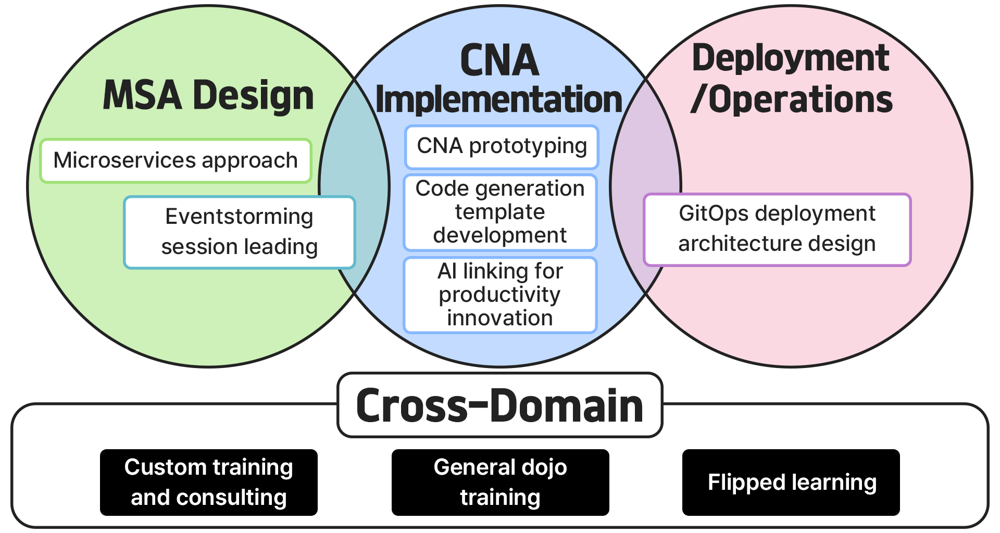

# Consulting

Are you concerned about MSA? CNA? We'll help you to solve your concerns.

## Consulting Services

### 1. Microservice Methodology

|                   |                    |
|---|---|
| **Application Stage** | MSA Design |
| **Cost Basis** | 1 hour |
| **Rate** | 500,000 KRW 
| **Consulting Content** &nbsp;&nbsp;&nbsp;&nbsp;&nbsp;&nbsp;&nbsp;&nbsp;&nbsp;&nbsp;&nbsp;&nbsp;&nbsp; | This service provides consulting based on the Domain-Driven Design starter modeling process, covering architecture design, service decomposition through domain-driven design, data management and synchronization strategies, data projection techniques, event-driven communication, monitoring and logging systems, security and authentication management, operation and deployment strategies, and efficient DevOps operation through SRE. |

### 2. Event Storming Session Leading

|                   |                    |
|---|---|
| **Application Stage** | MSA Design |
| **Cost Basis** | 1 hour |
| **Rate** | 1,000,000 KRW 
| **Consulting Content** &nbsp;&nbsp;&nbsp;&nbsp;&nbsp;&nbsp;&nbsp;&nbsp;&nbsp;&nbsp;&nbsp;&nbsp;&nbsp; | This service focuses on properly applying event storming's core concepts, as incorrect application can lead to difficulties in implementing analysis results or result in inefficient and complex microservices. The main content involves leading design feasibility to ensure correct application of event storming principles. |

### 3. CNA Prototyping

|                   |                    |
|---|---|
| **Application Stage** | CNA Implementation |
| **Cost Basis** | 1 aggregate |
| **Rate** | 500,000 KRW |
| **Consulting Content** &nbsp;&nbsp;&nbsp;&nbsp;&nbsp;&nbsp;&nbsp;&nbsp;&nbsp;&nbsp;&nbsp;&nbsp;&nbsp; | This consulting service aims to assist with initial cloud-native application design and generate prototype code tailored to domain subjects. Using Domain-Driven Design (DDD), it analyzes business requirements clearly and designs microservice architecture accordingly. It then automatically generates prototype code optimized for domain requirements and cloud environments, enabling rapid experimentation and validation. |

### 4. Code Generation Template Development

|                   |                    |
|---|---|
| **Application Stage** | CNA Implementation |
| **Cost Basis** | 1 template |
| **Rate** | 1,000,000 KRW |
| **Consulting Content** &nbsp;&nbsp;&nbsp;&nbsp;&nbsp;&nbsp;&nbsp;&nbsp;&nbsp;&nbsp;&nbsp;&nbsp;&nbsp; | This service thoroughly analyzes a company's domain model and business processes to design optimized code templates. This helps development teams automate repetitive code writing tasks, maintain code quality consistency, and reduce development time. It's particularly beneficial for companies seeking to build efficient and standardized development environments reflecting specific business requirements. |

### 5. AI Integration for Productivity Innovation

|                   |                    |
|---|---|
| **Application Stage** | CNA Implementation |
| **Cost Basis** | 1 hour |
| **Rate** | 500,000 KRW |
| **Consulting Content** &nbsp;&nbsp;&nbsp;&nbsp;&nbsp;&nbsp;&nbsp;&nbsp;&nbsp;&nbsp;&nbsp;&nbsp;&nbsp; | Provides AI utilization techniques for productivity innovation, including new technology-based application code generation, screen design for legacy system transition, and log-based application modernization. Also offers comprehensive consulting services for AI infrastructure setup, from LLM (Large Language Model) installation to optimal cost calculation and hardware specification determination. |

### 6. GitOps Deployment Architecture Design

|                   |                    |
|---|---|
| **Application Stage** | Deployment/Operation |
| **Cost Basis** | 1 hour |
| **Rate** | 300,000 KRW |
| **Consulting Content** &nbsp;&nbsp;&nbsp;&nbsp;&nbsp;&nbsp;&nbsp;&nbsp;&nbsp;&nbsp;&nbsp;&nbsp;&nbsp; | This service helps organizations implement efficient and consistent application deployment using GitOps methodology. It guides the process of designing infrastructure and application deployment architecture according to GitOps principles and building Git repository-centered automated deployment pipelines. This enables smooth management of real-time code changes and deployments, enhances deployment process transparency and stability, and facilitates quick rollbacks and management. |

### 7. Custom Education and Consulting

|                   |                    |
|---|---|
| **Application Stage** | All Areas |
| **Cost Basis** | 1 hour |
| **Rate** | 500,000 KRW |
| **Consulting Content** &nbsp;&nbsp;&nbsp;&nbsp;&nbsp;&nbsp;&nbsp;&nbsp;&nbsp;&nbsp;&nbsp;&nbsp;&nbsp; | Provides customized education and consulting services tailored to specific organizations, companies, or sites. Content is structured according to client's specific requirements, operating environment, and goals, focusing on practical exercises and case studies that can be immediately applied to actual work. |

### 8. General Apprenticeship Training

|                   |                    |
|---|---|
| **Application Stage** | All Areas |
| **Cost Basis** | 1 hour |
| **Rate** | 400,000 KRW |
| **Consulting Content** &nbsp;&nbsp;&nbsp;&nbsp;&nbsp;&nbsp;&nbsp;&nbsp;&nbsp;&nbsp;&nbsp;&nbsp;&nbsp; | Classes conducted by professional instructors at designated training centers covering all aspects of BizDevOps, combining instructor experience with real-time student feedback for practical learning that enables immediate application of cloud-native technologies in real-world situations. |

### 9. Flipped Learning

|                   |                    |
|---|---|
| **Application Stage** | All Areas |
| **Cost Basis** | 1 hour |
| **Rate** | 200,000 KRW |
| **Consulting Content** &nbsp;&nbsp;&nbsp;&nbsp;&nbsp;&nbsp;&nbsp;&nbsp;&nbsp;&nbsp;&nbsp;&nbsp;&nbsp; | Students pre-learn through provided videos and materials at home, followed by hands-on advanced learning led by professional instructors at face-to-face training centers. This allows students to learn at their own pace, enabling additional study of less understood areas while reducing the economic burden of education costs. |

<a href="https://forms.gle/VadgQzj3vK3Z7ZQt8" target="_blank">
    

        Apply Now
    

</a>

