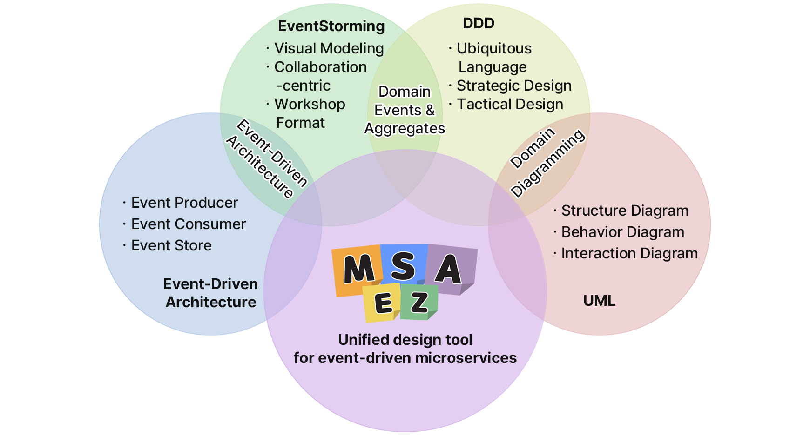

# Introduction

[**MSAEZ**](https://www.msaez.io/) is an integrated design tool that effectively combines the flexibility of event-driven architecture, collaborative design through EventStorming, domain-centric design approach of DDD, and visual representation tools of UML. Through this, companies can more easily design and manage complex microservice architectures. MSA-Ez facilitates communication between development teams and business teams, systematically manages system design, and contributes to increased scalability and maintainability. It enables rapid feedback and efficient design, reducing complexity in microservice architecture and providing powerful support for successful software development.

MSAEZ is an integrated platform designed to support the analysis, design, implementation, and operation of microservices. Through this platform, business experts and developers can collaboratively analyze and design target domains using domain-driven design and event storming techniques. It also enables automatic generation of source code based on Clean Architecture for each designed subdomain.

MSAEZ provides automation and guidance features utilizing ChatGPT throughout the entire lifecycle, offering the optimal execution environment needed for agile cloud-native application implementation.

MSAEZ supports the full Biz-Dev-Ops lifecycle. It operates 100% in a browser-based environment without requiring installation and is equipped with the latest OpenAI engines that support collaborative teamwork. For business planners, DevOps developers, and cloud operators, it automates cloud-native tasks spanning from business planning to implementation, testing, and deployment, providing various agile experiences.

    

        <a target="_blank" href="https://www.uengine.org//images/intro-msaez-2024_eGov-frame.pdf">Download MSAEZ Brochure</a>
    

## Key Features of MSAEZ

- **Online Event Storming Collaboration Tool**

MSAEZ provides a web-based platform with sticky note and whiteboard functionalities for online event storming collaboration. Event Storming, rooted in Domain-Driven Design (DDD), allows all stakeholders to define and understand events in the service, fostering a comprehensive approach to how events occur and their interactions.

- **Template-Based Clean Code Generation**

Leveraging the Mustache template engine, MSAEZ facilitates easy automatic generation of skeleton code from the designed model. Business developers can customize the generated code by adding various microservices patterns, referred to as "Topping," as optional features.

- **Custom Template Support**

In addition to built-in DSL templates (Java, Python, Go, NodeJS, Spring-boot-Mybatis, Spring-boot-JPA), MSAEZ allows developers to create and apply custom templates. Detailed guidelines and manuals are provided for creating custom templates, enabling optimization for the specific framework needs of organizations implementing microservices.

- **Latest OpenAI-Based Expertise Support**

MSAEZ utilizes state-of-the-art OpenAI engines, including ChatGPT, to support agile product (microservices) development. It provides interfaces within the MSAEZ tool for automating event storming, generating business logic, and facilitating automatic testing/debugging across all stages.

- **Integration with Version Control and Cloud IDE Usage**

MSAEZ supports the linkage of model-based generated code with GIT-based repositories. When MSAEZ users log in with their **GitHub** accounts, the code generated from Event Storming models is committed/pushed in real-time to their Git repository through the version control integration UI provided by MSAEZ. Moreover, the codes from the repository are instantly loaded into cloud IDEs (GitPod, CODESPACE). This integration supports DevOps developers in implementing and testing business logic in an agile environment.

Even if Event Storming design information changes while DevOps developers are utilizing the initial version model to implement business logic, the version control server's branch merge functionality seamlessly integrates design and implementation changes, avoiding conflicts.

## Microservice Architecture Tool Comparison

| Product Name | Open Source | Code Generation | AI Features | Modeling Tools | Local Support | Framework Dependency |
|:---:|:---:|:---:|:---:|:---:|:---:|:---:|
| [**MSAEZ**](https://www.msaez.io/) | O | O | O | O | O | X |
| ContextMapper | O | O | X | X | X | X |
| QLERIFY | X | ▵ | O | O | X | X |
| vLINGO | O | O | X | O | X | O |

## Differences from Low-Code/No-Code Platforms
**MSAEZ differentiates itself from low-code/no-code platforms in the following key aspects:**

1. **Code Generation**: Our tool generates code in general-purpose languages such as Java, Python, and Go. This ensures the sustainability, maintainability, and flexibility of the resulting codebase for further improvements, giving developers complete control over their applications. In contrast, low-code/no-code platforms often rely on proprietary runtimes that may limit deep customization and scalability.

2. **Vendor Lock-in**: By generating standard code, our tool avoids vendor lock-in and allows users to freely modify or migrate their applications without being tied to a specific ecosystem. In contrast, low-code/no-code platforms may create dependencies on their proprietary systems, making transitions to other systems difficult and costly.

3. **Large-Scale Design Support**: Our tool excels in designing large-scale cloud-native architectures. It provides event storming tools for a comprehensive overview of software design, enabling partitioning into microservices. This approach supports various microservice design patterns and aggregate design, creating clean and sustainable code following domain-driven design principles. In contrast, low-code/no-code platforms primarily focus on visualizing business logic at smaller scales, making them more suitable for common domains or supporting domain services such as back-office applications.

4. **Domain-Centric Development**: Our tool is tailored for developing core domain applications critical to customer-facing services. It provides detailed aggregate design and supports various microservice patterns, aligning with domain-driven design principles. In contrast, low-code/no-code platforms are generally more effective for general domains or back-office services that focus on internal processes rather than complex customer-facing applications.

This comprehensive approach makes our tool an excellent choice for organizations looking to build robust, scalable, and maintainable cloud-native applications.

### Comparison Table Summary

Characteristic|MSAEZ|Low-Code/No-Code Platforms
---|---|---
Code Generation|Generated in general-purpose languages (Java, Python, Go, etc.)|Relies on proprietary runtimes
Vendor Lock-in|Low (uses standard code)|High (uses proprietary systems)
Large-Scale Design|Suitable for large-scale cloud-native architectures|Focuses on smaller-scale business logic
Domain-Centric|Suitable for core domains, customer-facing services|Suitable for general domains, back-office services
Customization|High flexibility and scalability|Limited deep customization
Microservice Support|Supports various design patterns|Limited support
Usage Purpose|Complex and scalable enterprise applications|Simple business applications, internal tools
