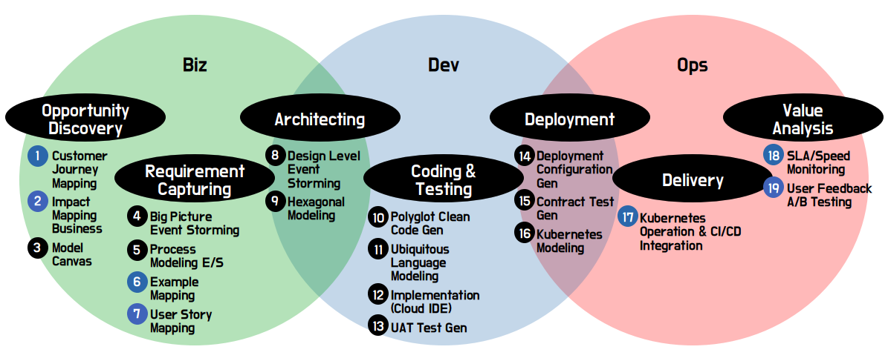

# Introduction

[**MSAEZ**](https://www.msaez.io/) is an integrated platform designed to support the analysis, design, implementation, and operation of microservices. Through this platform, business experts and developers can collaboratively analyze and design the target domain using domain-centric design and event storming techniques. Additionally, it enables the automatic generation of source code based on Clean Architecture for each designed subdomain.

MSAEZ supports the full lifecycle of BizDevOps using ChatGPT for automation and guidance, providing an optimal execution environment for agile cloud-native application implementation.

**Key Features of MSAEZ:**

1. **Online Event Storming Collaboration Tool:**
   MSAEZ provides a web-based platform with sticky note and whiteboard functionalities for online event storming collaboration. Event Storming, rooted in Domain-Driven Design (DDD), allows all stakeholders to define and understand events in the service, fostering a comprehensive approach to how events occur and their interactions.

2. **Template-Based Clean Code Generation:**
   Leveraging the Mustache template engine, MSAEZ facilitates easy automatic generation of skeleton code from the designed model. Business developers can customize the generated code by adding various microservices patterns, referred to as "Topping," as optional features.

3. **Custom Template Support:**
   In addition to built-in DSL templates (Java, Python, Go, NodeJS, Spring-boot-Mybatis, Spring-boot-JPA), MSAEZ allows developers to create and apply custom templates. Detailed guidelines and manuals are provided for creating custom templates, enabling optimization for the specific framework needs of organizations implementing microservices.

4. **Latest OpenAI-Based Expertise Support:**
   MSAEZ utilizes state-of-the-art OpenAI engines, including ChatGPT, to support agile product (microservices) development. It provides interfaces within the MSAEZ tool for automating event storming, generating business logic, and facilitating automatic testing/debugging across all stages.

5. **Integration with Version Control and Cloud IDE Usage:**
   MSAEZ supports the storage of model-based generated code in GIT repositories. Users can seamlessly commit and push the code to their Git repositories through MSAEZ's integrated UI. The platform also allows developers to load repository code into cloud IDEs (GitPod, CODESPACE) for immediate implementation and testing of business logic, creating an agile environment.

   Additionally, MSAEZ ensures smooth integration between design changes in event storming and ongoing implementation by utilizing branch merging functionality in version control.

Experience MSAEZ, the platform that seamlessly integrates business planning, implementation, testing, and deployment into a cloud-native workflow, supporting the Biz-Dev-Ops full lifecycle. No installation is needed, and it operates entirely in a browser, fostering collaborative teamwork with the latest OpenAI engines for business planners, DevOps developers, and cloud operators.