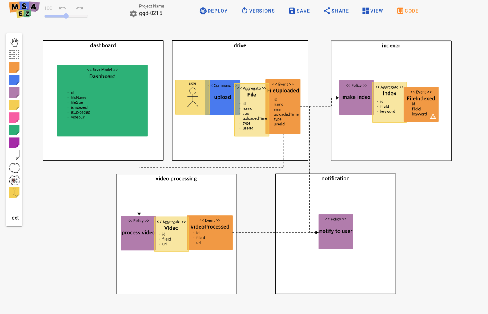

## Introduction

MSAEZ is a tool that supports analysis, design, implementation, and monitoring necessary for the operation of microservices. It facilitates domain analysis and design through collaborative event storming, automatically generating MSA (Microservices Architecture) source code from the designed domain model.

Recently adopted by leading global companies such as IBM and Pivotal in the realm of Microservices Architecture, MSAEZ provides a modeling environment for event-driven domain analysis techniques. It enables developers to implement business logic based on the modeling results by simultaneously generating MSA template code and files required for cloud deployment.

The generated code can be seamlessly integrated with cloud IDEs, allowing developers to immediately embark on development tasks. This tool supports the creation of a service based on the ideas of business experts, providing a solution where a single idea can lead to the creation of a service.

 MSAEZ 

---

## Open-source transition

As of November 2023, the entire MSAEZ service has transitioned to open-source.

All users can download and use the project from the following address.

https://github.com/msa-ez/platform

---

## ChatGPT Integration Service

We have applied AI-based technology from ChatGPT to facilitate easier business design.

For detailed information, please refer to the document below.

https://intro-kor.msaez.io/tool/chat-gpt/

---

## Effectiveness

Compared to the standard framework-based development of general SI companies, the development of microservices through the event storming tool has several advantages.

| **Section**           | **When applying the standard development methodology**        | **When applying the event storming tool**              |
| ---------------------- | ----------------------------- | ---------------------- |
| Ease of analysis and design | Analysis and design personnel understand professional tools (UML, BPM, ERD, etc) and create products using them | From domain experts to UI/UX personnel, developers can analyze and design without any tools |
| System scalability | Mutual interference increases with DB-level sticky reference (JOIN Query) due to designing the data structure first | Less interference between services by defining individual services after identifying business domains |
| MSA Development Productivity | Manual development by developers with MSA implementation skills | The tool automatically generates the initial source code |
| MSA Code Diversity | Implement all service code in a single language provided by the framework | A user-defined extension template can be created in a language that matches the characteristics of each service |
| Maintenance Flexibility | Constraints exist for SM organizations to understand the standard framework | With the application of ubiquitous language and the application of MSA Chassis for each event-storming sticker, SM is relatively advantageous. |

MSAEZ supports the entire MSA lifecycle, from analysis to operation. The source code, which was developed manually by developers with existing MSA skills, is automatically generated by the tool, and version control and electronic storage of results, which are impossible offline, is one of the advantages provided by MSAEZ which is a software-based event storming tool.

---

## Running Environment

| **Section**           | **Contents**        |
| ----------------- | ----------------------------- |
| Supporting OS | Windows, Linux, Mac OS |
| Supporting Cloud | All Cloud Platform (AWS, GCP, MS Azure, etc.) |
| Service Type | On-Premise or SaaS |
| Required Spec | 512MB Memory or more | 
| Supporting Browser | Cross-browser (IE, Edge 등 MS계열 제외) |
| Installation Module | X |