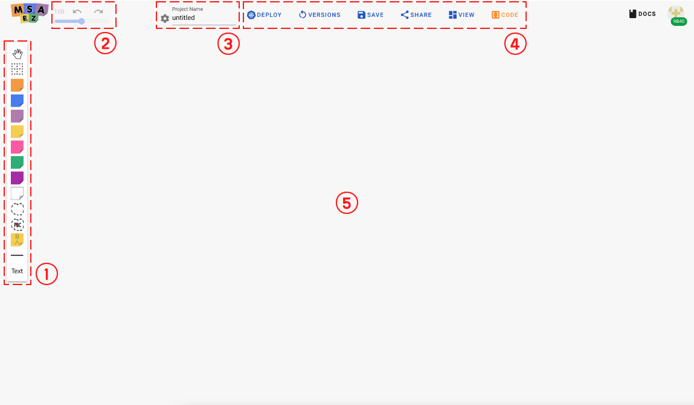
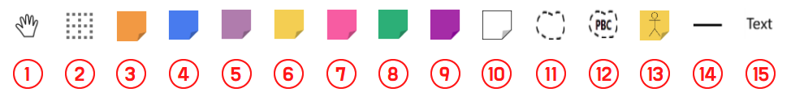
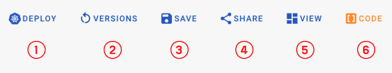
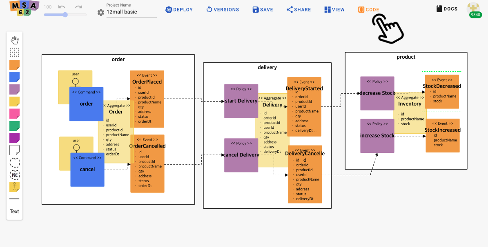
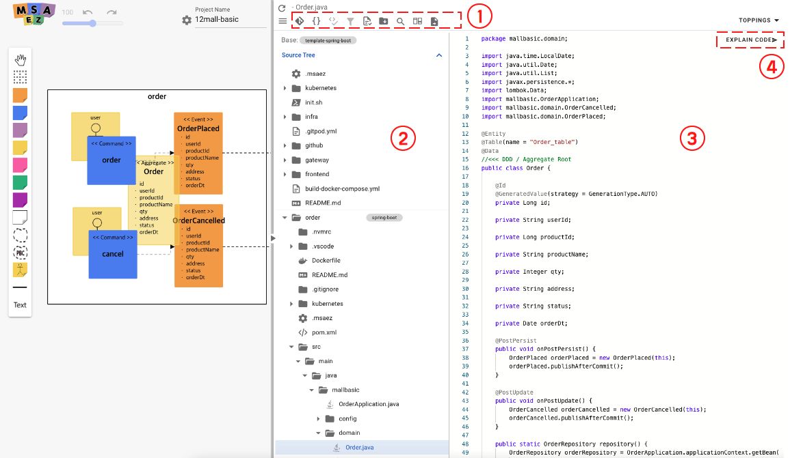
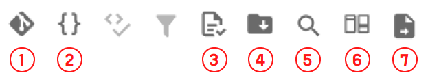
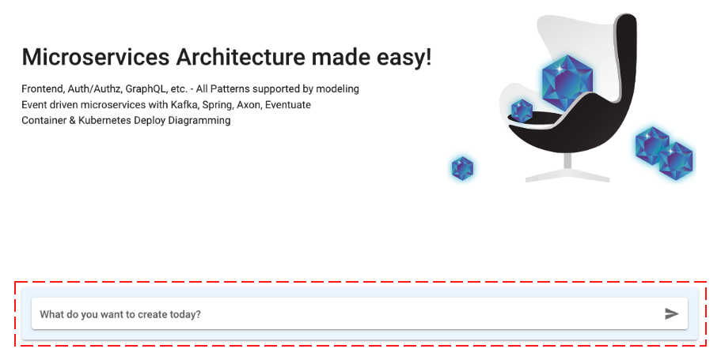
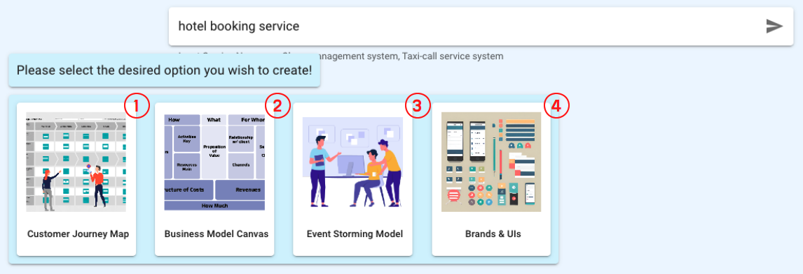

# Key Features

## Generating Eventstorming Model

#### How to

You can check detailed Event Storming examples in the document below.

[Basic Example](https://intro-kor.msaez.io/tool/event-storming-tool/) 

[Advanced Example](https://intro-kor.msaez.io/tool/google-drive-examples/)

#### UI Layout

|  | Name                | Features              |
|------|---------------------|----------------------------------------------------------------------- |
| 1    &nbsp;| Sticker Palette     | A palette where you can select Sticky notes for EventStorming |
| 2    &nbsp;| Zoom Panel          | Ability to enlarge, reduce, undo, and redo the screen created on the canvas |
| 3    &nbsp;| Project Name        | Enter the project name (Package name for Java) |
| 4    &nbsp;| Menu Panel             | Tools to choose from a variety of options for handling modeling results |
| 5    &nbsp;| Eventstorming Canvas     | A space for modeling by sticky notes |

#### Menu Specifications

1. Sticker Palette

|  | Name                | Features     |
|------|---------------------|----------------------------------------------------------------------- |
| 1    &nbsp;| Draggable Screen     | On/off feature allowing the canvas to be dragged |
| 2    &nbsp;| Auto Guidance          | On/off feature for automatic alignment during modeling |
| 3    &nbsp;| Event        | Sticker defining occurred facts and results, i.e., Domain Event |
| 4    &nbsp;| Command             | Sticker defining decision-making and API, representing Command |
| 5    &nbsp;| Policy     | Sticker defining policies in response to events |
| 6    &nbsp;| Aggregate     | Sticker defining aggregates as a set of implementations and data |
| 7    &nbsp;| External          | Sticker defining information for external system calls |
| 8    &nbsp;| ReadModel        | Sticker defining ReadModel, data for user reference |
| 9    &nbsp;| Issues             | Sticker for writing modifications and requests for the model |
| 10    &nbsp;| UI     | Sticker defining UI information |
| 11   &nbsp;| BoundedContext     | Framework for distinguishing units of each microservice |
| 12    &nbsp;| PBC          | Functionality to load and use existing models stored on the server |
| 13    &nbsp;| Actor        | Users, personas, stakeholders of this service |
| 14    &nbsp;| Line             |  |
| 15    &nbsp;| Text     |  |

2. Menu Panel

|  | Name                | Features |
|------|---------------------|----------------------------------------------------------------------- |
| 1  | Deploy | Convert modeling results into Kubernetes deployment models |
| 2  | Versions | View version information of the model and use the Replay feature |
| 3  | Save | Save modeling results to the server, or save locally as a JSON file or PowerPoint document |
| 4  | Share | Share modeling results with other users |
| 5  | View | View modeling UI transformed into Hexagonal or BPMN |
| 6  | Code | Commit the model-based generated source code to Git or download it as a local file |

---

## Template-based Source Code Generation

#### How to

Once event storming model creation is complete, click **CODE** button in the top Menu Panel to generate source code.

|  | Name                | Features   |
|------|---------------------|----------------------------------------------------------------------- |
| 1  | Menu Panel | Functions such as Git integration, template modification, and file download are available |
| 2  | Source Tree | Displays the complete file list generated based on the model |
| 3  | Source Code | Displays the source code of the selected file |
| 4  | Explain Code | Provides textual explanations for the code through integration with ChatGPT |

#### Menu Panel Specifications

|  | 이름                | 기능 설명                                                              |
|------|---------------------|----------------------------------------------------------------------- |
| 1  | Push to Git | Connects to the user's **GitHub** account, creates a repository, and integrates with GitPod IDE |
| 2  | Edit Template | Directly modifies the applied template file |
| 3  | Design Patterns | |
| 4  | Download Archive | Downloads the entire source code as a local file |
| 5  | Search | Activates the file name search function |
| 6  | Diff Mode | When the user modifies the original code, displays the changes in the modified version |
| 7  | Explain Project | Provides an explanation of the project |

---

## Chat GPT-based Business Modeling

#### How to

When you enter the type of service you want to create in the input box on the main screen of MSAEZ, four options will be presented.

 

|  | Name               | Features  |
|------|---------------------|----------------------------------------------------------------------- |
| 1 | Customer Journey Map | A marketing technique analyzing touchpoints between services and personas through persona analysis |
| 2 | Business Model Canvas | A diagram summarizing elements necessary for business operations |
| 3 | EventStorming Model | Implementing a business model with a focus on domain events |
| 4 | Brands & UIs | Download the entire source code as a local file |

When you select each option, the corresponding business design model is automatically created with Chat GPT-based AI service.

Detailed instructions can be found [here](https://intro-kor.msaez.io/tool/chat-gpt/).