# Vibe Coding

In today's business environment, markets are changing rapidly and enterprises must respond agilely to these changes. In this context, AI-driven development approaches have become essential rather than optional. 
**Vibe Coding** is an innovative approach that leverages AI to support the entire software development lifecycle. It significantly shortens the development process and maintains consistency by directly analyzing business requirements, transforming them into design models, and automatically generating implementation code. 
Particularly in complex system designs such as microservice architectures, the utilization of AI provides core value. Through Vibe Coding, you can effectively analyze complex business domains to appropriately partition them, design event storming according to requirements, and automatically generate high-quality code. This enables enterprises to shorten time-to-market, secure business agility, and achieve competitive advantages. 

## 1. Analysis and Design Using Vibe Coding
Here's how to conduct requirement-based analysis for a food delivery app service using Vibe Coding.

### 1) Accessing MSAEZ Modeling Tool
- Launch Chrome browser and access https://www.msaez.io
- Click the avatar icon in the upper right corner and log in with your **GitHub** account
- In the **"What would you like to build today?"** window, enter the service name **"Food Delivery App"** and press Enter

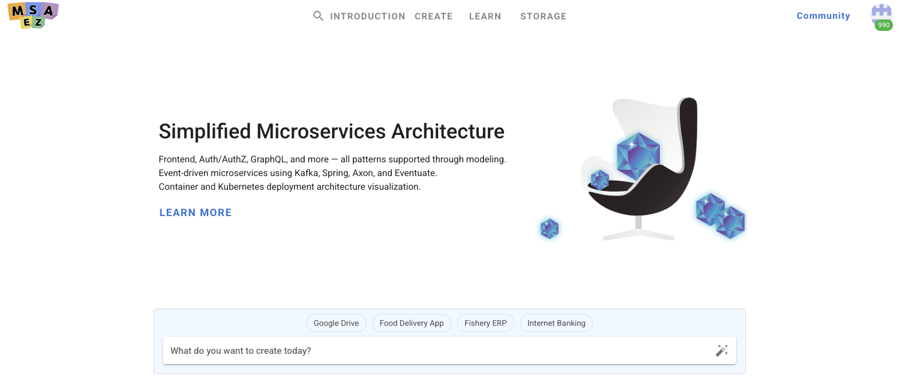

### 2) User Story Generation
Generate user stories as functional and requirement specifications, which is the first step in service analysis.
- Click the **"Generate with AI"** button to create user stories for the food delivery app as shown below

Once generation is complete, functional requirements for the service are written and displayed in a value-centered manner, showing what business value is provided to each target user of the service.

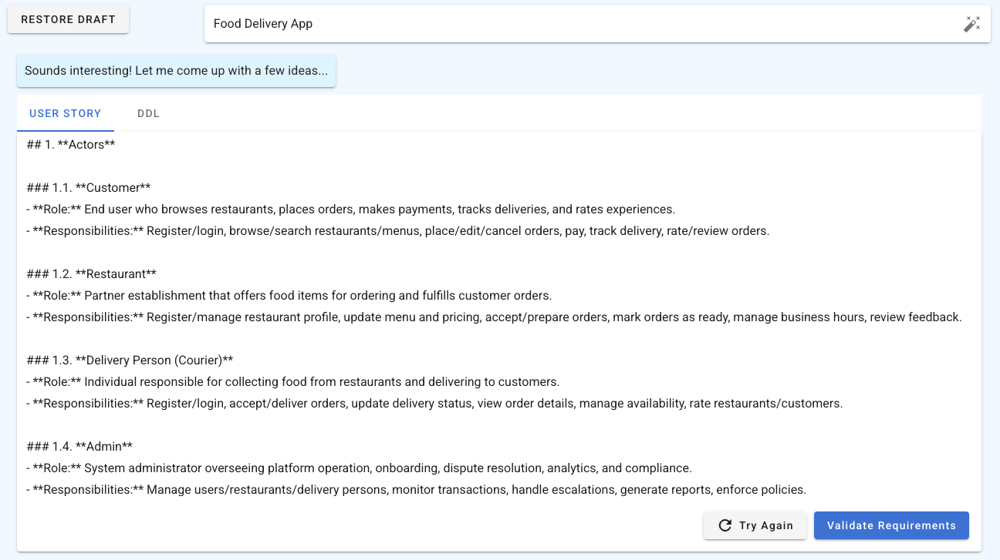

### 3) Process and Event Flow Generation
Once user story generation is complete, generate BPM (Business Process Management) based on the user stories.
- Click the **"Requirement Validation"** button
Once generation is complete, the actor-specific processes for the service are defined based on the previously generated user stories, allowing you to understand the actual workflow for service usage.
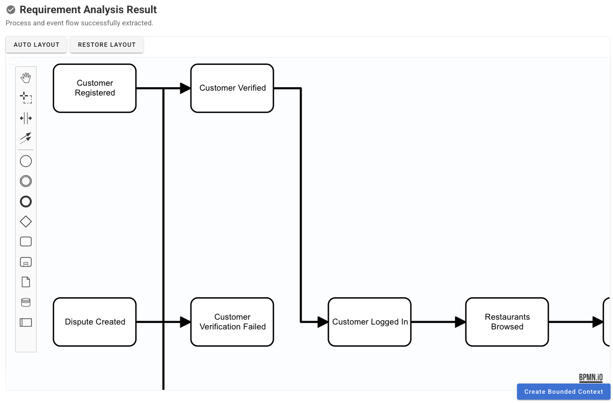

### 4) Bounded Context Partitioning Configuration and Generation
Clicking 'Generate Bounded Context' allows you to configure service partitioning settings. In this step, configure the following:
- Set the number of services to separate from a microservice perspective
- Set service boundaries considering various perspectives
- After completing all settings, click the 'Generate' button to proceed with Bounded Context partitioning according to the configured requirements

Once generation is complete, the Bounded Context partitioning results are created in multiple sections as follows:

1. Bounded Context Relationship Diagram  
    Shows the relationships between Bounded Contexts partitioned according to the configured number and perspectives.  
    Domains are separated into Core, Supporting, and Generic areas, and you can check the connection relationships (synchronous, asynchronous) between each service.
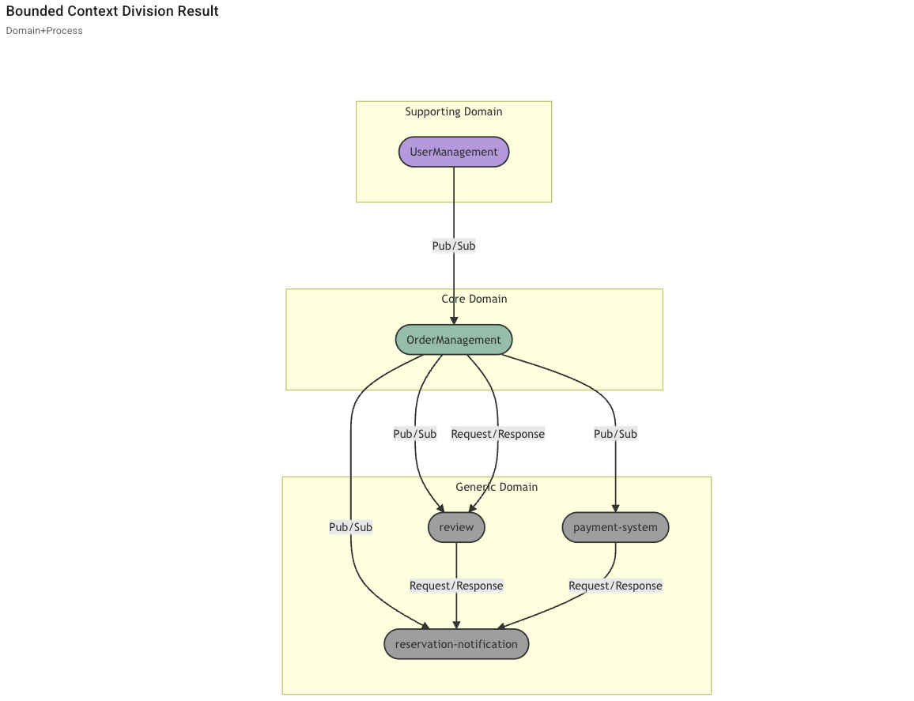

2. Core Domain Chart
    Positions the partitioned services by priority based on business differentiation and model complexity perspectives.  
    You can see that Core domains have higher business differentiation while Generic domains have higher model complexity.
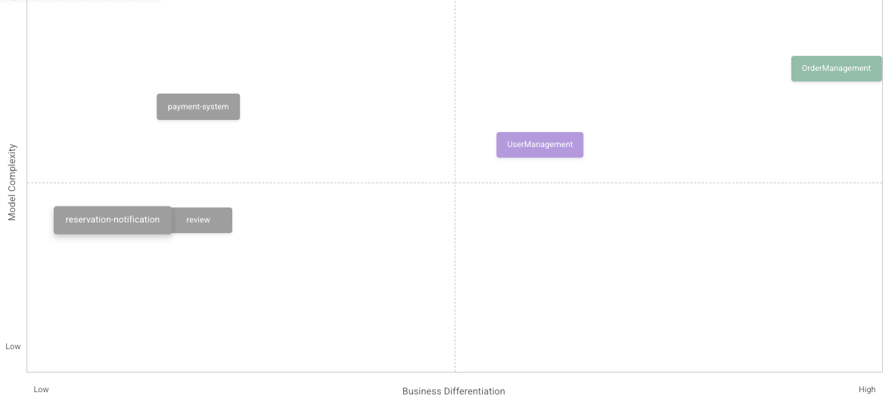

### 5) Aggregate Draft Generation
Generate drafts of aggregates to be defined for each partitioned Bounded Context.
- Proceed with 'Generate Aggregate Draft'.  

Once the draft is generated, you can see that detailed designs of aggregates for customer order services and their relationships with other aggregates are created as shown below. 
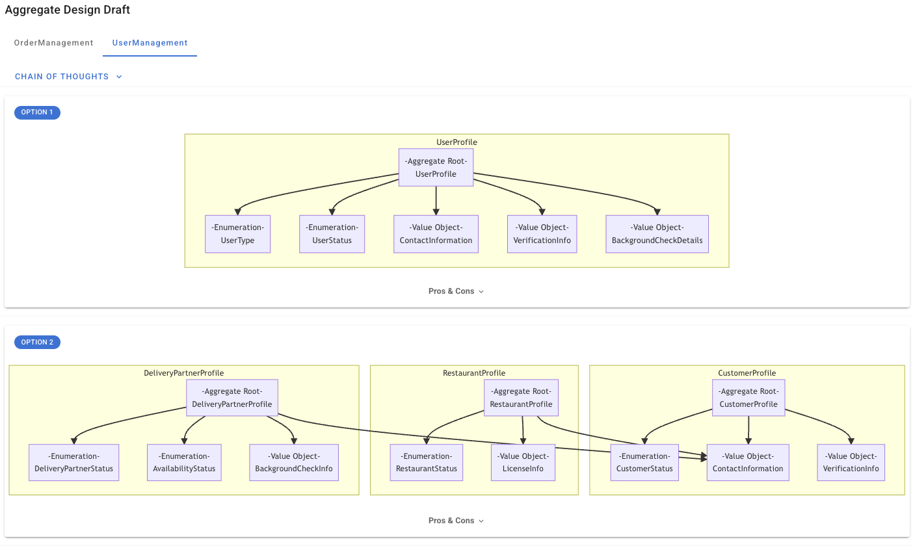

This enables analysis of core concepts, roles, and responsibilities from requirements and shortens lead time through automatic derivation of aggregate candidates.

### 6) Event Storming Model Design
As the final step in analysis/design, design an event storming model based on the generated aggregate drafts.
- Click 'Generate Event Storming Model'.  

When model generation begins, an event storming model that meets requirements is generated as shown below, based on results generated through AI in the analysis stage, including user stories, partitioned Bounded Contexts, and aggregate drafts.
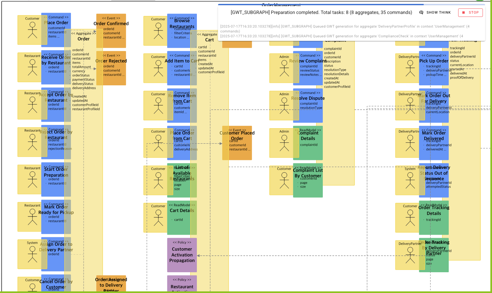

The generated event storming visualizes domain event-centered business flows and automatically configures relationships between stickers, enabling Domain-Driven Design (DDD) implementation.

### 7) Automatic PDF Deliverable Generation
You can document the deliverables created in the analysis/design stage through the automatic PDF generation feature.

- Navigate to the screen where you proceeded with the previous analysis steps, then click the 'Save' button in the upper right to save the current results.  
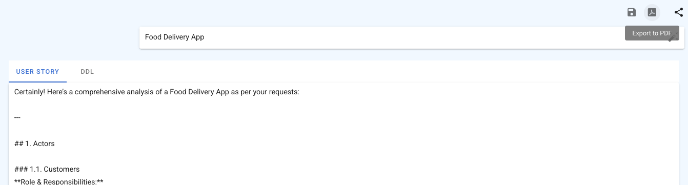

- Then click the 'Export to PDF' button on the saved screen to automatically generate analysis/design stage deliverables in PDF format.
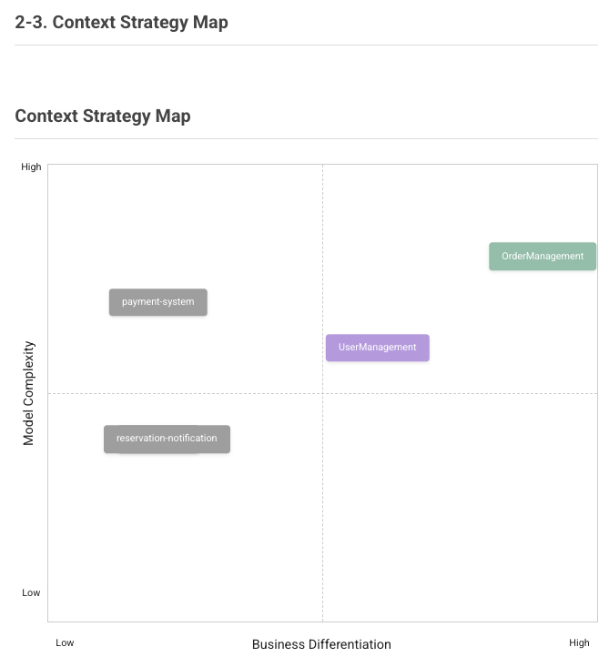

This provides consistent document formats to enhance readability, shortens documentation work time, and provides standardization of document quality.

## 2. Implementation Using Vibe Coding
Here's how to proceed with model-based implementation code generation using the finally generated event storming model and Vibe Coding for the food delivery app analysis/design.

### 1) Applying Vibe Coding Template
- Click the **'CODE'** button to create a Code Preview screen on the right side of the browser.

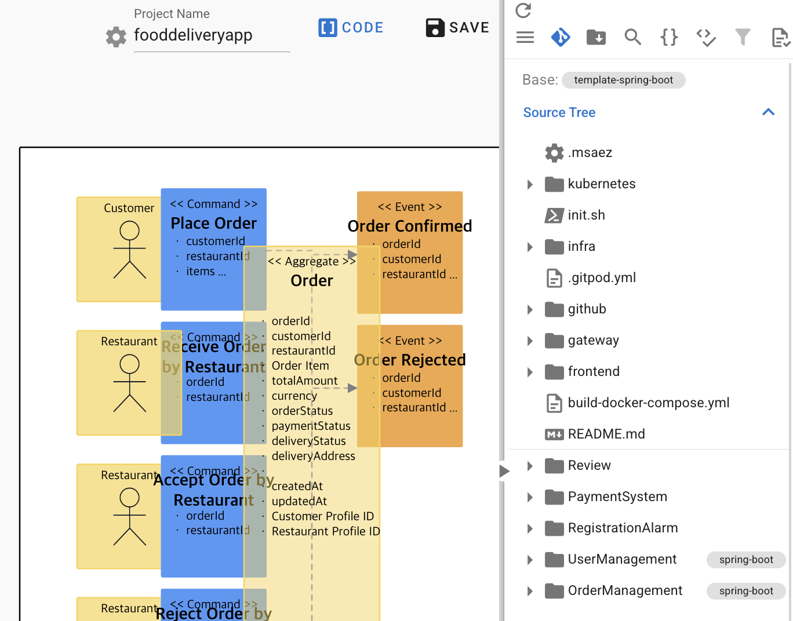
- Click **Base: template-spring-boot**, then click 'MARKETPLACE'.

- Select **'Vibe Coding for Spring boot Cline'** as shown below, then click 'APPLY'.

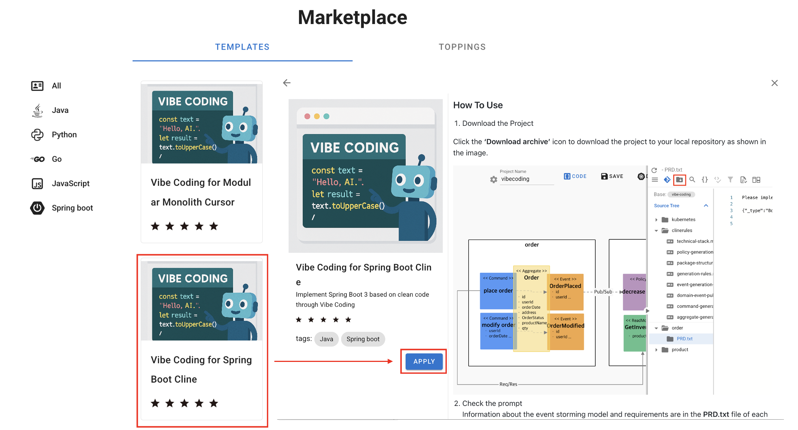

### 2) Project Creation
Download the project with Vibe Coding Template applied and run the project locally.

- Click **'Download Archive'** at the top of the Code Preview screen to proceed with download.

- Open the generated project by running a local IDE (Cursor, VSCode...) and selecting the downloaded file.

When you check the files, md extension files are created under the .clinerules folder.
These md files contain generation rules, package structure, technology stack, test file generation rules, event storming sticker rules, etc.,  
and are delivered along with prompts when implementing code in Vibe Coding to help generate code that complies with requirements.

### 3) Cline Installation and Setup
Here's how to install Cline, a closed-source LLM, to proceed with model-based Vibe Coding.

- Select Extensions as shown below.

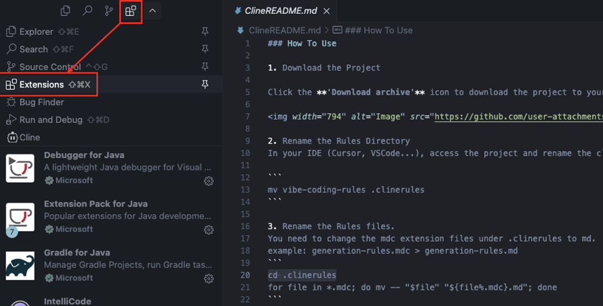

- Search for **'Cline'** in the search box, select it, then click **'Install'** to install the Cline Extension.

- Once installation is complete, a Cline icon is created, and clicking it generates the screen as shown below.

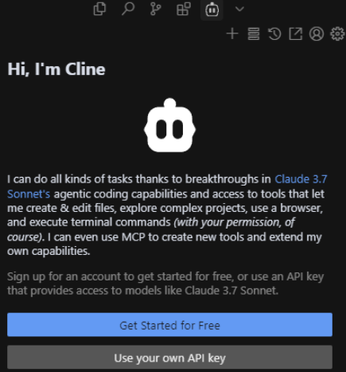

- Click "Use your Own API key" and configure the following settings in the configuration that appears, then click 'DONE' to save.

    Base URL: http://ai-server.dream-flow.com:30000/v1
    API KEY: Enter test value ('12345678')
    Model: Display name of configured model ('QWen2.5')

### 4) Code Generation Through Prompts
Proceed with Vibe Coding using the previously generated model information (metadata), prompts, and rules files. The method is as follows:

- Click PRD.txt under each Bounded Context folder.
- Copy the PRD.txt content, then navigate to Cline.
- Paste the copied content in **'Type your task here...'** at the bottom of the area, then press 'Enter'.

Once input is complete, you can see that code is generated as shown below based on the prompt entered in Cline and the files generated under .clinerules.
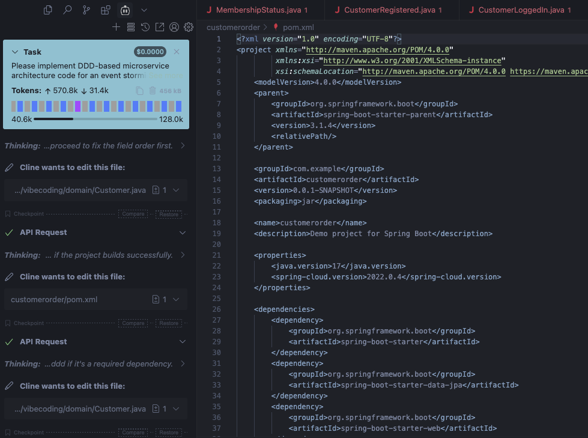

This Vibe Coding approach for analysis/design and implementation greatly helps in rapidly analyzing user business requirements, designing efficient microservice architectures, and generating high-quality code.   