# Natural Language-based Bounded Context & Domain Design AI

<!-- 

	<iframe style="position: absolute; top: 0; left: 0; width: 100%; height: 100%;" 
        src="https://www.youtube.com/embed/M6vK9WtyLwQ" 
        frameborder="0" scrolling="no" frameborder="none" allowfullscreen="">
    </iframe>

  -->

## 1. Domain Analysis Using LLM Technology
- Deep domain context understanding using LLM, beyond simple text analysis
- LLM analyzes domain experts' tacit knowledge and converts it into explicit knowledge
- Derivation and refinement of ubiquitous language

## 2. Microservice Derivation Based on Event Storming
- Business process analysis centered on domain events
- Aggregate identification criteria:
  - Transaction consistency boundaries
  - Invariants guarantee scope
  - Concurrency control units
- Defining relationships between bounded contexts through Context Map:
  - Conformist
  - Anti-corruption Layer
  - Open Host Service
  - Published Language

## 3. Automatic Bounded Context Separation
- Analysis of domain model cohesion and coupling
- Application of strategic design patterns:
  - Core Domain
  - Supporting Domain
  - Generic Domain
- Context communication pattern design:
  - Synchronous communication (Request-Response)
  - Asynchronous communication (Event-Driven)
  - Identification of Saga pattern application sections

## Implementation Method

Access [**MSAEZ**](https://www.msaez.io/) and click the AI Generation button.

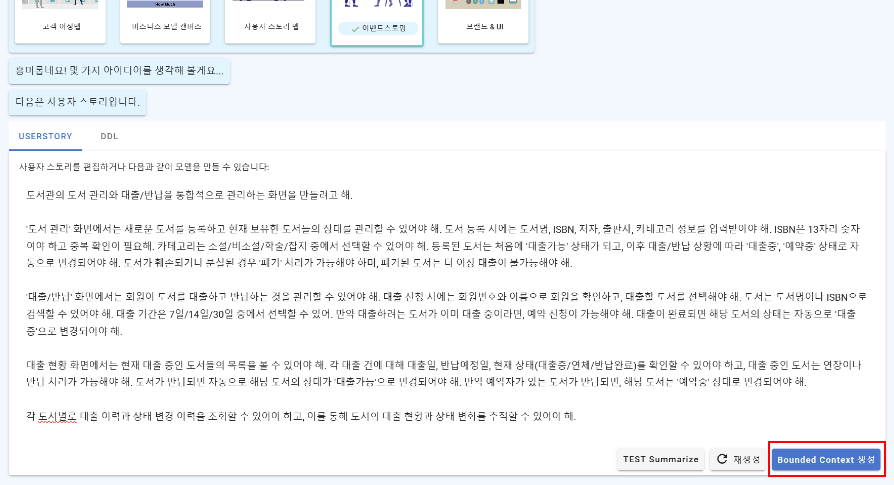

Click the **Event Storming Generation button** and write user stories in natural language.

When selecting event storming, a default user scenario is automatically generated for testing, but writing your own user scenario allows for more accurate requirement reflection.

Once scenario writing is complete, click the **Bounded Context Generation button**.

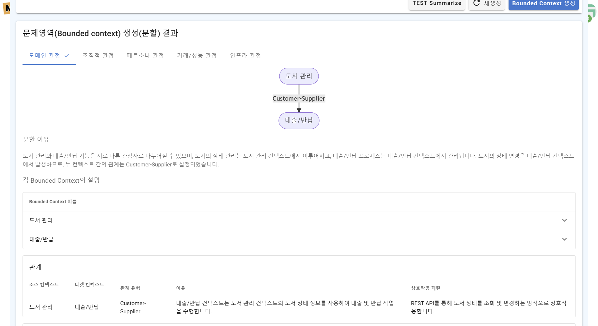

When clicked, **drafts of 5 perspectives for composing bounded contexts** are generated.

The top shows the bounded contexts to be generated and their relationship diagram, while the bottom displays AI's analysis of why such composition was derived.

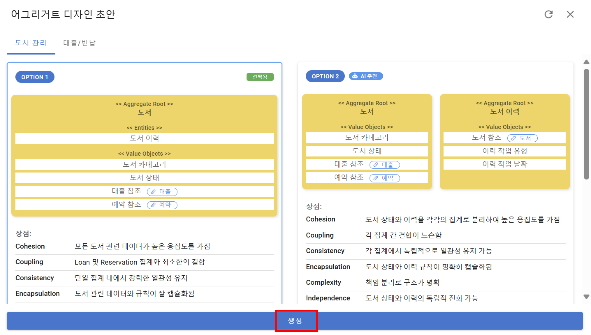

Clicking the **Create Model button** moves to the event storming canvas screen, where after detailed analysis of requirements assigned to each bounded context, options for composing aggregates are generated.

Each option is generated considering ACID and various factors, displaying advantages and disadvantages from multiple perspectives, including cohesion and coupling, which are core to microservice architecture design.

Selecting one of the suggested aggregate drafts and clicking generate automatically creates an event storming model including aggregates, commands, events, and policies within each bounded context.

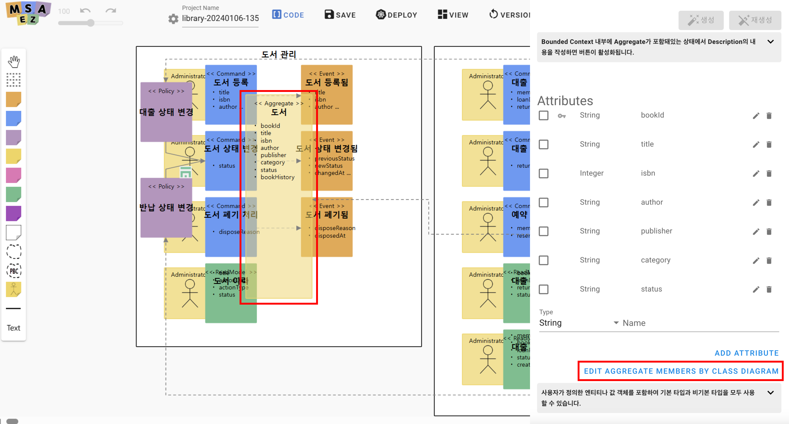

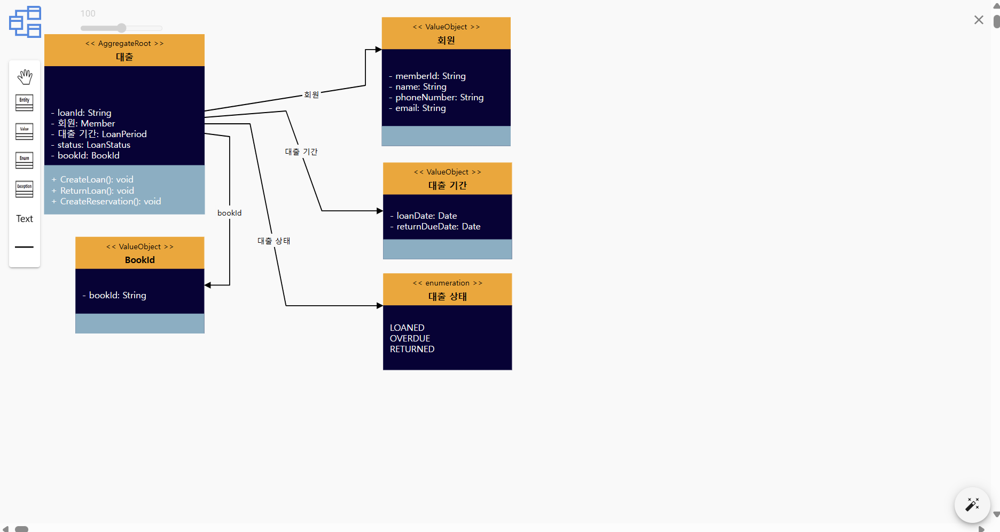

Once the event storming model is generated, you can check the class diagram by clicking the **Edit Aggregate Members By Class Diagram button** in the aggregate internal settings.

For example, examining the book aggregate shows that the BookId value object used as the book code and information about loan status and period are written within the class diagram according to the selected options.

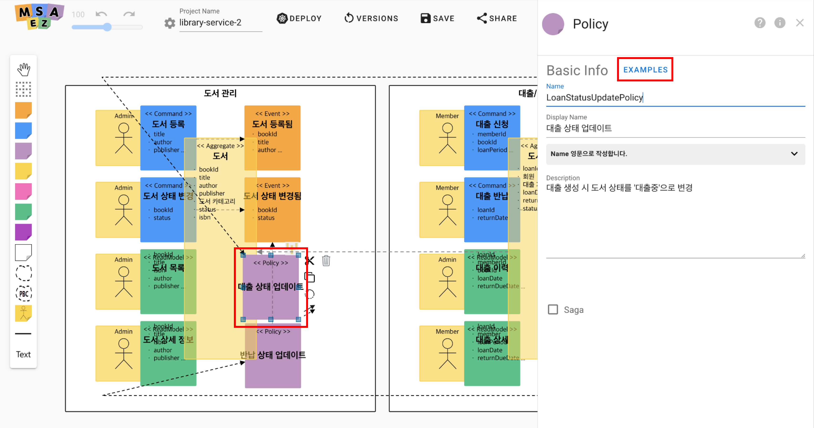

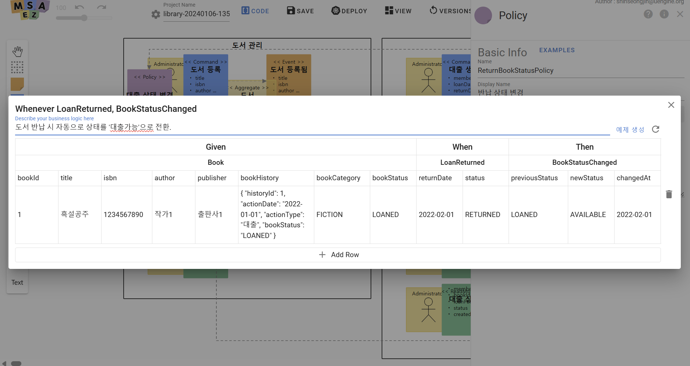

Next, select the policy sticker to generate **Given-When-Then examples** for testing application system policies.

Click the **Examples button** and then the **Generate Example button** in the opening tab to have AI automatically generate examples for that policy.

**※ What is Given-When-Then?** 
It's one method of writing test cases when creating and testing program features. Given is the initial situation, When is the user action, and Then is the resulting outcome, corresponding to Given - Aggregate / When - Command / Then - Event.

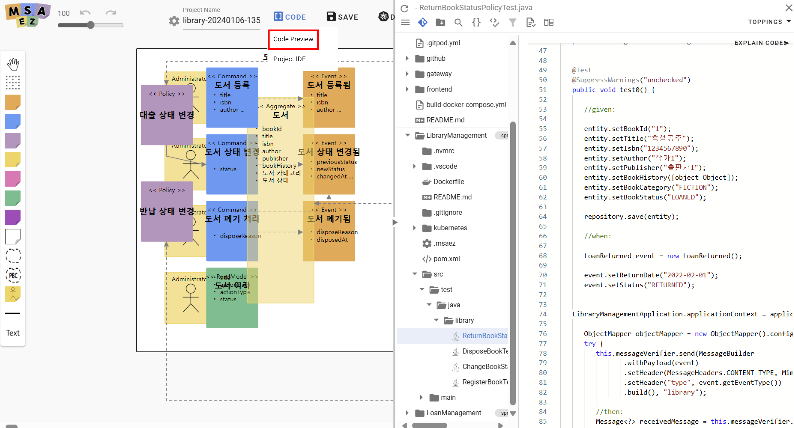

After example generation, check the code generated based on the event storming model.

Hover over the Code button among the icons at the top of the event storming canvas and click the **Code Preview button** to view all generated code files.

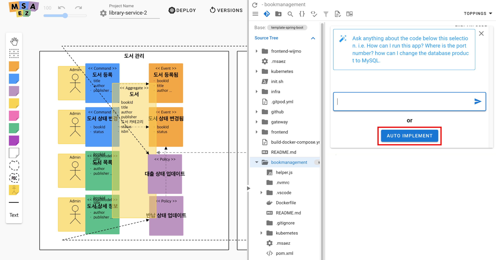

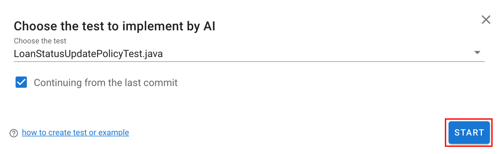

This is the stage for conducting **jUnit tests** for each bounded context.

Select the file you want to test and click the **Auto Implement button** to choose test items to be implemented by AI. Select desired tests and press the **Start button** to begin automatic testing.

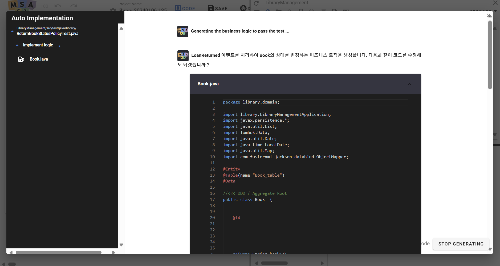

As shown above, **AI automatically conducts tests** and also writes some business logic needed to implement the functionality.

Once all errors are fixed and tests pass, **push the code to a Github repository to save as a project**.

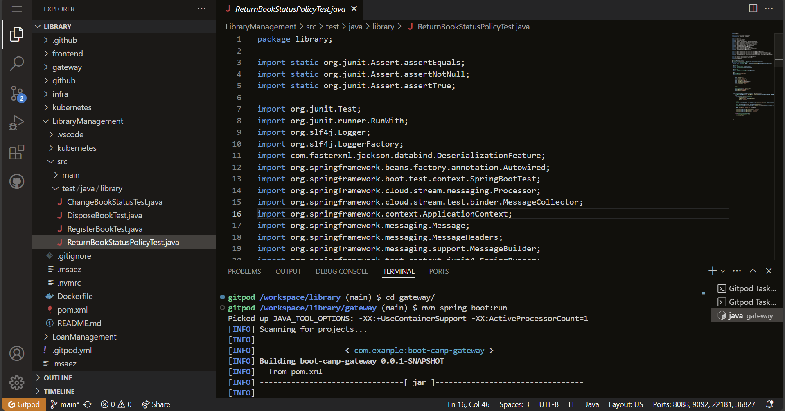

Add **gitpod.io/#/** before your GitHub URL where the project is stored to access GitPod, connecting you to a web browser-based IDE where you can operate the code.

