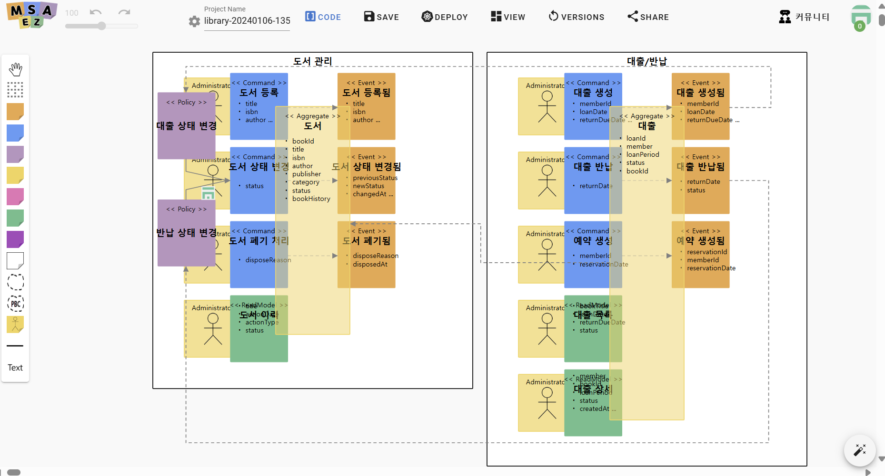

# 자연어 기반 Bounded Context & 도메인 설계 AI

	<iframe style="position: absolute; top: 0; left: 0; width: 100%; height: 100%;" 
        src="https://www.youtube.com/embed/M6vK9WtyLwQ" 
        frameborder="0" crolling="no" frameborder="none" allowfullscreen="">
    </iframe>

 

## 1. LLM 기술을 활용한 도메인 분석
- 기존의 단순 텍스트 분석이 아닌, LLM을 활용한 심층적 도메인 컨텍스트 이해
- 도메인 전문가의 암묵지(Tacit Knowledge)를 LLM이 분석하여 명시적 지식으로 변환
- 유비쿼터스 언어(Ubiquitous Language) 도출 및 정제

## 2. 이벤트스토밍 기반 마이크로서비스 도출
- 도메인 이벤트 중심의 비즈니스 프로세스 분석
- 애그리게잇(Aggregate) 식별 기준:
  - 트랜잭션 일관성 경계
  - 불변식(Invariants) 보장 범위
  - 동시성 제어 단위
- 컨텍스트 맵(Context Map)을 통한 바운디드 컨텍스트 간 관계 정의:
  - Conformist
  - Anti-corruption Layer
  - Open Host Service
  - Published Language

## 3. 바운디드 컨텍스트 자동 분리
- 도메인 모델의 응집도(Cohesion)와 결합도(Coupling) 분석
- 전략적 설계(Strategic Design) 패턴 적용:
  - Core Domain
  - Supporting Domain
  - Generic Domain
- 컨텍스트 간 통신 패턴 설계:
  - 동기식 통신 (Request-Response)
  - 비동기식 통신 (Event-Driven)
  - 사가(Saga) 패턴 적용 구간 식별

## 수행 방법

[**MSAEZ**](https://www.msaez.io/) 에 접속해 AI 생성 버튼을 클릭합니다.

**이벤트스토밍 생성 버튼**을 클릭하고 자연어로 유저 스토리를 작성합니다.

이벤트스토밍을 선택하면 기본적으로 테스트해 볼 수 있는 유저 시나리오가 자동으로 생성이 되지만, 직접 유저 시나리오를 작성하면 보다 정확한 요구사항을 반영할 수 있습니다.

시나리오 작성이 완료되면 **Bounded Context 생성 버튼**을 클릭합니다.

버튼을 누르면, **바운디드 콘텍스트를 구성할 수 있는 5가지 관점에 대한 초안**이 생성됩니다.

위쪽에는 생성시킬 바운디드 콘텍스트와 각 바운디드 콘텍스트의 관계도가, 아래쪽에는 왜 이런 식으로 구성을 도출했는지에 대한 AI의 분석 내용이 표시됩니다.

**Create Model 버튼**을 클릭하면 이벤트스토밍 캔버스 화면으로 이동하고, 각 바운디드 콘텍스트에 할당된 요구 사항들을 먼저 세부적으로 분석하는 과정을 거친 후 어그리거트를 구성할 수 있는 옵션이 생성됩니다.

각 옵션들은 ACID 및 여러 고려 사항을 통해 생성이 되며, 마이크로서비스 아키텍처 설계의 핵심인 응집도와 결합도를 포함한 다양한 고려 사항 측면에서 장점, 단점을 분석해 표시해줍니다.

제시된 어그리거트 초안들 중 하나를 선택해 생성 버튼을 클릭하면 각 바운디드 컨텍스트 내부에 어그리거트부터 커맨드, 이벤트, 폴리시를 포함한 이벤트스토밍 모델이 자동으로 생성됩니다.

<!-- 

생성된 이벤트스토밍 모델 -->

이벤트스토밍 모델 생성이 완료되면, 어그리거트 내부 설정에서 **Edit Aggregate Members By Class Diagram 버튼**을 클릭해 클래스 다이어그램을 확인해볼 수 있습니다.

예를 들어 도서 어그리거트를 살펴보면, 선택되어있는 옵션대로 도서 어그리거트 루트에 도서 코드로 활용되는 BookId 밸류 오브젝트와 대출 상태 및 기간 등에 대한 정보가 클래스 다이어그램 내부에 작성된 것을 확인해 보실 수 있습니다.

다음 단계로 폴리시 스티커를 선택해 어플리케이션의 테스트를 위해 각 시스템 정책에 대한 **Given-When-Then 예제**를 생성합니다.

**Examples 버튼**을 클릭하고 열리는 탭에서 **예제 생성 버튼**을 클릭하면 AI가 해당 정책에 대한 예제를 자동으로 생성해줍니다.

**※ Given-When-Then이란?** 
프로그램을 만들고 기능을 테스트할 때, 테스트 케이스를 작성하는 방법 중 하나입니다. Given은 주어진 상황, When은 사용자의 행위, Then은 그로 인해서 일어나는 결과이며, Given - Aggregate / When - Command / Then - Event에 대응됩니다.

예제 생성이 완료되면 이벤트스토밍 모델을 기반으로 생성된 코드를 확인합니다.

이벤트스토밍 캔버스 상단 아이콘 중 Code 버튼에 마우스 커서를 올려 **Code Preview 버튼**을 클릭하면 생성된 코드 파일 전체를 조회할 수 있습니다.

각 바운디드 컨텍스트 별로 **jUnit 테스트**를 진행하는 단계입니다. 

테스트를 진행하고자 하는 파일을 선택하고 **Auto Implement 버튼**을 클릭하면 AI로 구현되는 테스트 항목을 선택할 수 있습니다. 원하는 테스트를 선택하고 **Start 버튼**을 누르면 테스트가 자동으로 진행됩니다.

위 화면과 같이 **AI가 자동으로 테스트를 진행**하는 것은 물론, 해당 기능을 구현하기 위해 필요한 비즈니스 로직도 일부 작성해줍니다. 

모든 오류가 수정되어 테스트를 통과하면 해당 코드를 **Github 리포지토리에 push해 프로젝트로 저장**합니다.

프로젝트가 저장된 본인의 GitHub URL 앞에 **gitpod.io/#/** 를 붙여 GitPod에 접근하면 해당 코드를 운용할 수 있는 웹브라우저 기반 IDE로 연결됩니다.

