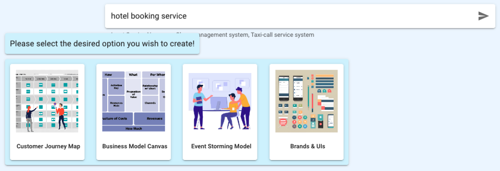
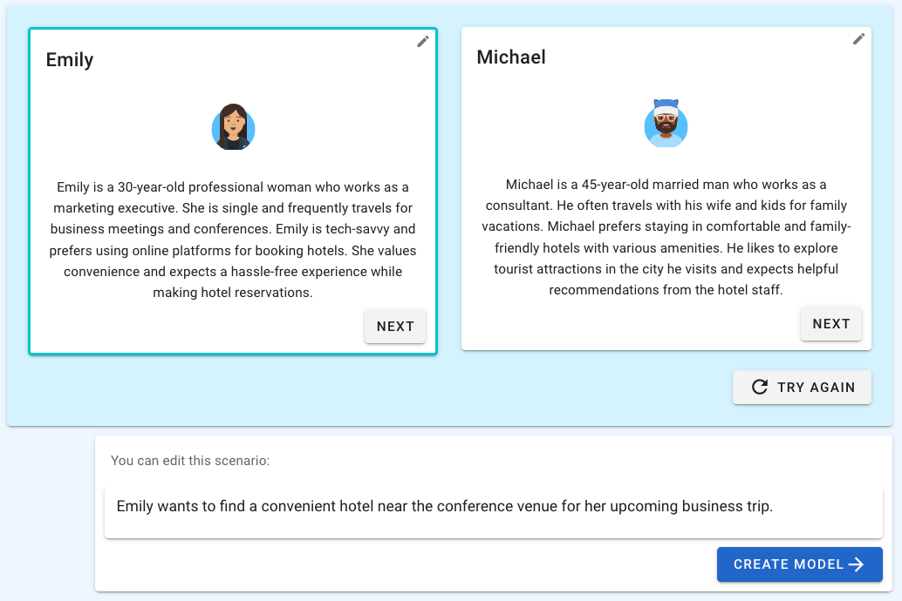

# Creating Models with ChatGPT

<iframe style = "width:100%; height:100%;" src="https://www.youtube.com/embed/HSMEgOJj3Co" title="YouTube video player" frameborder="0" allow="accelerometer; autoplay; clipboard-write; encrypted-media; gyroscope; picture-in-picture" allowfullscreen></iframe>

 

## Generating business model utilizing OpenAI

 By auto-generation of the Customer Journey Map, Business Model Canvas and Eventstorming Model with the power of Chat GPT, MSAEZ will save time during the design process and provide more efficient business experience.

## How-to

1. Enter the type of service that you want to create in the input box on the main page of MSAEZ(e.g. hotel booking service, food delivery service, etc...).
 

2. Select the option that you want to create from Customer Journey Map, Business Model Canvas, Eventstorming Model and Brand&UI.

### Customer Journey Map

3-1. Choose the Persona of the potential customer for the service.

3-2. If the customer action scenario of the persona had been generated, click CREATE MODEL button(Scenario can be modified).

3-3. A Customer Journey Map that reflects the requirements of the persona would be automatically generated.
 
### Business Model Canvas

4-1. Click CREATE MODEL button of Business Model Canvas. 

4-2. Chat GPT recommends the elements that make up the business and generates model automatically.

### Eventstorming Model

5-1. The user story of the service is created.

5-2. Click CREATE MODEL button to call Chat GPT to create domain events that makes up the business.

5-3. Click Generate Aggregate button to create full eventstorming model based on previously created domain events.