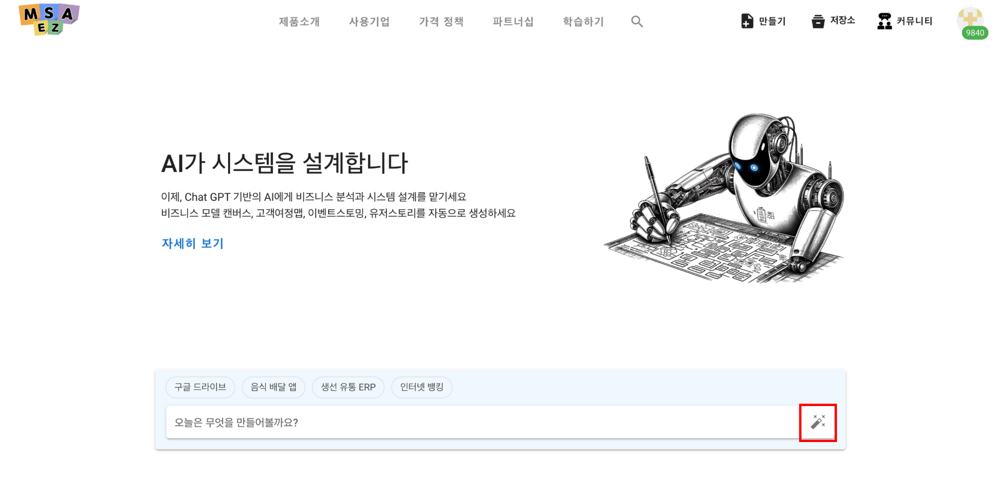
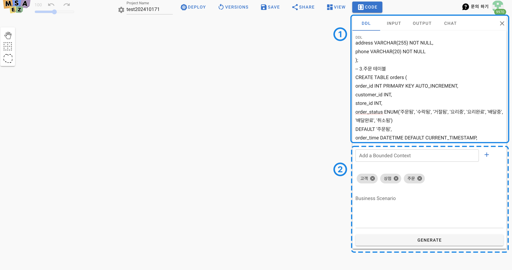
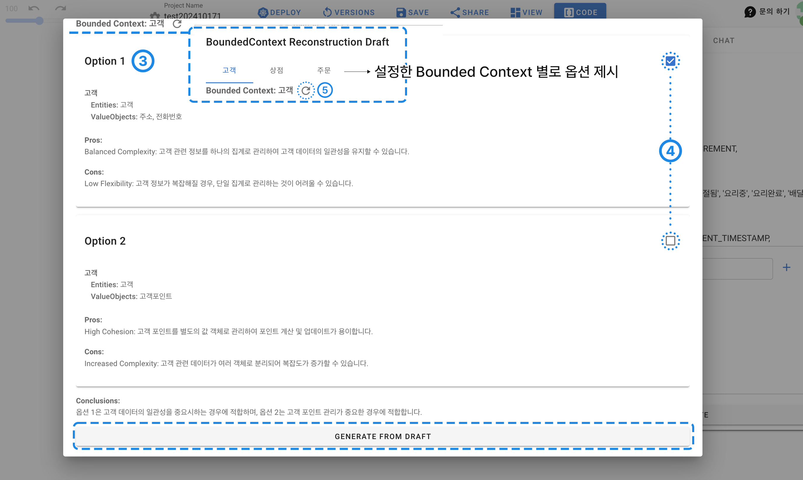
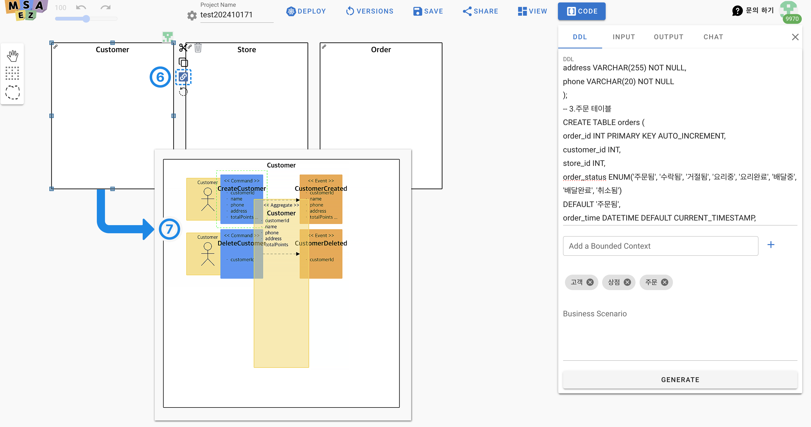

# DDL To EventStorming

**DDL To EventStorming** 기능은 설계에서 도출한 데이터를 DDL 언어로 입력하면, AI가 각 모델을 시각화하고 데이터 구조에 대한 다양한 옵션을 제시합니다. 이를 통해 각 옵션의 장단점을 비교 분석할 수 있으며, 요청한 서비스 영역별로 최적화된 솔루션을 제공하여 애플리케이션을 생성할 수 있습니다. 이 기능을 통해 사용자는 복잡한 대규모 프로젝트를 직접 일일이 설계하지 않고도 간편하게 진행할 수 있습니다.

## 수행 방법

<!-- 

[**MSAEZ**](https://www.msaez.io/) 에 접속해 AI 생성 버튼을 클릭합니다. -->

① 서비스의 설계서로 정해진 DDL을 넣습니다.

② 서비스 범위를 지정해서 사용할 Bounded Context를 추가한 후 GENERATE 버튼을 누릅니다.

③ 사용될 Aggregate domain에 대해 어떻게 정의를 해서 사용할지에 대한 옵션을 AI가 제시를 하면,

④ 각 서비스별로 체크해서 사용할 도메인을 정하고 GENERATE 버튼을 클릭합니다.

⑤ 옵션이 마음에 들지 않을 경우, 제안을 다시 받을 수 있는 재생성 버튼 클릭합니다.

⑥ Bounded Context별로 모델이 생성되고, Bounded Context 옆의 파란색 아이콘을 클릭합니다.

⑦ 자동으로 생성된 모델 확인이 가능합니다.
