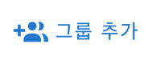
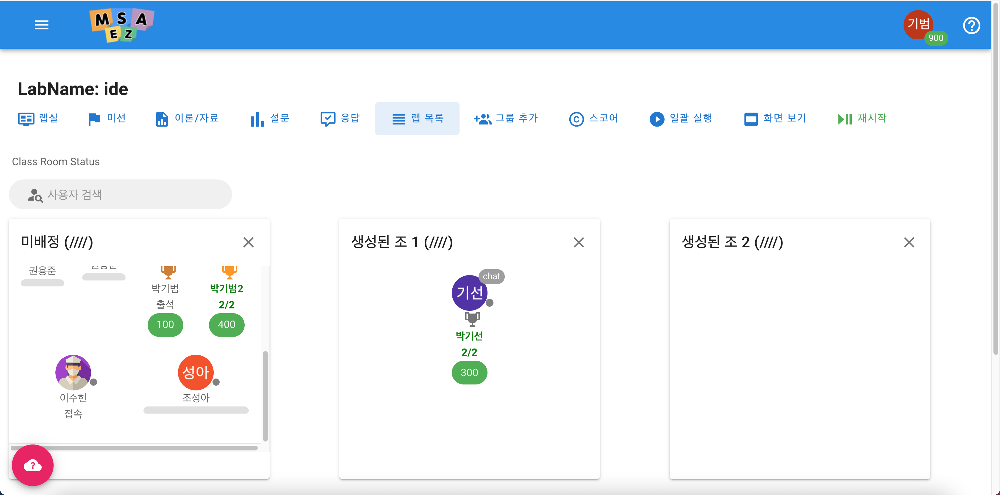

# Registration Course

<iframe style = "width:100%; height:100%;" src="https://www.youtube.com/embed/Le0a-NH6xwQ" title="YouTube video player" frameborder="0" allow="accelerometer; autoplay; clipboard-write; encrypted-media; gyroscope; picture-in-picture" allowfullscreen></iframe>

## lecture development

### · Create a lecture

**[Click Create Course](http://www.msaez.io/#/courses) -> Go to Create Course tab**

 

| Number | Name                | Detail of fuction                                                                 |
| ---- | ------------------- | ------------------------------------------------------------------------- |
| 1    | lecture title  | This is the representative title of the lecture to be used in the lecture.  |
| 2    | lecture code | This is the unique code you have when creating a lecture. (Duplicate creation is not possible) |
| 3    | Start Date          | You can specify the start date of the lecture. |
| 4    | End Date            | You can specify the end date of the lecture. |
| 5    | Recommended lectures | When checked, the lecture is displayed in the Recommended Lectures tab. |
| 6    | public lecture | When checked, the lecture is displayed in the public lecture tab. |
| 7    | paid lectures | When checked, the lecture can be created as a paid lecture. |
| 8    | corporate lecture | When checked, the lecture is displayed in the corporate lecture tab. |
| 9    | connection Key      | This is the password to enter the class. |
| 10   | Create a lecture | When you click, a lecture is created according to the settings above. |

---

### · Create lab

| Number | Name                | Detail of fuction                                                                 |
| ---- | ------------------- | ------------------------------------------------------------------------- |
| 1    | lab-Id              | Unique Id of lab                            |
| 2    | lab-Name            | Lab's representative title                                          |
| 3    | lab-Scenario        | Description of lab                                           |
| 4    | tool                | Tools to use in the lab                                             |
| 5    | lab-price           | Giving a price when creating a paid course                                          |

<h3>lab-tool</h3>

| Number | Name                | Detail of fuction                                                              |
| ---- | ------------------- | ------------------------------------------------------------------------- |
| 1    | event-storming      | Use the event storming tool when entering the created lab           |
| 2    | ide                 | Use of tools using Web Visual Studio when entering the created lab               |
| 3    | kuber-ez            | Use the kuber-ez tool to enter the created lab                                |
| 4    | url                 | Used during Electron class when entering the created lab             |

### · Move and delete lab positions

| Number | Name                | Detail of fuction                                                                 |
| ---- | ------------------- | ----------------------------------------------------------------------------------- |
| 1    | Lab Order           | Order can be changed by dragging the mouse                                                   |
| 2    | Drop here to Delete | Remove the lab of Lab Order when moving it to the right, Drop here to Delete. (not actually removed) |
| 3    | CANCLE              | Even if the function is operated, pressing the CANCEL button resets it to the initial state  |
| 4    | SAVE                | Final reflection when clicking the SAVE button after operating the function  |

### · instruction Editing

<h3> · Insert video to be used in lab</h3>

**When clicking the fan icon at the bottom of the video, the video insertion URL input window is displayed.**

<h3> · Instruction content editing</h3>

**You can edit the content by clicking the fan icon at the right end of the Instruction Markdown format**

<h3> · Instruction contents Merge</h3>

**If you click the icon next to the fan at the right end of the instruction, you can use the merge function of other people's instructions.**

### · Store content

**Ability to work on materials (code, modeling) to be used in lectures and save related data in the lab when clicking the icon**

### · quiz edit

**Edit a lecture question Click the pencil icon to edit the question you want to edit and write it down**

## lecture progress

### · group formation
**Create Group Add UI when clicking Add Group Button**

   

**If you drag and drop users on the created UI with the mouse, users who are together are grouped together.**

### · chatting

| Number | Name                | Detail of fuction                                                       |
| ---- | ------------------- | ----------------------------------------------------------------- |
| 1    | NOTICE | Announcements made by instructors (only instructors can enter)                 |
| 2    | CLASS | UI that allows conversations with all participants                            |
| 3    | GROUP | UI for chatting only with grouped users                                           |
| 4    |  | Screen capture icon you are currently viewing |
| 5    |  | Icon to turn chat notifications on and off |

### · error support

**After checking user questions through chat, a separate UI window is displayed when clicking the user icon in classRoom**

   

**When you click View Lab Room in the output UI window, you can see the problems that occurred in the user's lab.**

### · Submit results

**After completing the lab, the learner clicks on the Labs tab - Submit Results.**

**After that, click the corresponding icon to complete the submission of results.**

**Instructors can check the submitted information in the LAB tab by clicking the user's icon in the classroom.**

## Student Management

### · compensation

**Instructors can present prizes by clicking on the user's icon in the classroom - by clicking the Pay Prize button in the LAB tab.**

**When the instructor clicks the start button in the classroom and then clicks the end button, the coin input alert window is displayed.**

**Users who have activated checkpoint acquire the coins entered in the maximum alert window according to their ranking.**

### · Fee inquiry

**You can check the purchase/use list in the purchase/use list in the list that appears when you hover your mouse over your login icon in the upper right corner.**

### · Coupon issuance, use and inquiry

**If you click Register Coupon and Get Coins from the list that appears when you hover your mouse over your login icon in the upper right corner, an input window will open where you can use the acquired coupon. (You can check the list of used coupons in the purchase/use list list.)**

