# Event Monitoring

<!-- 

	<iframe style="position: absolute; top: 0; left: 0; width: 100%; height: 100%;" 
        src="https://www.youtube.com/embed/Y3Si5eMNgTM" 
        frameborder="0" crolling="no" frameborder="none" allowfullscreen="">
    </iframe>

  -->

The event monitoring feature collects event logs from applications created based on the event storming model, allowing users to monitor the progress of current events.

## Key Features of the Event Monitoring Feature

- It is possible to track the business process in real time, making it easier to identify the problem point and resolve it immediately.
- It is easy to check if the new feature is working as intended after adding a new feature or modifying the system. 
- It is possible to view all processing steps for a specific business based on a unique identifier (e.g., order number) at a glance. 
- It is possible to check the detailed information for each step, including the event type, occurrence time, and detailed content.

## How to Perform

### Demo - Food Order Service
- The right side is a screen implemented with the left event storming model, and the monitoring content is handled by the left side screen.

#### Order(User's Order Management)
1. Click the Order registration button to input and register information about order management.

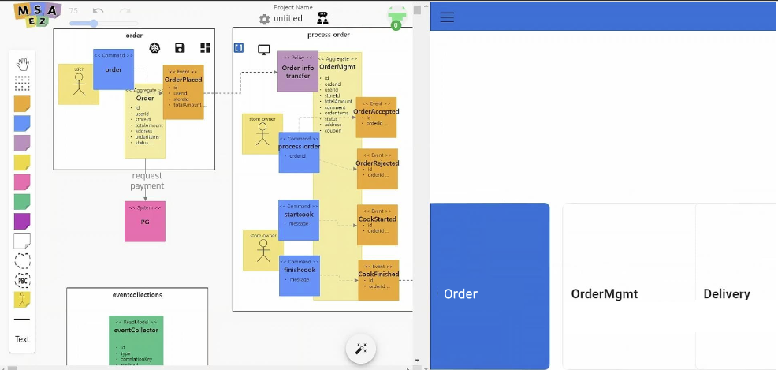 

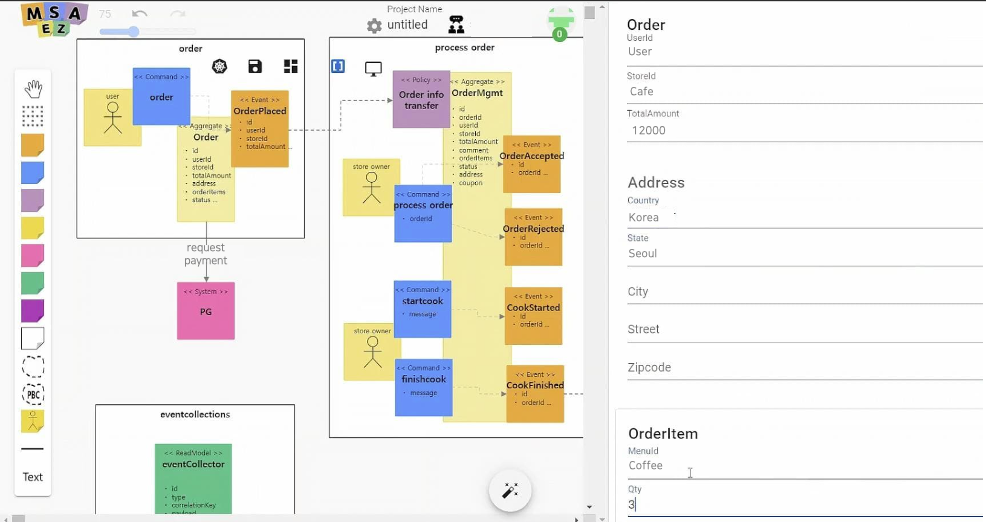

2. Click the monitor icon at the top of the screen to start the monitoring feature.

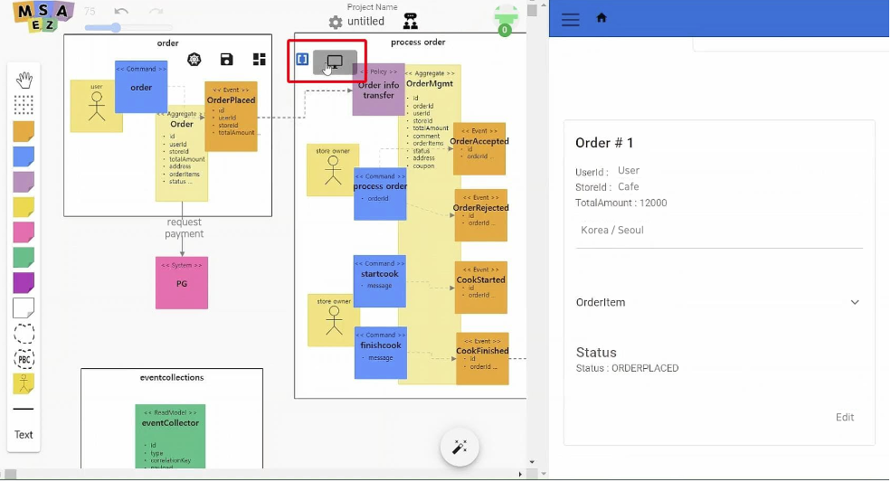

3. Events filtered based on the unique identifier (Correlation Key) are displayed in the event storming diagram. (The number in the diagram represents the order of the events.)

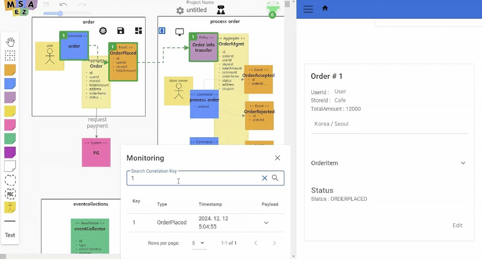

4. In the event list, you can check the event type, event occurrence time, and event details.

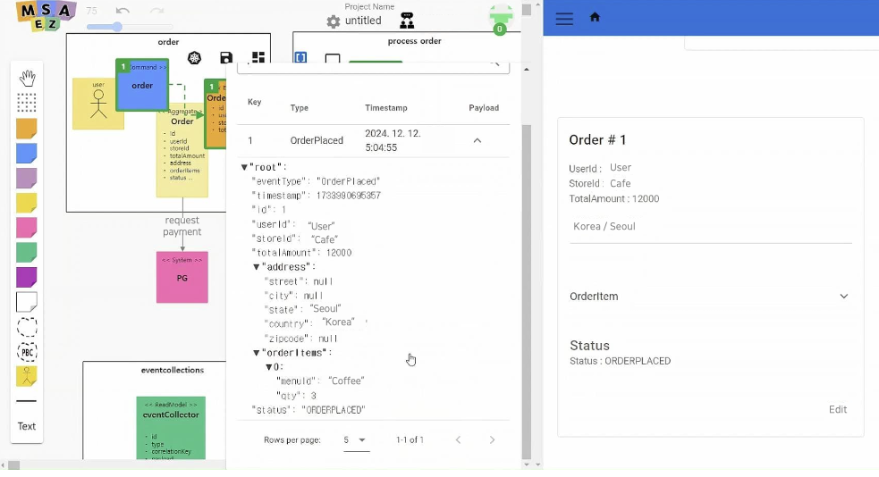

#### OrderMgmt(Order History Status Management)
- The same method can be used to track and manage all events registered in the same way.
  

- **Process Order**
  <!-- - 모니터링 페이지에서 주문 내역을 입력한 후 **Process Order** 버튼을 클릭하면 해당 커맨드가 실행되고 OrderPlaced, OrderAccepted 이벤트가 차례로 실행되는 것이 확인됩니다. -->
  <!-- - 우측 구현 화면에서 **Process Order** 버튼을 클릭하면 OrderAccepted 이벤트가 실행됩니다.  -->
  - When a user orders in Order, the OrderPlaced event is executed, and the order history is registered in OrderMgmt with the Order info transfer policy.
  - Click the **Process Order** button to process the order by executing the process order command, which triggers the OrderAccepted event.

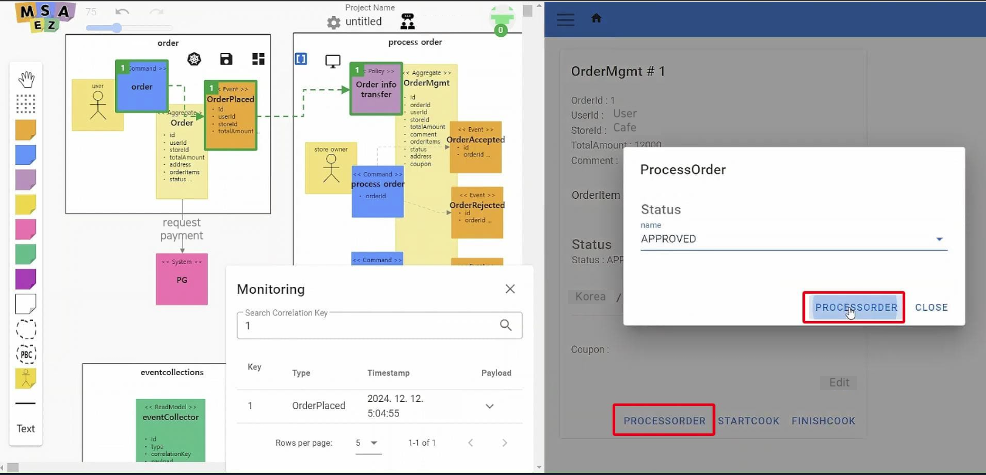 

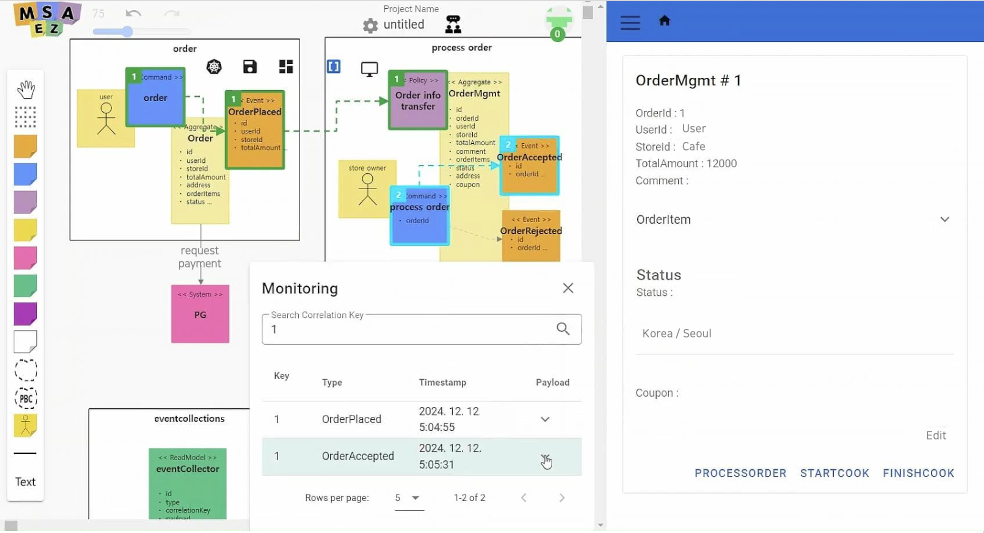 

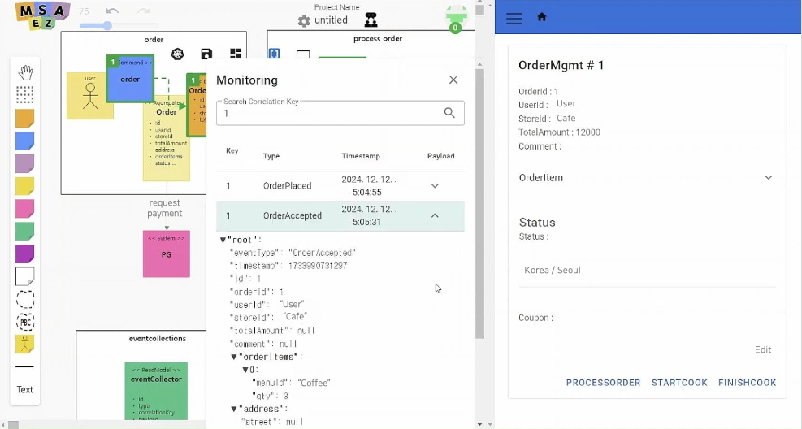
  

- **Start Cook**
  - The Start Cook command requests a cooking message for accepted orders and starts cooking the ordered food when the Start Cook button is clicked.

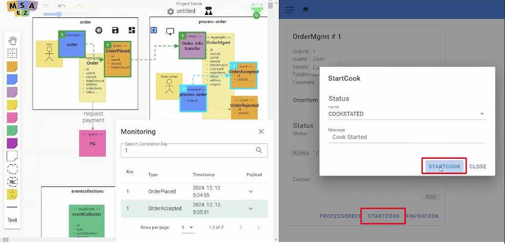

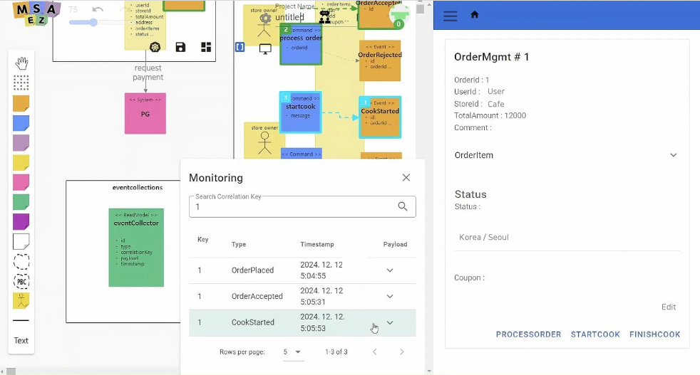

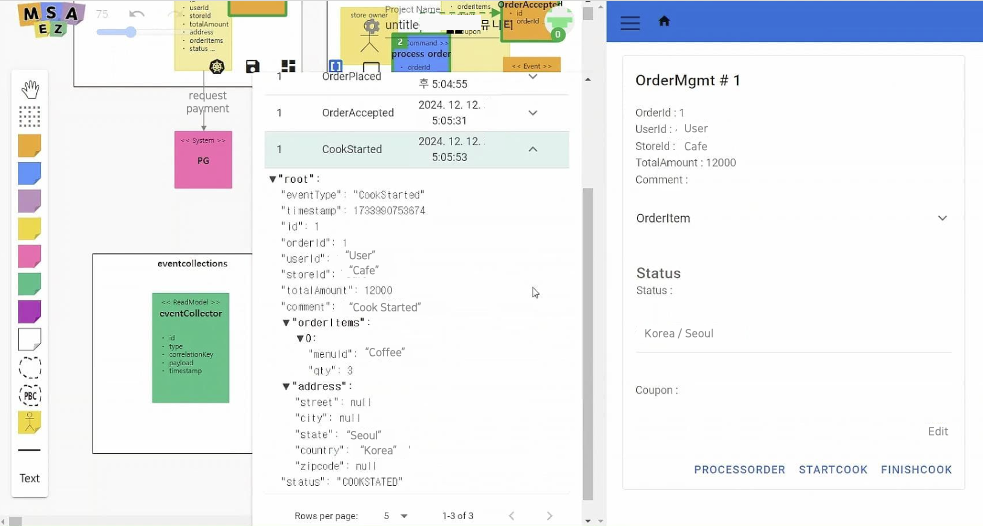
  

- **Finish Cook**
  - The Finish Cook command inputs a cooking completion message for cooking orders and executes the CookFinished event when the Finish Cook button is clicked, completing the ordered food.

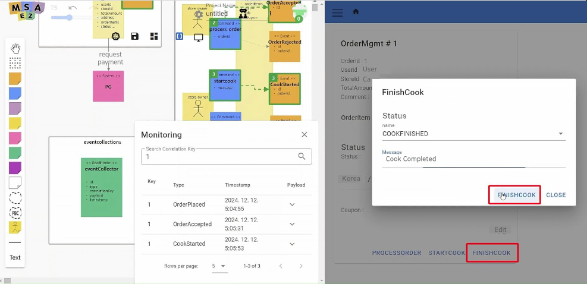

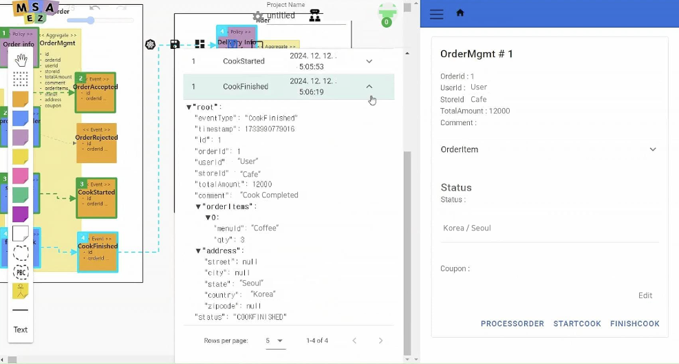
