# EventStorming

<h2>MSA Development with MSAEZ</h2>

## Service Access
[Pease navigate to the URL](http://www.msaez.io) **Chrome web browser is recommended**

<h2>example project</h2>

The example project is the process of creating a Java Project running with Spring-boot by EventStoring two services, an order service and a delivery service, and automatically deploying them to Kubernetes in Google Cloud.

### ·	Event Sticker
An orange icon in the sticker palette refers to an Event.

<h4>Event property setting</h4>

If you double-click the added Event sticker, the properties window appears as shown below on the right, and the values for each property setting are as follows.

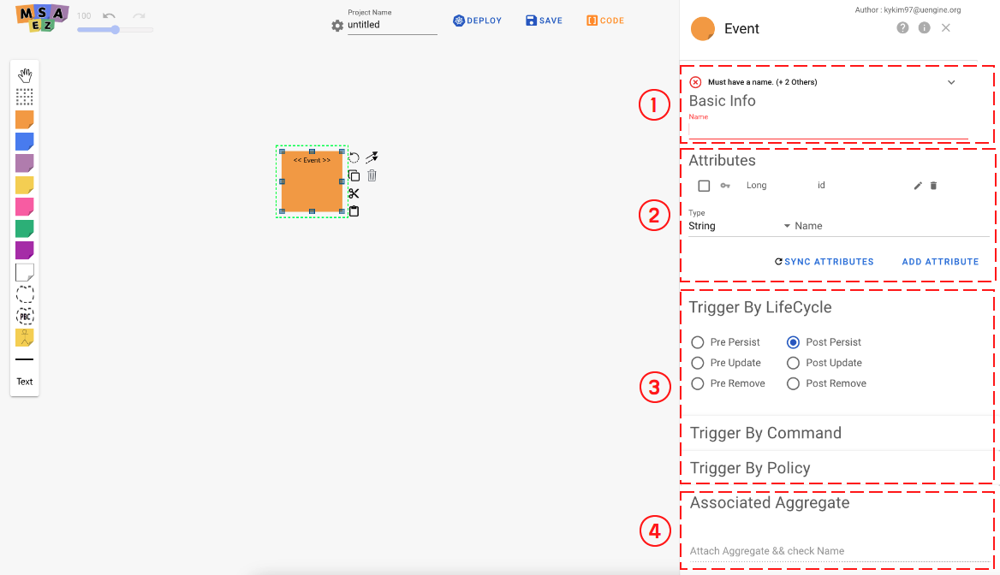

| Number | Name                 | Detail of fuction                            |
| ---- | -------------------- | ------------------------------------ |
| 1    | Event Name           | The name to be written on the Event Sticky note      |
| 2    | Trigger              | Trigger of the entity that raises the event  |
| 3    | Attribute            | Register Event Attributes             |
| 4    | Associated Aggregate | Select the aggregate to be associated with the event       |

According to the order scenario of the ordering team, fill in the following.

1. Enter **OrderPlaced** in Event Name.

2. Set **PrePersist** for trigger.

3. Attribute registers Entity to be used in Event. Basically, if an aggregate is connected in step 4. below, refer to the entity information of the aggregate.

4. Select the aggregate to be connected. (After that, after adding the aggregate, select it.)

The delivery team creates an Event according to the delivery scenario.

1. Enter **DeliveryStarted** in the Event Name.

2. Set **PostUpdate** for trigger.

3. Attribute registers Entity to be used in Event. Basically, if an aggregate is connected in step 4. below, refer to the entity information of that aggregate.

4. Select the aggregate to be connected. (After that, after adding the aggregate, select it.)

### ·	Policy Sticker

Policy is indicated by a lilac colored icon in the sticker palette.

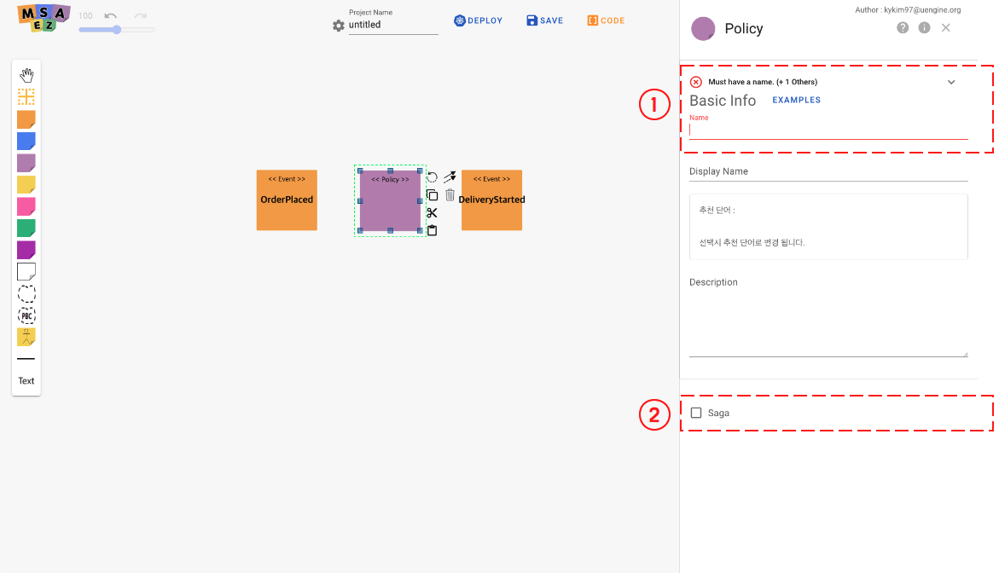

<h4>Setting Policy Properties</h4>

If you double-click the added policy sticker, the properties window appears as shown below on the right, and the values for each property setting are as follows.

| Number | Name                   | Detail of fuction                       |
| ---- | ---------------------- | -------------------------------- |
| 1    | Policy Name            | Name to be written on Policy Sticky note |
| 2    | Saga            | Saga 형태의 모델을 그릴 때 중앙 Policy에 설정 |

Depending on the task at the time the event occurs, enter it as follows.

1.  Enter **start delivery** in Policy Name.

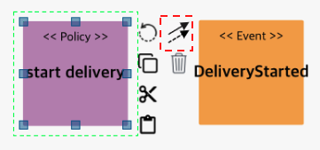

2. Policy 스티커 옆의 화살표 2개 아이콘을 드래그해 ****DeliveryStarted** Event로 연결하여 relation을 생성해줍니다.

### ·	Command Sticker

Command is indicated by a blue icon in the sticker palette.

<h4>Command property setting</h4>

If you double-click the added Command sticker, the properties window appears as shown below on the right, and the values for each property setting are as follows.

| Number | Name                     | Detail of fuction                 |
| ---- | -------------------------- | --------------------------------- |
| 1    | Command Name               | Name to be written on Command Sticky note |
| 2    | Associated Aggregate       | Select Aggregate to be associated with Command  |
| 3    | Method               | Select CRUD Type of Restful API   |
| 4    | Httpie command usages      | httpie에서 자주 사용 될 명령어 추천   |

Depending on the task at the time the event occurs, enter it as follows.

1. Enter **order** in Command Name.

2. Restful Type is set to POST.

3. Select the aggregate to be linked. (After that, select after adding Aggregate.)

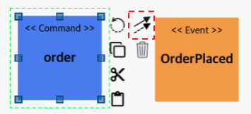

4. Command 스티커 옆의 화살표 2개 아이콘을 드래그해 **OrdePlaced** Event로 연결하여 relation을 생성해줍니다.

### ·	Aggregate Sticker

Aggregate is indicated by a yellow icon in the sticker palette

<h4>Set Aggregate Attributes</h4>

If you double-click the added Aggregate sticker, the properties window appears on the right as shown below, and the values for each property setting are as follows.

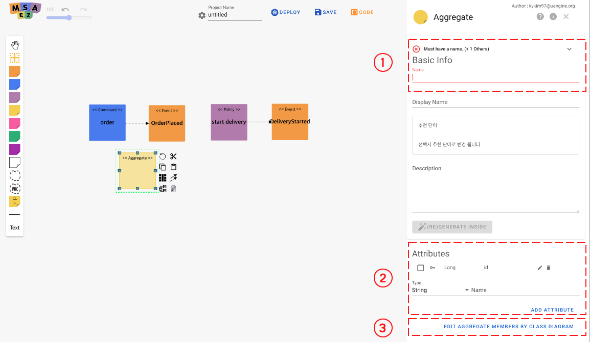

| Number | Name              | Detail of fuction                                   |
| ---- | ----------------- | ---------------------------------------------- |
| 1    | Aggregate Name    | Name to be written on Aggregate Sticky note           |
| 2    | Attributes        | Defines Aggregate Entity (Domain Entity). |
| 3    | Edit Aggregate Members   by Class Diagram       | 클래스 다이어그램으로 Attributes를 정의합니다                       |

To define the Aggregate (Domain Entity) of the ordering service, write the following.

1. Enter **Order** in Aggregate Name.

2. Defines Aggregate Entity (Domain Entity).
The service adds an entity called Name whose Type is String.

To define the Aggregate (Domain Entity) of the shipping service, fill in the following.

1.  Enter **Delivery** in Aggregate Name.

2. Defines Aggregate Entity (Domain Entity).
In this service, an entity called Address whose Type is String is added.

Aggregate를 추가 하였다면 Order는 order Command와 OrderPlaced Event 사이에, Delivery는 start delivery Policy와 DeliveryStarted Event 사이에 각각 위치시킵니다.

### ·	Bounded Context Sticker

Bounded Context is indicated by the dotted line icon in the sticker palette.

<h4>Setting the Bounded Context property</h4>

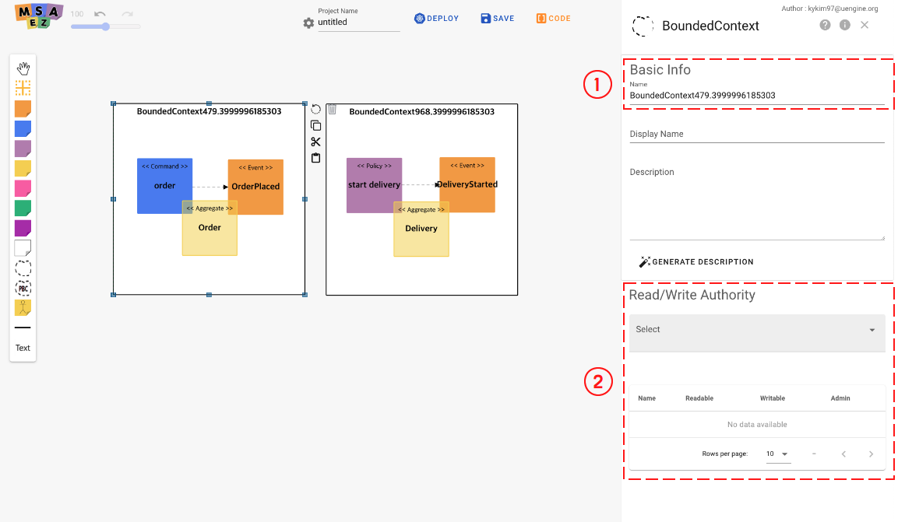

| Number | Name                   | Detail of fuction                     |
| ---- | ------------------------ | ----------------------------- |
| 1    | Bounded Context Name     | Name to be used for Bounded Context |
| 2    | Bounded Context Authority       | Bounded Context의 권한을 부여할 유저 선택과 권한 부여 |

주문 서비스의 Bounded Context와 배송 서비스의 Bounded Context를 그린 후, 각각의 서비스에 맞게 EventStorming의 Sticky Note들을 각 Bounded Context에 Drag & Drop으로 넣어줍니다.

각 Bounded Context들의 name은 Order, Delivery로 입력해줍니다.

### ·	Relation

Relation refers to the line from the Event sticker to the Policy sticker.

<h4>Add Relation</h4>

Select the arrow icon from the Event sticker, or just drag and drop it on the Policy sticker to be connected and then the connection will be established.

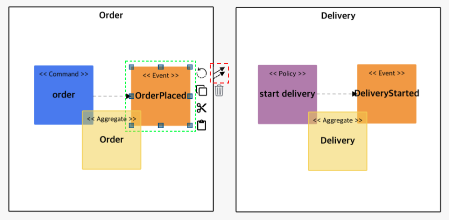

<h4>Relation property setting</h4>

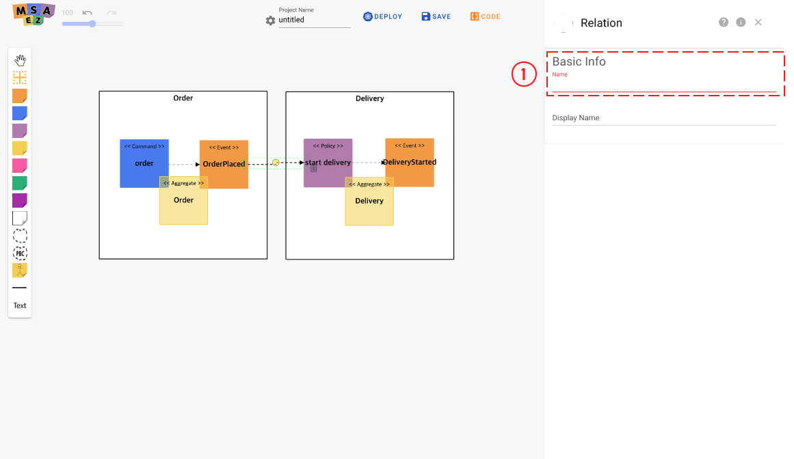

| Number | Name | Detail of fuction                                                                                                         |
| ---- | -----| --------------------------------------------------------------------------------------------------------------------------- |
| 1    | Type | Whether to use the event-driven Pub/Sub method, Or set whether to use the Request & Response Restful API method |

주문 서비스의 OrderPlaced의 이벤트가 발생할 경우 start delivery가 시작되도록 연결하되 어떠한 방식으로 start delivery를 시작하게 할 것인지를 설정하여 줍니다.

1.  It is set in Pub/Sub method of Event-Driven method.

<h4>EventStoring Results</h4>

When the above event storming is completed, it will appear as shown in the picture below.

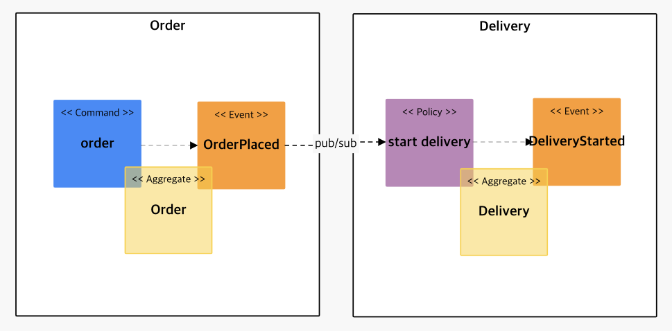

### ·	Code Preview

If you select Code Preview, you can check the result of EventStoring converted into Code through Code Preview.

<h4>Code preview layout</h4>

| Number | Name               | Detail of fuction                                                                   |
| -- | -------------------- | ------------------------------------------------------------------------------------ |
| 1 | Menu Panel | Git 연동, 템플릿 수정, 파일 다운로드 등의 기능 사용 가능 |
| 2 | Source Tree | 모델을 기반으로 생성된 전체 파일리스트 표시 |
| 3 | Source Code | 선택한 파일의 소스코드 표시 |
| 4 | Topping | Java/Spring Version, Security - Token based Authentication,  Kubernetes/Service Mesh등 설정 |                                          |

<h4>Menu Panel 상세</h4>

|  | 이름                | 기능 설명                                                              |
|------|---------------------|----------------------------------------------------------------------- |
| 1    &nbsp;| Push to Git | 사용자의 GitHub 계정과 연결해 레포지토리 생성 및 GitPod IDE 연동 |
| 2    &nbsp;| Edit Template | 적용된 템플릿 파일을 직접 수정 |
| 3    &nbsp;| Design Patterns |  |
| 4    &nbsp;| Download Archive | 전체 소스코드를 로컬 파일로 다운로드 |
| 5    &nbsp;| Search | 파일명 검색 기능 활성화 |
| 6    &nbsp;| Diff Mode | 사용자가 원본 코드를 수정하면 수정본의 변경사항을 표시 |
| 7    &nbsp;| Explain Project | 프로젝트에 대한 설명 제시 |

## Build

### ·	Download file structure description

  - A project is created by the name (Order, Delivery) set in Bounded Context, and when the c-compression is unpacked, it has the following structure.

  - 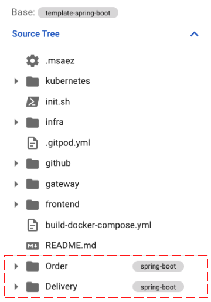

  - gateway is a provided template and shows how to configure spring-cloud-gateway. For normal use, you need to modify the routes part in the application.yaml file of gateway/src/main/resource and use it.

  - The file structure was created according to the basic template for each sticker as shown below. It is a spring-boot-based project and manages resources with maven. If you want to change the file creation location or the basic contents of the file every time you create it, you can use the custom template in the next chapter.

  - application.yaml
    
      - It is a configuration file of spring-boot, and the local environment variable and Docker environment variable are separated by profile setting.
    
      - Because it is event-based, the spring-cloud-stream library is used for message processing. Among them, the broker is set up using kafka.

  - Dockerfile   

      - This file is required when creating a Docker image.

      - When building with Docker, "--spring.profiles.active=docker" is set, so the profile set in the application.yaml file is read.

### ·	GitPod Cloud IDE

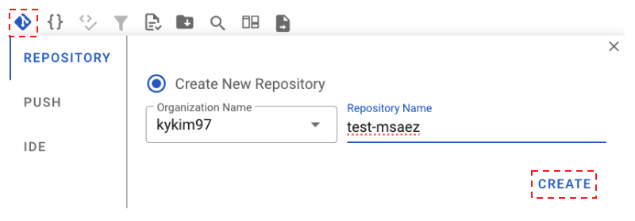

Code Preview의 Menu Panel에서 Push to Git 버튼을 클릭하면 나오는 다이얼로그의 Create 버튼을 클릭해 본인 GitHub 계정에 New Repository를 생성합니다.

Repository 생성이 완료되면 초록색 success 알림창이 뜨고, Repo 주소 옆에 있는 버튼을 클릭하면 해당 레포지토리로 이동해 프로젝트가 생성된 것을 확인할 수 있습니다.

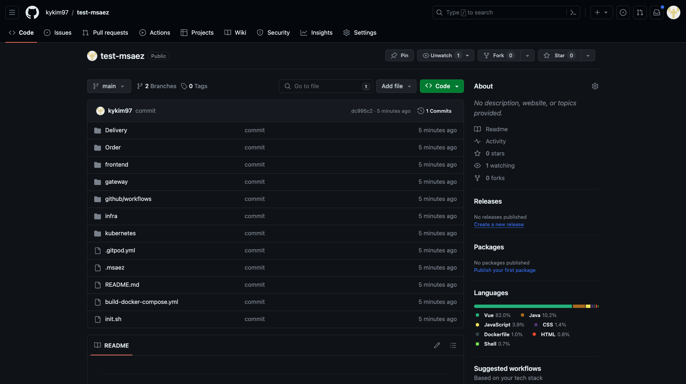

생성된 Git Repository 화면

Repository 생성 완료가 확인되면 IDE 탭으로 이동해 Open GitPod 버튼을 클릭해 GitPod Cloud IDE를 실행시킵니다.

GitPod에 접근하면 위와 같은 시작 페이지가 나오고, Continue 버튼을 클릭해 작업을 이어가줍니다.

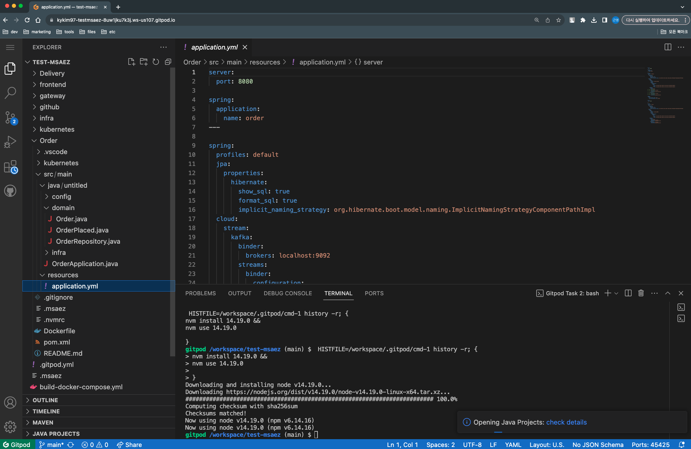

별도의 설치 없이 웹 브라우저 기반으로 로컬 IDE를 운용할 수 있는 GitPod Cloud IDE에 이벤트스토밍을 통해 생성된 코드가 잘 넘어온 것을 확인할 수 있습니다.

<!-- <h4>Prerequisites</h4>

  - maven install

  - run local kafka - localhost:9092

### ·	Execution

  - Since it is a Maven project, run it with mvn spring-boot:run .

  - If it runs normally, write localhost:8081 (port is different for each project, refer to the configuration file) in the browser to check whether the property values set in Aggregate are displayed normally at HATEOAS level.

  - Check if methods such as get and post written in Command are called successfully.

### ·	Cloud deployment

This guide shows how to automatically build and deploy the working source code by uploading it to github and creating a GCB trigger.

### ·	Git integration

  - GCB supports git repository, github, google code, and bitbucket so far. This guide explains how to put the code on github in two ways.

  - [https://github.com/](https://github.com/)
    Create a repository at

  - A repository is created and a git address is created.

  - Push the source to github by executing the script below in the project you want to upload to github.

  - git init

  - git commit –m ‘commit message’ .

  - git push \<github address\>

### ·	Create GCB Trigger

GCB trigger generation proceeds in the following order.

1. Enter the GCB menu of GCP and click the trigger menu.

2. Click the Connect Repository button at the top.

3. Select github in Connect Repository.

4. Proceed with github authentication.

5. Finalize the repository connection by selecting the project to connect to.

6. Click the Create Trigger button at the top to create a trigger.

7. At the bottom of the trigger creation screen, choose CloudBuild as the build configuration.
>
8. Click the Create Trigger button to complete the trigger creation. Trigger execution can be done directly with the trigger execution button on the right. 

If you create a trigger as above, you can check that the trigger works whenever you execute the push command on github.

### ·	Deploy Kubernetes

### ·	Check your Kubernetes deployment

  - If the trigger is executed without any issues, you can check the build success/failure in the history menu.

  - If a green success screen appears in the build history, it means that it has been successfully deployed to GKE. You can check the currently running services in the Workloads item of the GKE menu.

### ·	What to do when deployment fails

* n the case of build failure, build failure appears in red as shown below in the history item, and when clicked, it is possible to check in which step the error occurred. It can be resolved while checking the detailed log by clicking the log download button.

* If an error occurs in the deploy step, first check whether you have permission to deploy from GCB to GKE, and if not, set the permission.

> Cloud Build – In the Settings menu, check if the status is Kubernetes Engine Developer Enabled, and if not, enable it.

* Verify that the name matches the cluster zone in the option part of the cloudBuild.yaml file.

<pre class=" language-yaml">

options :  
    env:  
    ## location/name of GKE cluster (used by all kubectl commands)  
    - CLOUDSDK_COMPUTE_ZONE=asia-northeast1-a  
    - CLOUDSDK_CONTAINER_CLUSTER=standard-cluster-1
    
</pre> -->
