# Google Drive Examples

<h2>Developing Microservice-based Google Drive Service</h2>

## Move on to practicing tool
Get access to [labs.msaez.io](http://labs.msaez.io)
<br/>(Chrome browser recommended)

## Scenario

1. User uploads a file.
 
2. Whenever a file is uploaded, the location of the file is being indexed by the name of the file.
 
3. If uploaded file is a video, the file is getting video-streamed(the result is the video streaming service url).
 
4. When the file is uploaded or it is created as a video, the user who uploaded the file gets notification.
 
5. The dashboard displays the status of uploaded files(size, name, indexing status, upload status, video url).

The List of Bounded Contexts: 
 
1. dashboard
2. drive
3. indexer
4. video processing
5. notification

## Modeling

<h4>1. Create an EventStorming Model</h4>

> 

Scroll down and move on to MODELING TOOLS.

Click on CREATE button of EventStorming Model and create new model.

<h4>2. Draw Bounded Contexts</h4>

> 

Make five bounded contexts, setting the boundary of microservice units.

The name of each bounded contexts would be dashboard, drive, indexer, video processing, notification.

<h4>3. Pull out Events(orange sticker)</h4>

> 

Place orange colored 'Event' sticker to show the result of each mivroservices based on the scenario.

First scenario : "User uploads a file". This event runs through 'drive' service, so name the event 'FileUploaded'.

Second scenario : "Whenever a file is uploaded, the location of the file is being indexed by the name of the file". This event seems to be handled by 'indexer', so name the event 'FileIndexed'

Third Scenario : "If uploaded file is a video, the file is getting video-streamed". The bounded context to handle this action is 'video processing', so put 'VideoProcessed' for the name of the event.

Our forth and fifth scenarios are inappropriate to show by the event sticker. So we have three big events on our google drive service.

<h4>4. Add Inputs for the Events</h4>

> 

When you applied all event stickers, next step is to set the inputs to trigger the event.

We will use 'Command', the blue sticker and the lilac-colored 'Policy'. Place all the input actions connected to the event.

The difference between command and policy is about the actor. Command is an action which the users carry out, and Policy is an action that runs automatically by the system.

So our first scenario, "User uploads a file" involves user's action of uploading files to the system, so it could be shown as blue sticker and name it 'upload'.
When you put 'Actor' sticker beside, the model gets more understandable.

In contrast, our second and third scenario is a process of indexing and streaming the video after the user uploads a file to the system.
In this case we can use policy stickers. The name of the policy would be 'make index' for 'FileIndexed' and 'process video' for 'VideoProcessed'.

And also the action of indexing files and processing video runs when the event of uploading file is done, so we should draw a pub/sub line from the event 'FileUploaded' to 'make index' and 'process video'.

The pub/sub is an abbreviation for publish/subscribe, which means the policy subscribes the published event and make the next event to run.

<h4>5. Add Aggregates(yellow sticker)</h4>

> 

Our next step would be adding the yellow sticker below command and policy, which is an 'Aggregate'.

The aggregate would be placed between every inputs and outputs, and we will name it with the representative nouns to express the data coming out from each action and events.

The most important data comes from the drive service would be files that users have uploaded, so name it 'File'.

For the indexer and video processing, we will put the name of the aggregate with the result of indexing and video streaming process, which is 'Index' and 'Video'.

After declaring three aggregates, we have to define attributes for each of them. These attributes will be generated into codes based on our eventstorming model.

Double click on aggregate and move on to 'Attributes' part. There is an id, which is a key for each attribute. Now we need to add more attributes.

> 

First, let's define attributes for 'File'. 

<h4>File</h4>

| Type  | Name  |
|---|---|
| Long  | id  |
| String  | name  |
| Long  | size  |
| Date  | createdTime  |
| String  | type  |
| String  | userId  |

Define every attributes as shown in the table above and then move on to 'Index' and 'Video'

<h4>Index</h4> 

| Type  | Name  |
|---|---|
| Long  | id  |
| Long  | fileId  |
| List<String\>  | keywords  |

<h4>Video</h4>

| Type  | Name  |
|---|---|
| Long  | id  |
| Long  | fileId  |
| String  | url  |

Index and video are both being created based on uploaded files, so they need 'fileId' in addition to their own key 'id' to identify the file information.

And also Index needs 'keywords' which are indexed by the name of the file, and Video needs 'url' to get access to streaming service. For the keywords, make it a List of String as following the instruction image.

<h4>6. Add Attributes for Events</h4>

> 

After adding attributes on aggregates, we need to put in the same information on events to activate pub/sub lines.

There are 'Attribute' area on event as same as aggregates and there is a button named 'Sync Attributes'. Click this button to duplicate attributes defined on the aggregate connected to the event.

Repeat this job on all of three events.

<h4>7. Add Notification Policy</h4>

> 

Giving a notification to the user is able to implement by declaring a simple policy sticker.

Place a policy named 'notify to user' inside the 'notification' and draw a pub/sub line to activate the action.

The scenario said "When the file is uploaded or it is created as a video, the user who uploaded the file gets notification", so this policy needs to work whenever the event 'FileUploaded' and 'VideoProcessed' are published.

<h4>8. Add ReadModel(green sticker) & Attributes</h4>

> 

The dashboard, where we can notify the status of files can be expressed by "ReadModel". The CQRS(Command and Query Responsibility Segregation) settings from readmodel will play a major role in the operation of the service.

First place a green sticker at the bounded context 'dashboard' and name it 'Dashboard'.

We must add attributes here as well, which are the things we must show on the dashboard. 

<h4>Dashboard</h4>

| Type  | Name  |
|---|---|
| Long  | id  |
| String  | fileName  |
| Long  | fileSize  |
| Boolean  | isCreated  |
| Boolean  | isIndexed  |
| String  | videoUrl  |

<h4>9. Add CREATE WHEN for ReadModel</h4>

> 

Next step is the CQRS rule declaration for the model.

CQRS can be divided into three major categories: Create, Update, Delete.

The Google Drive Service we are modeling now starts every action when the file is uploaded, so declare 'FileUploaded' for Create part.

And then match the attributes of dashboard and event as shown in the table below.

<h4>CREATE WHEN FileUploaded</h4>

| SET  |   |
|---|---|
| readModelField  | eventField  |
| Dashboard.id  | FileUploaded.id  |
| Dashboard.fileSize  | FileUploaded.size  |
| Dashboard.fileName  | FileUploaded.name  |
| Dashboard.isUploaded  | true  |

For 'isUploaded', we don't have to match it with the event but put in the value of 'true' by choosing the option 'Direct Input'.

<h4>10. Add UPDATE WHEN for ReadModel</h4>

> 

After declaring Create part and matching attributes, move on to Update part.

When the value of the file is being updated after it was uploaded on the drive is when the file is being indexed and get video processing.

Therefore, we need two Updates: 'FileIndexed' and 'VideoProcessed'.

And then match the attributes of dashboard and event as we've done before on Create part.

<h4>Update WHEN FileIndexed &nbsp;&nbsp;&nbsp;&nbsp;&nbsp;&nbsp;&nbsp;&nbsp;&nbsp;&nbsp;&nbsp;&nbsp; Update WHEN VideoProcessed</h4>

| SET  |   | SET  |   |
|---|---|---|---|
| readModelField  | eventField  | readModelField  | eventField  |
| Dashboard.isIndexed  | true  | Dashboard.videoUrl  | VideoProcessed.url  |

| WHERE  |   | WHERE  |   |
|---|---|---|---|
| readModelField  | eventField  | readModelField  | eventField  |
| Dashboard.id  | FileIndexed.fileId  | Dashboard.id  | VideoProcessed.fileId  |

For 'isIndexed', put in the value of 'true' as we've done before for 'isUploaded'.

<h4>11. Check Generated Codes from Eventstorming Model</h4>

> 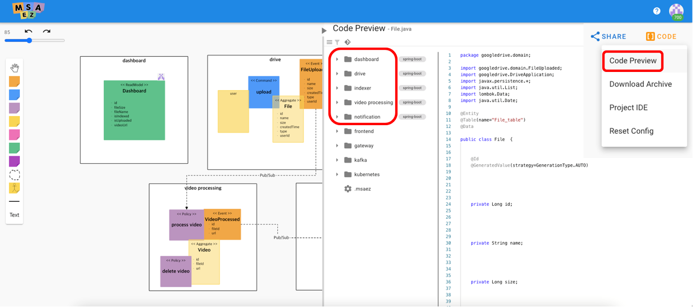

So our eventstorming model for Google Drive Service is completed. Now our next step is to run the actual service by using the codes generated from the model.

Before we get into coding by IDE tool, we can check the code family created.

Click the orange colored button 'CODE' to open the Code Preview window and we can check every code lists that would be added on our explorer later.

<h4>12. Run Gitpod IDE</h4>

> 

Now let's open IDE tool to run the service. We are going to use Gitpod IDE, provided by Github and based on VSCode.

To use Gitpod, first we should create a repository at our Github account and interlock it with Gitpod.

Click the git icon placed on the upper-left side of the Code Preview area and then create a repository of our project.

When the repository is created, three options come out: 'Local IDE', 'Cloud IDE', 'Update from model code'. Click the button at the side of the Cloud IDE urlto run Gitpod.

※ If it doesn't work well, click the profile image of Github interlocking dialog and check if the switch 'Using gitpod to open Project IDE' is on.

## Run the Project

<h4>13. Run Drive Service</h4>

> 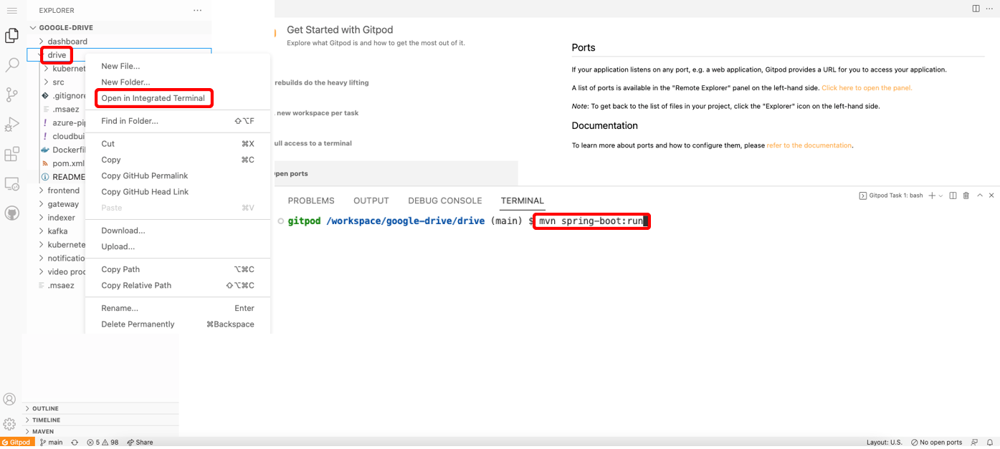

If the Gitpod IDE is opened properly, it's time to actually operate our project.

The Google Drive Service we created only works when every five microservices is running at th same time.

First, let's run 'drive' service. Right click on the drive folder and click 'Open In Integrated Terminal' to open a terminal to handle drive service.

그리고 스프링부트 기반의 마이크로서비스 실행을 위해 오픈된 터미널 창에 
Then put in the command below on the opened terminal to run the Spring Boot-based microservice.

```
mvn clean spring-boot:run
``` 

<h4>14. Run Kafka</h4>

> 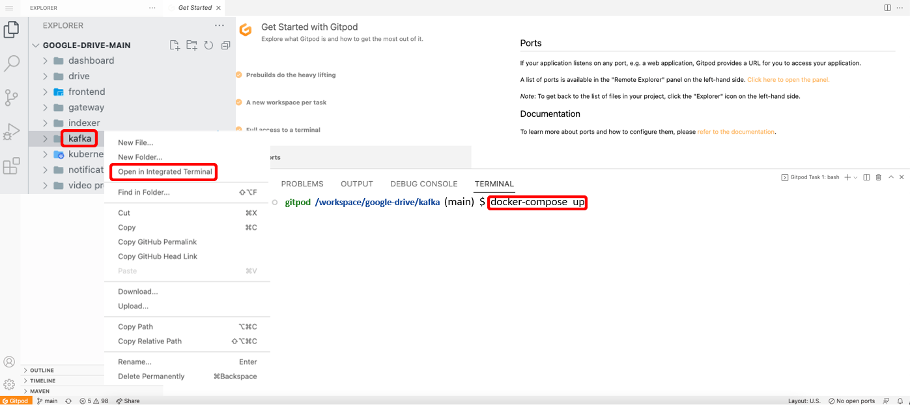

While waiting for drive service to be operated, let's run kafka to operate the microservices we created.

Right click on 'kafka' folder and open another terminal.

```
docker compose-up
``` 

Put in the command above to run kafka service.

<h4>15. Install httpie Tool & Test</h4>

> 

> 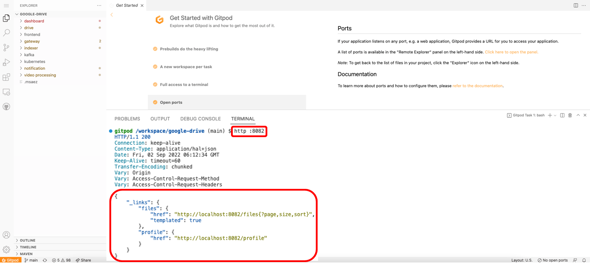

Next step is to install 'httpie' tool. This is a process for the test to check if the service is operating properly before we move on to front-end web.

Click the '+' button on the upper-right side of the terminal area to open another terminal.

```
pip install httpie
``` 

Put in the command above to install httpie tool.

The drive service must've been running now, so put in the command below on the terminal we installed httpie tool to check if the service is operating well.

```
http :8082
``` 

If the terminal shows the result as below, it means the service is running properly.

```
{
    "_links": {
        "files": {
            "href": "http://localhost:8082/files{?page,size,sort}",
            "templated": true
        },
        "profile": {
            "href": "http://localhost:8082/profile"
        }
    }
}
``` 

<h4>16. Edit Codes from Index & Service Operation</h4>

> 

> 

Next step is to add functions mentioned at the scenario to the service.

Open component search window and search 'Index.java' and open it'.

```
// Keyboard Shortcuts to open Component Search Window
// mac - command + p
// window - ctrl + p
``` 

Modify 'makeIndex()' as below.

```
public static void makeIndex(FileUploaded fileUploaded){
    Index index = new Index();
    index.setFileId(fileUploaded.getId());
    index.setKeywords(Arrays.asList(fileUploaded.getName().split(" ")));
    repository().save(index);
}
```

This code puts the id of uploaded file to the 'fileId' of the Index and divide the name of uploaded file by the space and save each words as keywords.

After the code modification is done, open a terminal from 'indexer' folder and put in the command below to run the service.

```
mvn clean spring-boot:run
``` 

<h4>17. Upload a Test File</h4>

> 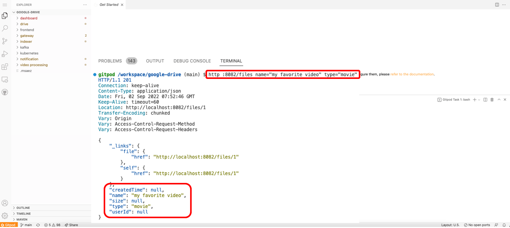

When the index service started operation, we'll upload a file and check if our work so far fits the scenario.

Move on to main terminal where we installed httpie tool and put in the command below.

```
http :8082/files name="my favorite video" type="movie"
``` 

This command uploads a video file named "my favorite video".

```
{
    "_links": {
        "file": {
            "href": "http://localhost:8082/files/1"
        },
        "self": {
            "href": "http://localhost:8082/files/1"
        }
    },
    "createdTime": null,
    "name": "my favorite video",
    "size": null,
    "type": "movie",
    "userId": null
}
``` 

If the terminal shows the result as it is shown above, the file is successfully uploaded.

<h4>18. Check if the Indexer works on the Uploaded File</h4>

> 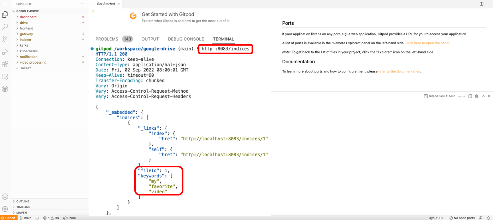

파일이 정상 업로드된 것을 확인했다면, indexer 마이크로서비스의 작동 여부를 확인해 보겠습니다.
After we checked the file has been uploaded properly, next step is to check whether the 'indexer' service works or not.

Put in the comand below on the main terminal.

```
http :8083/indices
``` 

If the three keywords made by dividing the name of the file by spaces have been added to the list, it means that the indexer is working well.

```
{
    "_links": {
        "index": {
            "href": "http://localhost:8083/indices/1"
        },
        "self": {
            "href": "http://localhost:8083/indices/1"
        }
    },
    "fileId": 1,
    "keywords": [
        "my",
        "favorite",
        "video"
    ]
}
``` 

<h4>19. Edit Codes from Video & Service Operation</h4>

> 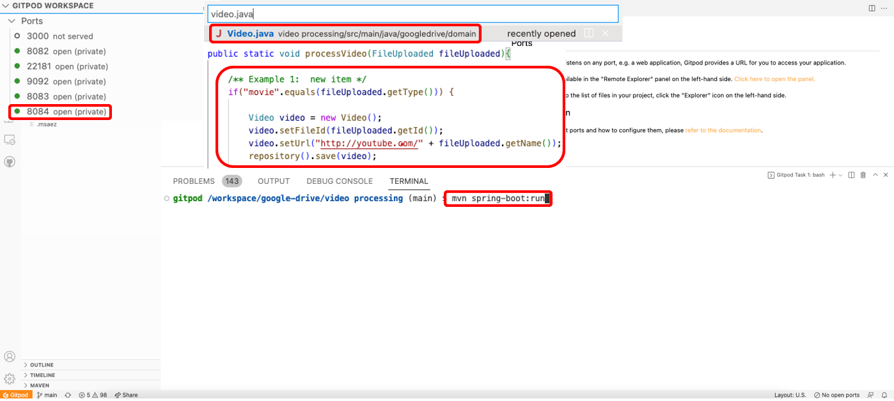

This time, we will modify some codes to make streaming url for the uploaded video files.

Open component search window and search 'Video.java' and open it.

Modify 'processVideo()' as below.

```
public static void processVideo(FileUploaded fileUploaded){
    if("movie".equals(fileUploaded.getType())) {
        Video video = new Video();
        video.setFileId(fileUploaded.getId());
        video.setUrl("http://youtube.com/" + fileUploaded.getName());
        repository().save(video);
    }
}
```

This code puts puts the id of uploaded file to the 'fileId' of the Video and make url by adding 'http://youtube.com/' in front of the name of uploaded file.

Then open a terminal from 'video processing' folder and put in the command below to run the service.

```
mvn clean spring-boot:run
``` 

<h4>20. Check if the Video Processing works on the Uploaded File</h4>

> 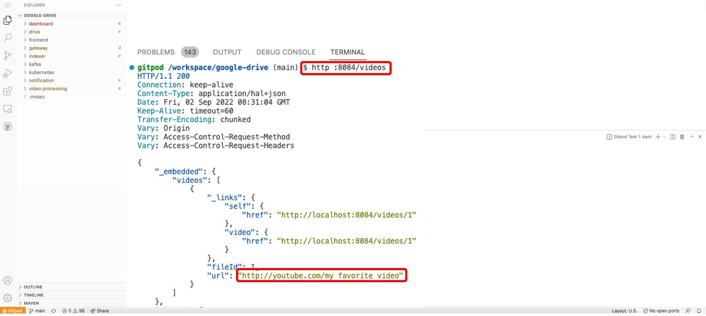

Now let's check if the microservice 'video processing' on port 8084 is working or not.

Put in the command below on the main terminal.

```
http :8084/videos
``` 

If the name of uploaded file has been changed to the youtube link as below, video processing service is running properly as well.

```
{
    "_links": {
        "self": {
            "href": "http://localhost:8084/videos/1"
        },
        "video": {
            "href": "http://localhost:8084/videos/1"
        }
    },
    "fileId": 1,
    "url": "http://youtube.com/my favorite video"
}
``` 

<h4>21. Run Dashboard Service and Inquire History</h4>

> 

For the last, let's check if the informations we put in is printed well on the dashboard.

Open a terminal from 'dashboard' folder and put in the command below to run the service.

```
mvn clean spring-boot:run
``` 

Dashboard server is on port 8081, so put in the command below to inquire the dashboard history.

```
http :8081/dashboards
``` 

If the information of uploaded file comes out as the CQRS rules we set before, then it's done.

```
{
    "_links": {
        "dashboard": {
            "href": "http://localhost:8081/dashboards/1"
        },
        "self": {
            "href": "http://localhost:8081/dashboards/1"
        }
    },
    "fileName": "my favorite video",
    "fileSize": null,
    "isIndexed": true,
    "isUploaded": true,
    "videoUrl": "http://youtube.com/my favorite video"
}
```

<h4>22. Run Front-End Server</h4>

> 

We've done the test by httpie tool before operating actual web program, so now let's move on to web page by front-end server.

Open a terminal from 'frontend' folder and put in this command to install node_modules

```
npm install
``` 

When the process is done, put in the command below to run front-end server.

```
npm run serve
``` 

> 

Since the frontend service must get through gateway, so open a terminal from 'gateway' folder and put in the command below to run the service.

```
mvn clean spring-boot:run
``` 

Gateway server is on port 8088, so click on the globe icon on the right side of the port and move on to the web page.

## Operating Web Application

<h4>23. Home Page</h4>

> 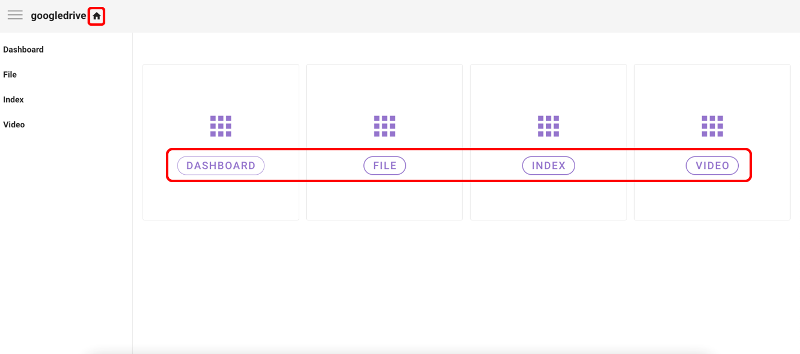

This is a homepage we would see at the first time we get access to the front-end webpage.

There are buttons to move to the page of each microservices, and you can click the home icon at the upper-left side to get back to this page.

<h4>24. Inquire Dashboard</h4>

> 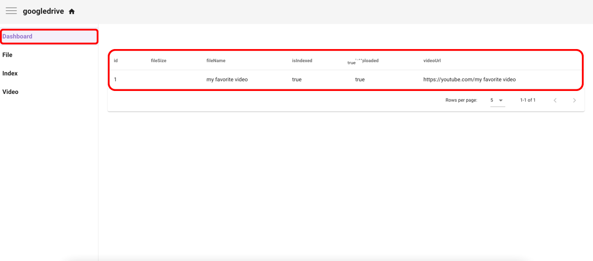

For the first, let's inquire the dashboard.

The dashboard shows the informations based on our CQRS settings: fileName, fileSize, upload/index status and videoUrl.

We can see that the informations of the file we uploaded by httpie tools is more legible on front-end web by showing it on the table.

<h4>25. Inquire the List of Uploaded Files + Add Another</h4>

> 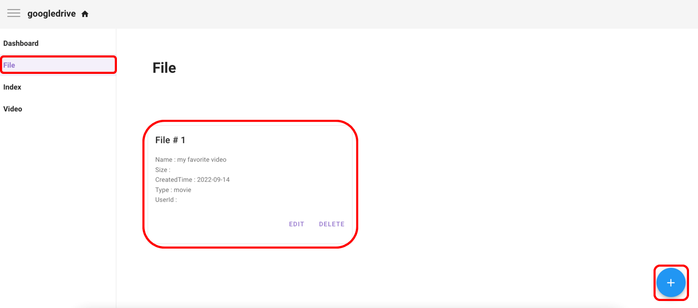

Next, we'll inquire the file list.

There are informations of the file we uploaded on the terminal and it also can be editted or deleted.

Click the blue colored '+' button to add another file on our web page.

<h4>26. Specifications for File</h4>

> 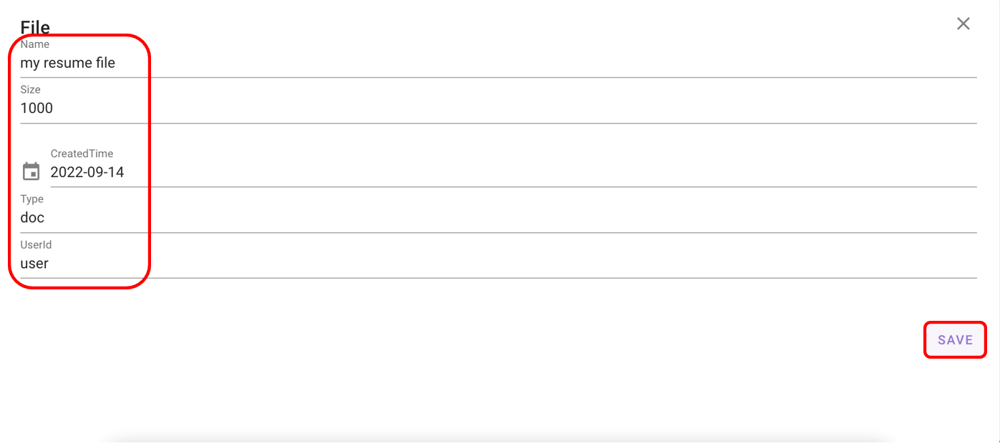

This is a page we encounter when we click the button.

Just simply add the values for the attributes we set on the aggregate from eventstorming model.

Add a document file as it is shown on the capture image.

<h4>27. Inquire Newly Uploaded File</h4>

> 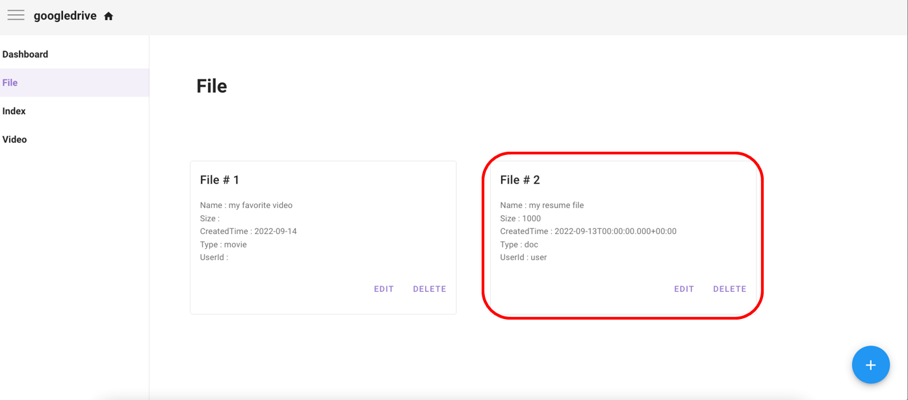

Our new file has been added on the file list.

The specifications show that the new file got the informations we put in at the adding page.

<h4>28. Check if the New File has been Indexed</h4>

> 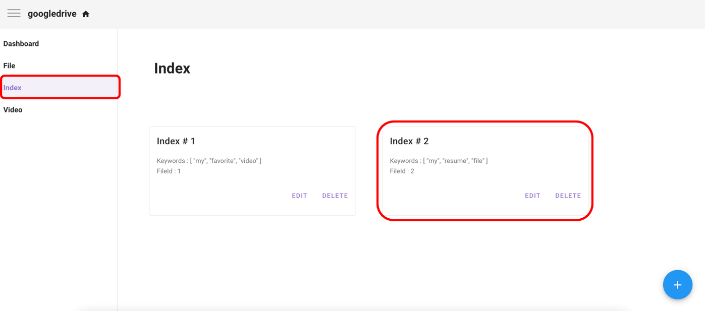

Next, let's check if the new file has been indexed well.

'my resume file' has been well divided into three keywords: 'my', 'resume', 'file'.

<h4>29. Check if the New File has been VideoProcessed</h4>

> 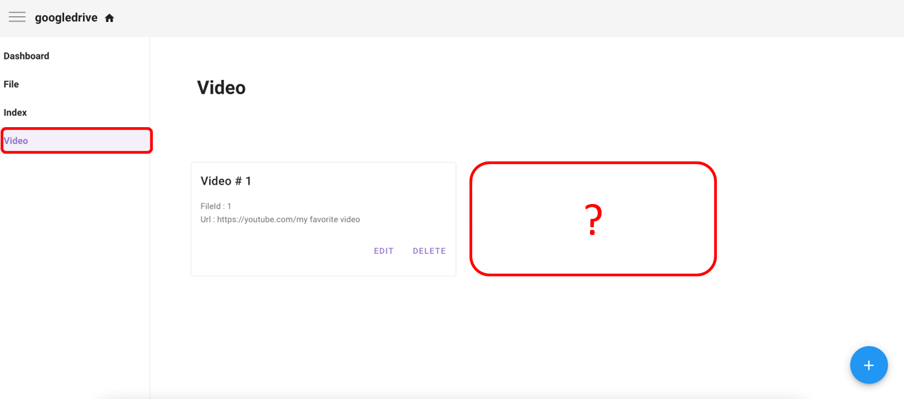

For the last, let's check if the new file has been videoProcessed.

On the list, there is only one file we added on the terminal and our new file isn't there.

This is because we put in 'doc' for the type of the file when we added it.

Our new file's type is not 'movie', so it must not be added on the video list.