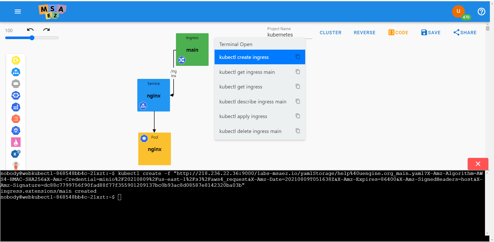

# Infrastructure Modeling (Kubernetes)

<div style = "height:400px; object-fit: cover;">
<iframe style = "width:100%; height:100%;" src="https://www.youtube.com/embed/vtPtymnmo6M" title="YouTube video player" frameborder="0" allow="accelerometer; autoplay; clipboard-write; encrypted-media; gyroscope; picture-in-picture" allowfullscreen></iframe>
</div>

## Getting started
Kuber-Ez is a visual, web-based diagramming tool that allows you to construct kubernetes manifests and deployment models with minimal understanding of YAMLl and CLI.

**URL: [Getting Started with Kubernetes](http://www.msaez.io/#/)**

- Click + NEW in the upper right corner and click Kubernetes Deploy Diagram.


<br/>


## Quick Tour

<h3>Screen Layout</h3>

<!-- https://user-images.githubusercontent.com/48265118/92880687-3d82e580-f449-11ea-81cf-e5a2c00ac6f1.png 원본 이미지 -->


***

<h3>1. palette area</h3>

The Kubernetes Objects palette area groups a list of Kubernetes objects, separated by each category.

<h3>object palette</h3>

| category | object | Explanation |
|:-------:|:-------:|:----:|
| Workload    | Namespace<br/>Deployment<br/>ReplicaSet<br/>Pod<br/>StatefulSet<br/>DaemonSet | A set of controller objects to maintain Kubernetes' basic object and desired state |
| Routing     | Service<br/>Ingress | An object that serves the Workload object so that it can be accessed from the outside. |
| Persistence | PersistentVolume<br/>PersistentVolumeClaim<br/>StorageClass | A set of volume resources to manage Kubernetes storage |
| Autosalcer | HorizontalPodAutoscaler | An object that automatically scales the number of Pods in a resource by observing CPU and memory usage |
| Job | Job<br/>CronJob | A set of controller objects that cause a specified number of Pods to successfully launch and terminate. |
| Configuration | ConfigMap<br/>Secret | A set of objects that store data for use by other objects. |
| Role Based Access Control<br/>(RBAC) | Role<br/>RoleBinding<br/>ClusterRole<br/>ClusterRoleBinding<br/>ServiceAccount | A set of objects that manage privileges in the Kubernetes system based on a user's role. |
| Istio | Gateway<br/>VirtualService<br/>DestinationRule<br/>ServiceEntry<br/>Sidecar<br/>Quota<br/>Rule<br/>QuotaSpec<br/>QuotaSpecBinding<br/>MemQuota |  |
| Knative | Service |  |
| Argo | Workflow |  |

***


<br/>

<h3>2. menu area</h3>

It is a function for cluster connection and deployment and management of generated YAML code displayed in the upper right corner. The detailed description is as follows.
 
1) Manage Clusters: You can register and delete user's clusters, and click a registered cluster to select a cluster to use.
 
Manage Clusters screen called when clicking the gear button


Click the + button to enter the name, API Server of the cluster, and token and save it, then the cluster information entered on the screen will be registered. The cluster to use is selected by clicking on the registered cluster.
<p>


</p>


2) Deploy: This button deploys the object modeled on the canvas to the server. It can be used if there is a cluster selected by the user.
 
A popup window that appears when you click the Deploy button. Check the cluster information to be deployed and click the Deploy button to deploy the modeled objects on the canvas.


3) Code Preview: There are two menus: Code Preview and Download Archive. When you click Code Preview, you can preview the YAML file of the modeled object on the canvas according to the template. When you click Download Archive, the YAML file according to the selected template is downloaded.
 
Click Code Preview and select Separate File per kind from Template


You can check the YAML of the modeling object for each template you want.


A popup window called by clicking Download Archive. You can download the Yaml file by selecting the template you want.


***

<br/>

<h3>3. command area</h3>

This is the shell area where Kubernetes CLI commands are output. An object is defined on the canvas, and when a command is clicked on the object's context menu, the corresponding command is output to the shell area.<br>
**Open a terminal from the object's context menu**
<P>


<p>

<h3>Invoke kubectl get deployment command via menu</h3>

<p>


<p>

***

<br/>

<h3>4. canvas area</h3>
This is the area where the object selected from the object palette is implemented. If you double-click the object, an edit window appears where you can edit the properties of the object and additional definitions can be made.

**Property definition through UI editing window**


## Tutorial

<h3>pod 추가 및 터미널 오픈</h3>

**Add pod and open terminal**
>


| Number | Name                | Detail of fuction                                                                |
| ---- | ------------------- | ------------------------------------------------------------------------- |
| 1    | pod                 | Add pods                                                             |
| 2    | terminal            | Internal terminal operation                                                 |

**terminal click screen**
>


**Double-click the pod to set it up as follows.**
- Name: nginx
- Image: nginx
- Port: 8080

>

>

**Labels and Containers Description**<br>

labels are tags that Kubernetes uses to look up you.<br>
- nginx with a tag called App
- An application called nginx

You can think of Containers (plural) as basically processes.
- Since more than one process can be spawned in one pod

### · Pod
**kubectl create pod(This is a command to create a pod.)**

- Click the terminal icon in the image below to click kubectl create pod.

>

>

```
pod/nginx created
```

<br><br>

**kubectl get pod nginx(This is a command to check the status of the nginx pod.)**

>

- When entering a command, the output is as follows.
>

<br><br>

**kubectl describe pod nginx(This is a command to check nginx pod details.)**
>

- result screen
>

### ·	Service

**Double-click the service to set it as follows.**
- Name: nginx
- Image: nginx
- Target Port: 8080
- Type: ClusterIp

**Difference between ClusterIp of Type and LoadBalancer**
- clusterIp (configuration to allow access only from inside Kubernetes) - suitable for security
- LoadBalancer (make it accessible from outside) - not secure


<br><br>


**Click the arrow icon to connect to the pod(nginx)**

>
<br><br>

**kubectl create service(This is a command to create a service.)**
>
```
service/nginx created
```


### ·	Ingress
<h4>Ingress (which acts as an API gate gateway)</h4>

- Ingress is an API gateway.

**Double-click Ingress to set it up as follows.**
- Name: main
>

<br><br>

**kubectl create ingress(This is the command to create an ingress.)**
>

>

- result screen
```
ingress.extensions/main created
```
<br><br>

**kubectl get ingress(This command checks the ingress status.)**
>

- result screen
>

<br><br>

**Connect with the IP address of ADDRESS**
- Result screen (IP address of ADDRESS obtained by kubectl get ingress)
>

