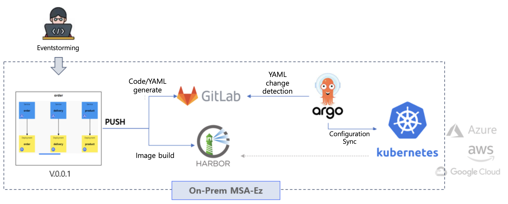

# K8s Deployment Modeling

The 12th Microservices implemented and designed using the Domain-Driven Design (DDD) pattern are deployed and operated in a cloud-native infrastructure environment. The term 'cloud-native infrastructure environment' refers to each service that constitutes the 12th shopping mall being deployed not on a single VM but independently operated, isolated, and using container virtualization technology known as **[Docker](https://www.docker.com)**.

The management platform for these containers is called a 'container orchestrator,' with Kubernetes being a prominent example. Kubernetes provides orchestration features such as Self Healing, Auto Scale-Out, Service Mesh, Monitoring, Tracing, etc., ensuring the processes of the deployed 12th shopping mall comply with SLA while operating independently. **[More Info](http://www.kubernetes.io)**

MSAEZ is built on the foundation of Event Storming models, providing deployment diagramming tools necessary for Kubernetes cluster deployment. The designed deployment model is stored in a Git version control server and is automatically deployed using the Argo stack, which synchronizes Git versioning with the operational environment versioning. **[More Info](https://argoproj.github.io/)**

## Deployment Modeling 

The diagramming tool for Kubernetes deployment based on the Event Storming model is approached as follows:

Similar to the Event Storming tool, the deployment diagramming tool consists of:

- A palette area for Kubernetes object modeling
- A canvas area for modeling
- An area for previewing the resulting deployment YAML

When accessed from the Event Storming tool, the diagramming tool reads the microservice implementation patterns configured in the model and constructs the deployment diagram with corresponding objects. Deployment personnel can complete the deployment shape on the cluster by adding orchestration objects, such as the required basic instance count and file storage, from the palette.

Detailed deployment modeling methods can be learned in the Modeling Practice menu.