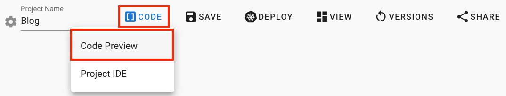

# Marketplace

## Overview

The Marketplace is one of MSAEZ's automated code generation features, allowing customization of microservice code for each service such as order, delivery, and product based on the Event Storming model. Users can change the language (or specific framework) settings or add microservices patterns (UI Framework, API Gateway, Service Mesh, BFF, Testing, etc.) to the automatically generated 'clean code.'

DevOps developers can effortlessly add implementation code to their services by simply selecting the desired implementation language or microservices pattern from the UI list provided by the platform. (The added implementation code is also applied to the runtime deployment modeling.)

The areas in the Marketplace where languages or specific frameworks are implemented are referred to as 'templates,' while the areas where microservices patterns are implemented are called 'toppings.'

## Application Method
Click on the "Code Preview" button.

# End Generation Here

1. Enter the Marketplace where various templates can be added to the code generated based on the Event Storming model.

2. Categories are organized by language and framework, with templates and toppings separated, allowing users to choose the desired options.

3. The applied language templates and toppings can be selected in the CODE PREVIEW window and applied to the code.