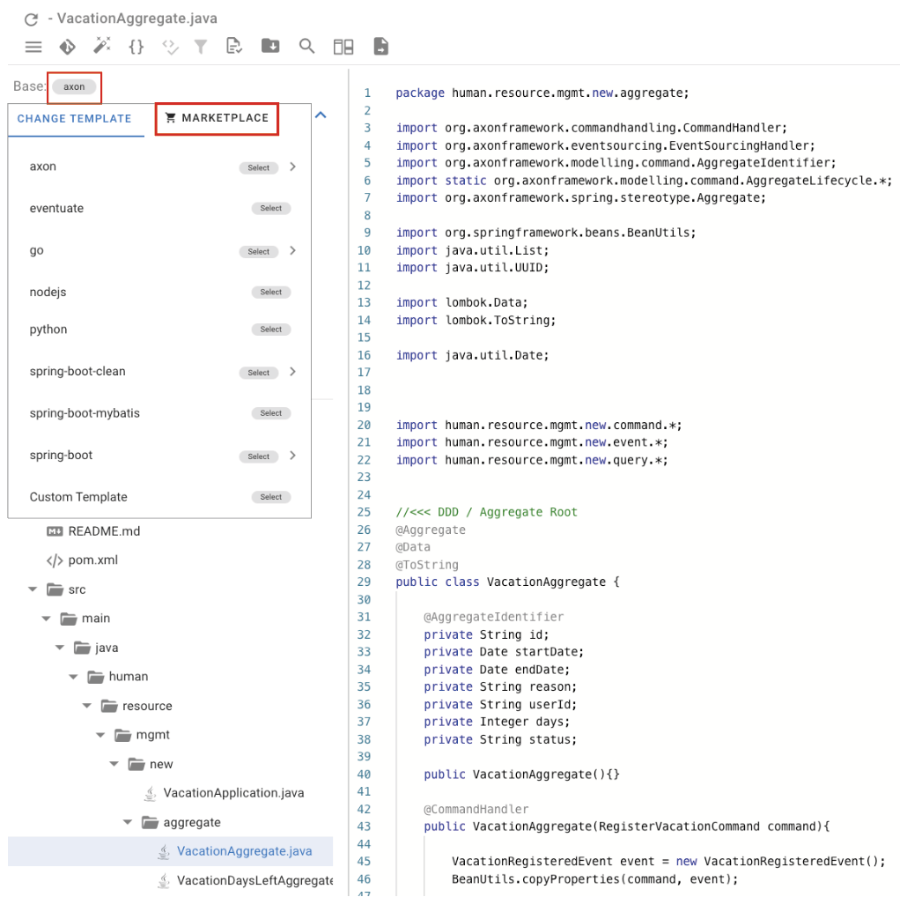
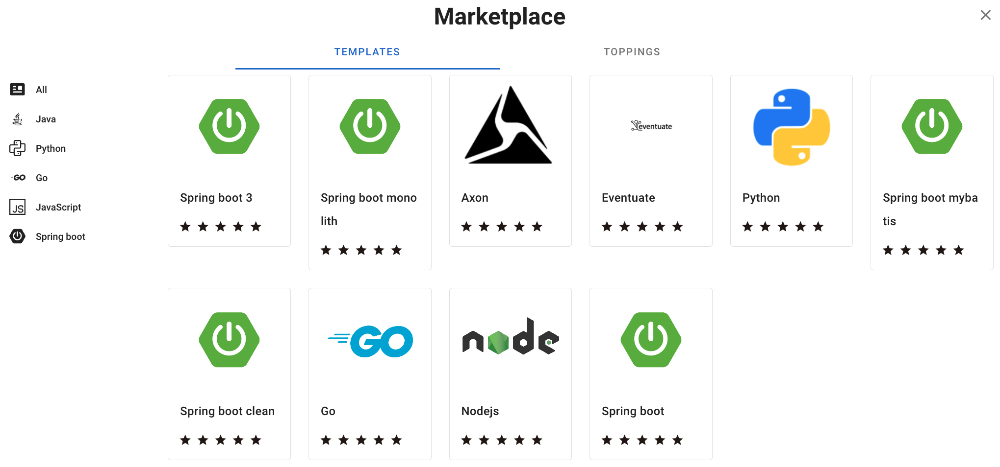
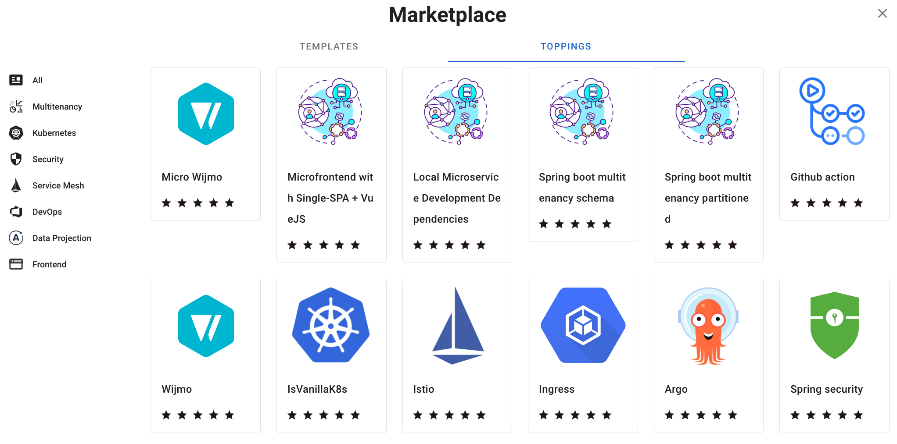
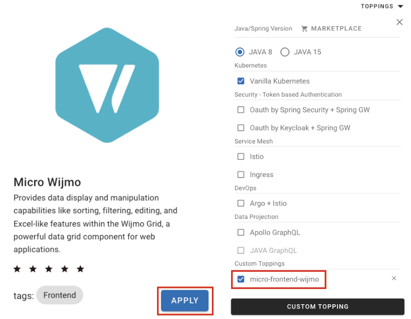

# Template/Topping Marketplace

## Scheme

As an extension version of MSAEZ's auto code generation, the Marketplace simply provides more options to developers by adding more diverse language templates, frameworks, and toppings to the code.

## How-to
> 

Enter Marketplace which can apply diverse templates on the code created based on eventstorming model.

> 

> 

Categories are organized by languages and frameworks, and it is divided by templates and toppings, so users can select the option they want.

> 

Selected language templates and toppings can be selected at CODE PREVIEW and can be applied to the code.