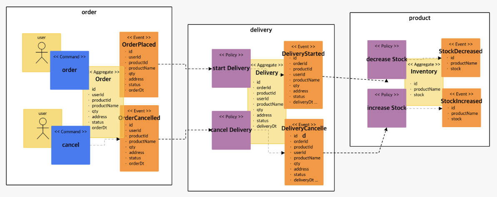
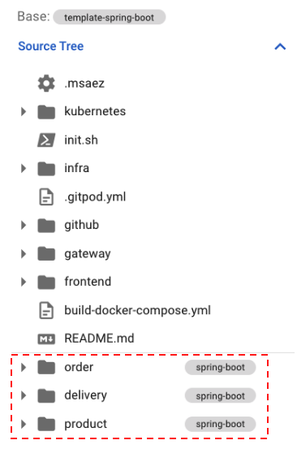
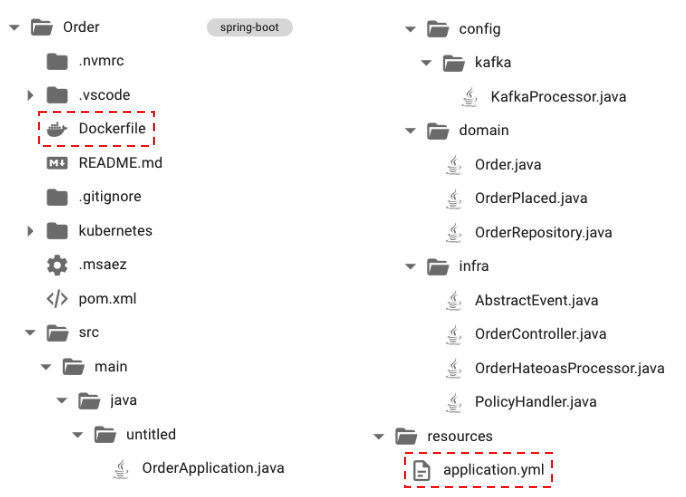
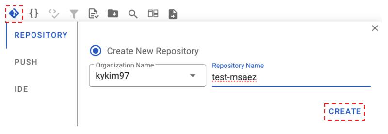
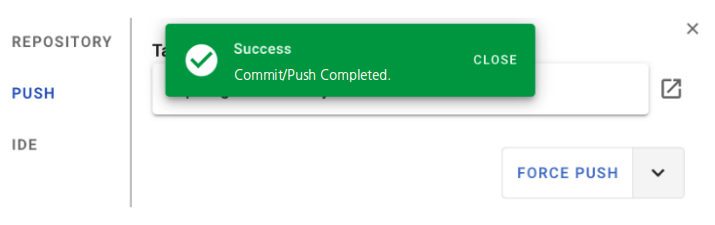
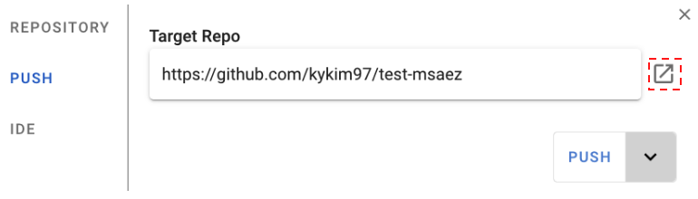
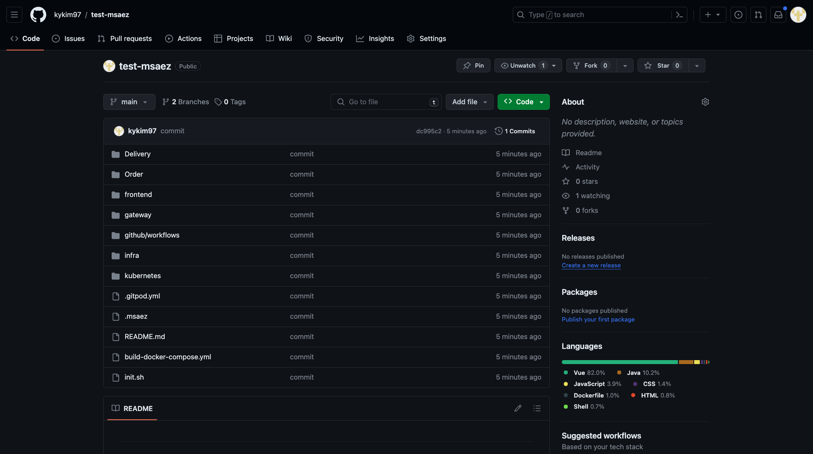
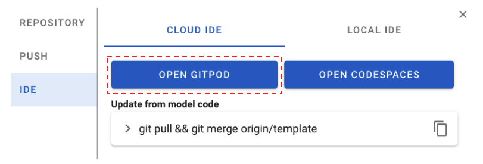
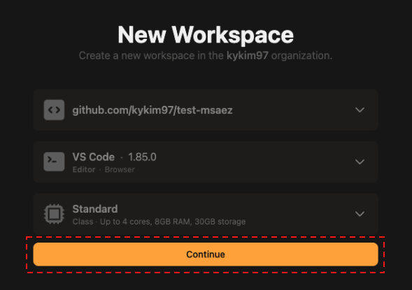
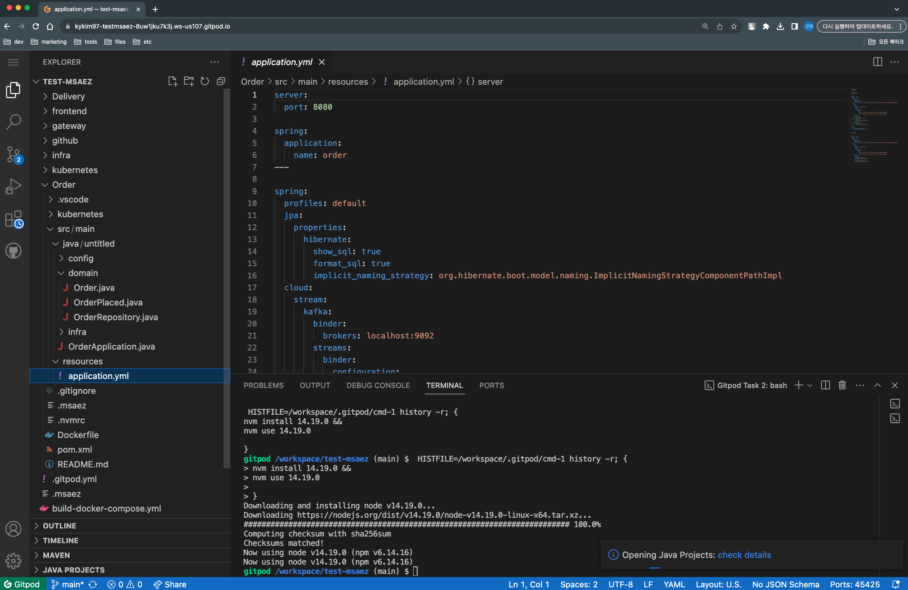

# Automatic Code Generation

In this session, we will explore the code generation feature of MSAEZ and demonstrate how to utilize the automatically generated code with various microservices patterns based on the previously created event storming model.

Firstly, we will leverage the code generation functionality provided by MSAEZ for the following event storming model created in the previous steps:

## File Structure

Projects are created based on the names set in the Bounded Context (Order, Delivery), and they have the following structure:

The gateway is a template provided for configuring spring-cloud-gateway. When using it, you need to modify the `routes` section in the `application.yml` file located in `gateway/src/main/resource` for proper functionality.

The file structure is generated based on stickers using default templates. The projects are spring-boot based, and resource management is done using Maven. If you want to make changes to the file creation location or the default content within the files, you can use custom templates explained in the next section.

**application.yml**
- This is the configuration file for spring-boot, separating local environment variables and Docker-specific environment variables using profiles.
- Since it's event-driven, the spring-cloud-stream library is used for message processing, with Kafka configured as the broker.

**Dockerfile**
- This file is necessary for creating a Docker image.
- When building with Docker, it is configured with "--spring.profiles.active=docker" to read the profiles set in the `application.yml` file.

## Integration with GitPod Cloud IDE

Click the "Push to Git" button in the Code Preview Menu Panel, and in the dialog that appears, click the Create button to create a new repository in your GitHub account.

Once the repository is created, you'll see a green success notification. Click the button next to the Repo address to navigate to the created repository.

Git Repository Screen

Once the repository creation is confirmed, go to the IDE tab, click the Open GitPod button, and launch the GitPod Cloud IDE.

Upon accessing GitPod, you'll see the start page as shown above. Click the Continue button to continue your work.

Without any additional installations, you can use the web-based GitPod Cloud IDE to seamlessly continue working on the code generated through event storming. Confirm that the code has been successfully transferred.

You can use this IDE to implement specific business logic, add services, or carry out other development tasks.
