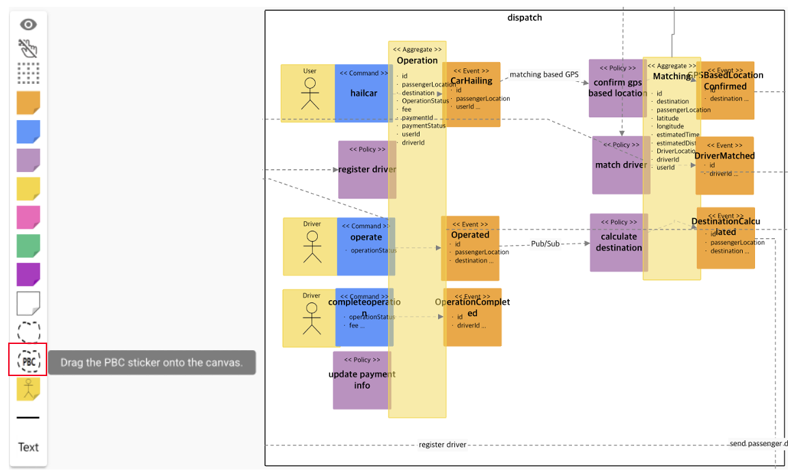
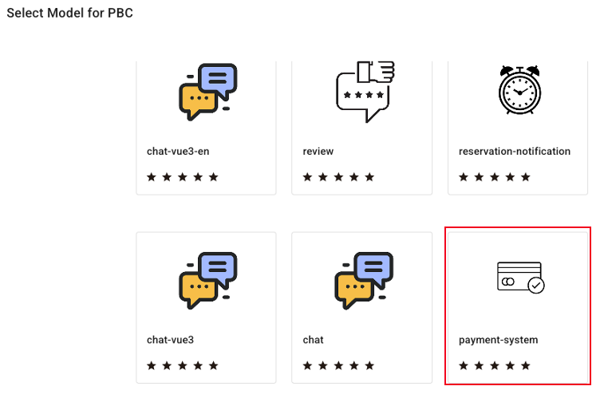
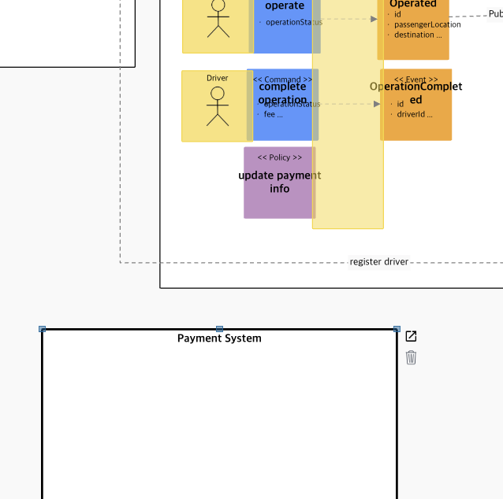
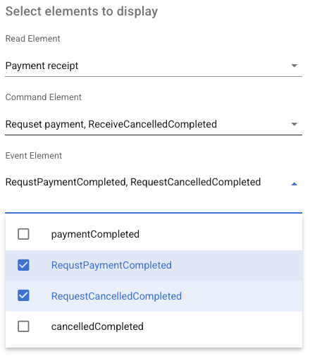
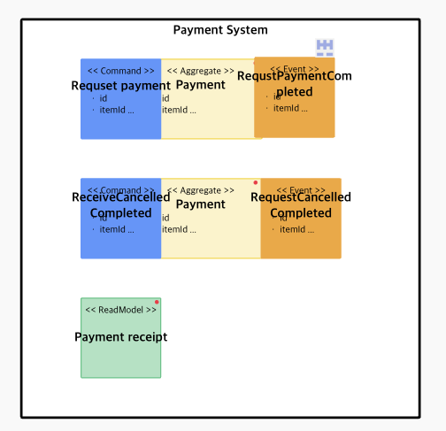
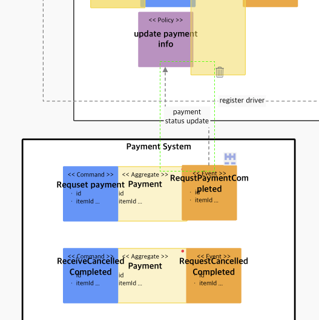
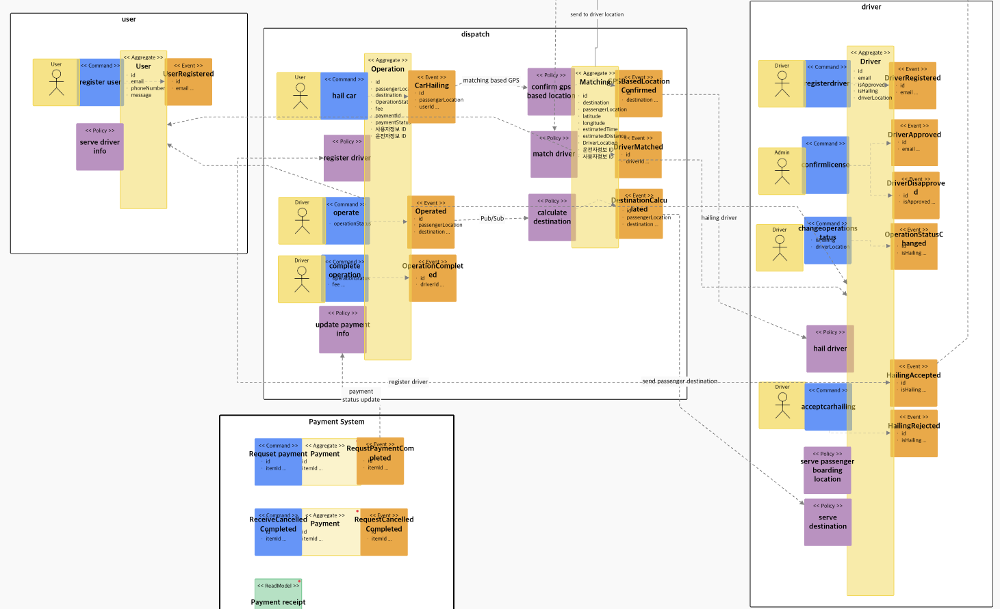
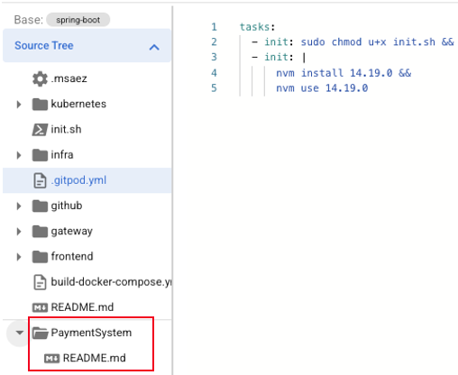
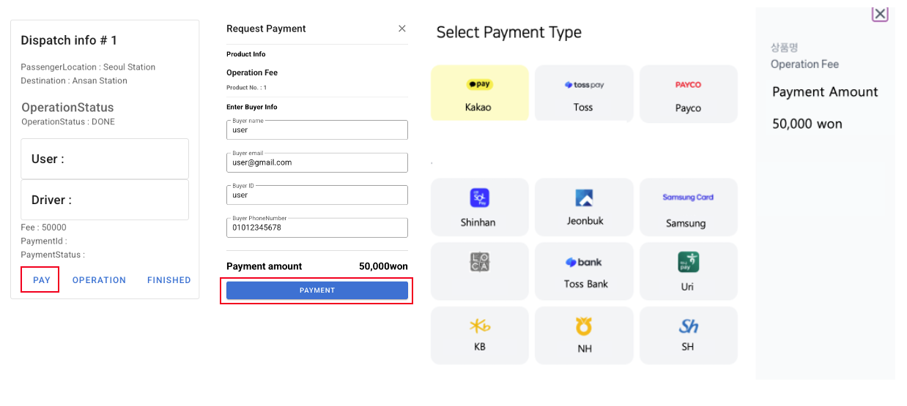
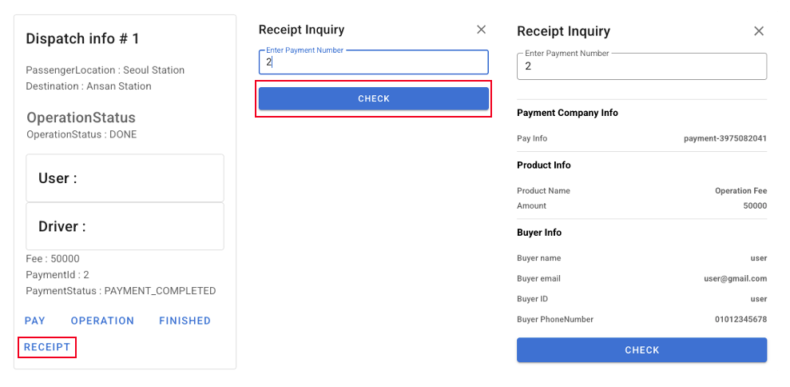

# PBCs(Packaged Business Capabilities) for Composable Enterprise Implementation

## Overview

<!-- 마이크로서비스 아키텍처에서 비즈니스 기능의 재사용과 효율적인 통합은 중요한 과제입니다. 특히 자주 사용되는 비즈니스 기능을 매번 새롭게 구현하는 것은 시간과 리소스의 낭비를 초래하는데, 이러한 문제를 해결하기 위해 Packaged Business Capabilities(PBC) 기능을 추가하였습니다. -->

**PBC** is a concept that packages specific business functions as independent modules, similar to business functions that can be assembled like building blocks.

**MSAEZ** adds a PBC marketplace to domain-centered design modeling (Event Storming) to enable more effective microservice composition and flexible business logic. The selected PBC in the analysis/design phase is already provided in a completed state with completed business logic and UI implementation, allowing developers to build services by combining ready-to-use functional modules without additional coding.

This allows complex features such as notification systems, user review management, and payment processing to be implemented quickly and efficiently using proven solutions, achieving both improved development quality and operational efficiency.

## How to Use PBC Marketplace
We will explain how to apply a complex payment processing feature using the **Payment PBC Application Example**. Specifically, we will detail the analysis/design and implementation methods for a ride-hailing service that enables users to pay for completed rides based on fare calculations.

### Analysis/Design

 

 
1. Drag and drop the PBC from the left palette of the Event Storming model canvas to select and apply the desired function from the existing PBC list provided by MSAEZ.
 (Since a payment system is needed, apply the payment-system from the marketplace)

  

 
2. Once the PaymentSystem PBC template appears at the bottom of the dispatch bounded context, double-click the PBC model to configure it.

  

 
3. In the PBC panel, you can choose from the ReadModel, Command, and Event stickers that implement the functions in the PBC model, selecting only the stickers related to the functions needed for your service.

  

 
4. After closing the PBC panel, you can see that only the selected stickers have been imported, completing the PaymentSystem PBC model as shown in the image above.

  

 
5. Next, establish connections to enable communication between the existing microservices and the PBC. After payment completion, update the payment status and payment ID in the ride information to enable receipt viewing later.

  

 
• Model showing payment system PBC applied to ride-hailing service

### Implementation

 
1. Opening the code viewer creates a PaymentSystem folder. Following the instructions in the README file generates the complete implementation.

  

 
2. In the implemented UI, clicking the payment button at the bottom left opens the payment details page. Clicking the payment button again displays the payment interface provided by the payment gateway.

  

 
3. Once payment is completed, the paymentId and paymentStatus are registered. A receipt check button becomes available, and clicking it allows you to enter the paymentId to view the payment information.