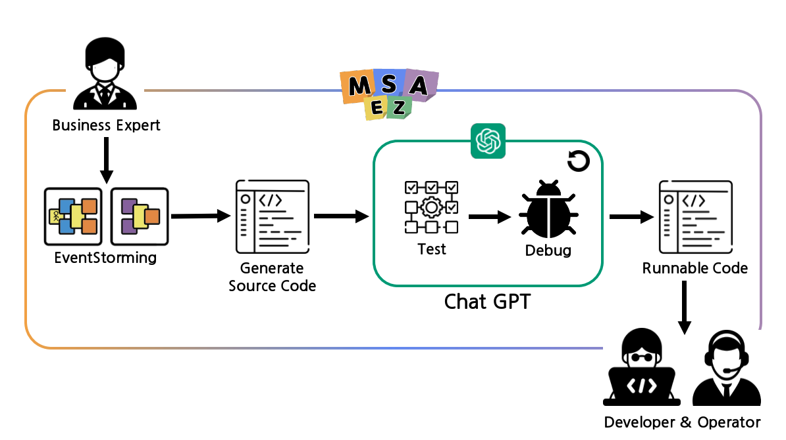
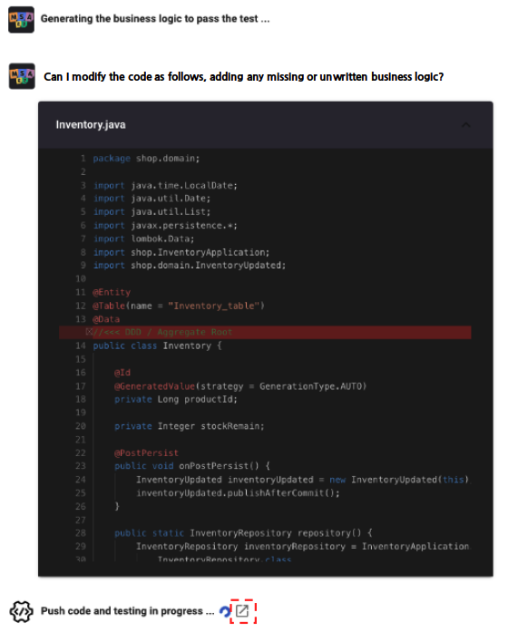

# Code Implementation with ChatGPT

<div style = "height:400px; object-fit: cover;">
<iframe style = "width:100%; height:100%;" src="https://www.youtube.com/embed/JuCN-bD7Jkk" title="YouTube video player" frameborder="0" allow="accelerometer; autoplay; clipboard-write; encrypted-media; gyroscope; picture-in-picture" allowfullscreen></iframe>
</div><br>

<h2>Unit Testing and Debugging with OpenAI</h2>



This feature enables the automatic generation of source code based on the completed Event Storming model. It sends prompts to ChatGPT, and the testing and debugging processes are automated until the code is in a runnable state.

By delegating testing and debugging tasks, traditionally handled by developers, to AI, this functionality allows services to be implemented with just an idea from business experts.

<div style="height: 400px; object-fit: cover;">
<iframe style="width: 100%; height: 100%;" src="https://www.youtube.com/embed/yZMueAKEqwI" title="YouTube video player" frameborder="0" allow="accelerometer; autoplay; clipboard-write; encrypted-media; gyroscope; picture-in-picture" allowfullscreen></iframe>
</div><br>

For detailed steps, refer to the demo video above.

## Execution Steps


1. Save the completed Event Storming model and push it to the Git repository.


2. In the properties of each Policy sticker, click the EXAMPLES button to add **Rules** for Given, When, Then.


3. After adding Rules, open the CODE PREVIEW pane, and clicking the top-level file of the microservice containing that Policy will open the test selection window on the right.


4. Clicking the test selection window will automatically apply the **unit-test** topping to the code, and a test folder will be created within each microservice file.

```java
UpateInventoryTest.java

@Test
    @SuppressWarnings("unchecked")
    public void test0() {
        //given:
        Inventory entity = new Inventory();

        entity.setProductId(123L);
        entity.setStockRemain(50L);

        repository.save(entity);

        //when:

        OrderPlaced event = new OrderPlaced();

        event.setProductId(123L);
        event.setQty(10L);

        InventoryApplication.applicationContext = applicationContext;

        ObjectMapper objectMapper = new ObjectMapper();
        try {
            String msg = objectMapper.writeValueAsString(event);

            processor
                .inboundTopic()
                .send(
                    MessageBuilder
                        .withPayload(msg)
                        .setHeader(
                            MessageHeaders.CONTENT_TYPE,
                            MimeTypeUtils.APPLICATION_JSON
                        )
                        .setHeader("type", event.getEventType())
                        .build()
                );

            //then:

            Message<String> received = (Message<String>) messageCollector
                .forChannel(processor.outboundTopic())
                .poll();

            assertNotNull("Resulted event must be published", received);

            InventoryUpdated outputEvent = objectMapper.readValue(
                received.getPayload(),
                InventoryUpdated.class
            );

            LOGGER.info("Response received: {}", received.getPayload());

            assertEquals(outputEvent.getProductId(), 123L);
            assertEquals(outputEvent.getStockRemain(), 40L);
        } catch (JsonProcessingException e) {
            // TODO Auto-generated catch block
            assertTrue("exception", false);
        }
    }
```

5. Check the test file within that folder, and you will find example values and logic for given, when, and then that you applied earlier.


6. Select the file to test, click the AUTO IMPLEMENT button, and ChatGPT will be prompted. Automatic testing will then proceed.



7. Click the button next to "Push code and testing in progress" to navigate to the Github Actions test page and check the test progress.


8. If the test fails, the reason for the failure and the error log are displayed. The code that fixed the error is automatically applied, and the test is repeated.


9. If the test passes, a button appears with the message "Test success," and it connects to the GitPod Cloud IDE with the applied runnable source code.

You can use this IDE to proceed with development tasks such as implementing business logic or start deploying services immediately.